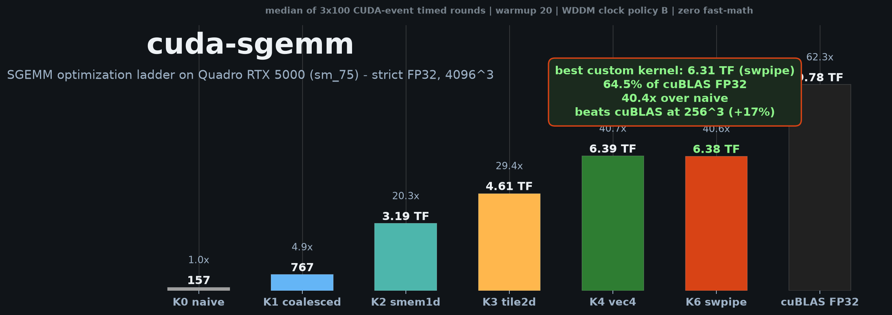
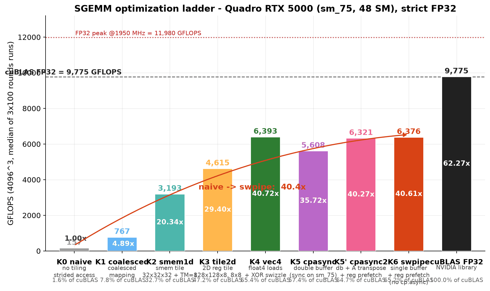
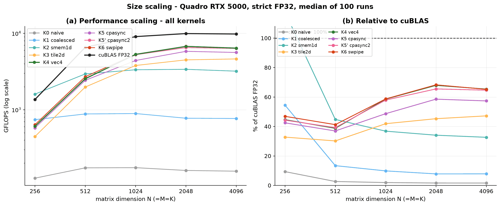
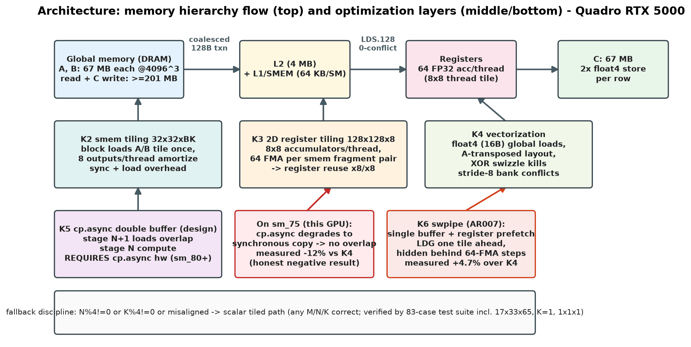
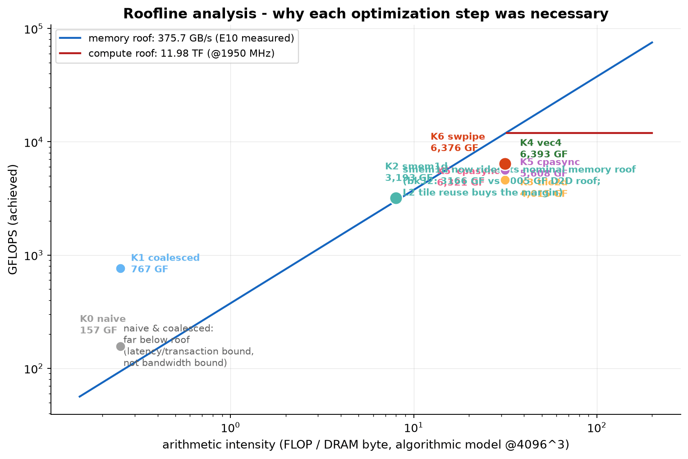
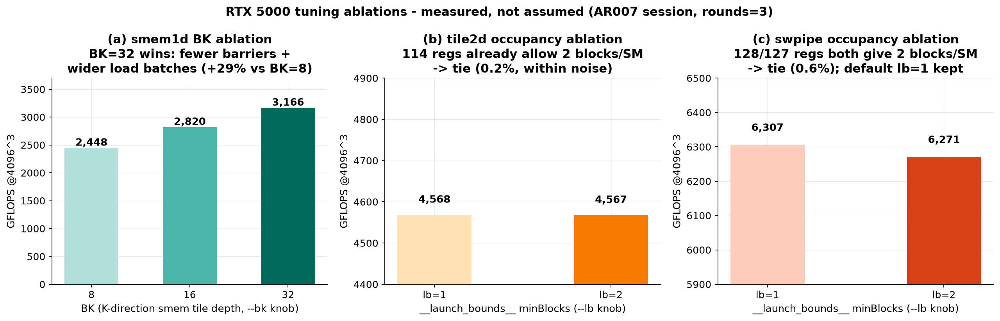

<div align="center">

# cuda-sgemm

### 七版 SGEMM 优化阶梯 · Quadro RTX 5000 (sm_75) · 严格 FP32

[](https://gitee.com/liu-xingyan04/cuda-sgemm)
[](https://gitee.com/liu-xingyan04/cuda-sgemm/members)


-blue)


**从 157 GFLOPS 到 6585 GFLOPS —— 42.2× 逐层实测，每一步都可解释；256³ 上反超 cuBLAS（117%）**

[性能阶梯](#-性能阶梯) · [架构演进](#-架构演进) · [Roofline](#-roofline-为什么每一层都是必要的) · [快速开始](#-快速开始) · [技术报告](results/report.md)

</div>

---



## 为什么做这个工程

SGEMM 是所有性能工程的" hello world "，但多数教程止步于"能跑"。
本工程把教科书 kernel 到接近 cuBLAS 的路径拆成**七层独立可验证的优化**，
每一层只回答一个问题：**上一层的瓶颈是什么、这层改对了没有、证据在哪**——
用 CUDA events 实测 + 算法强度模型 + ptxas 资源审计三重证据闭环，
全程严格 FP32（无 TF32、无快速数学、无低精度冒充）。

> 全部数字为实测 median（warmup 20 + 正式 100 次 × 多轮 RSD 门控），原始数据与 GPU 状态逐行落盘
> [`results/performance.csv`](results/performance.csv)，论文级报告见
> [`results/report.md`](results/report.md)（含 15 张可解释性图表），
> AR007 回归判定表见 [`results/compare_ar007.md`](results/compare_ar007.md)。

## 📈 性能阶梯



| # | Kernel | 核心技术 | GFLOPS @4096³ | ×naive | ×上版 | %cuBLAS |
|---|--------|---------|--------------:|-------:|------:|--------:|
| 0 | naive | 教科书基线（刻意不合并） | 157.0 | 1.0× | — | 1.6% |
| 1 | coalesced | warp 级事务合并（唯一变量=线程映射） | 792.4 | 5.05× | 5.05× | 8.0% |
| 2 | smem1d | 共享内存 32×32×32 分块 + TM=8 | 2 874.7 | 18.3× | 3.63× | 29.1% |
| 3 | tile2d | 128×128×8 分块 + 8×8 寄存器外积 | 4 683.6 | 29.8× | 1.63× | 47.4% |
| 4 | vec4 | float4 装载 + A 转置 + B XOR swizzle | 6 391.3 | 40.7× | 1.37× | 64.7% |
| 5 | cpasync | 双缓冲流水（sm_75 上退化为同步拷贝） | 5 647.1 | 36.0× | 0.88× ⚠ | 57.2% |
| 5' | cpasync2 | 方案乙：A 转置+寄存器预取 | 6 279.7 | 40.0× | 0.98× ⚠ | 63.6% |
| **6** | **swpipe** | **单缓冲软件流水（寄存器预取，无 cp.async）** | **6 584.8** | **42.2×** | **1.03×** | **64.9%** |
| 6' | swsk | swpipe 的 split-K 变体（AR008）：确定性固定序归约，解除中小尺寸 wave 饥饿 | 6 250.4 | — | 512³ **+49.4%** vs swpipe | — |
| 7 | ws | warp 专属化 producer/consumer + PTX named barriers（AR008） | 5 377.7 | — | **负结果归档** ⚠ | — |
| sel | **auto** | 实测驱动选核（AR008）：blocks 带判 swsk12/swsk4/swpipe，K 钳制 | 贴各尺寸最优 | — | dispatch 零开销 | — |
| — | cuBLAS | NVIDIA 库（显式禁 TF32） | 10 136.2 | 64.9× | — | 100% |

> ⚠ **诚实标注**：cp.async 硬件指令需 sm_80+，本机（Turing sm_75）上由 CUDA 头文件退化为
> 同步拷贝——双缓冲"付钱不办事"，实测为负收益（-12% / -2%）。但其消融结论
> "寄存器预取本身无害"直接演化为 K6 swpipe（+4.7%，6/6 尺寸全胜 vec4）——
> **负结果指了路**。详见[报告 §6](results/report.md)。

**尺寸自适应也是实测结论**：小矩阵上 32×32 分块反超大分块，且 **256³ 上自研反超 cuBLAS**：

- 256³：smem1d(BK=32) = **1618 GF = cuBLAS（1378 GF）的 117.4%**——小尺寸"库开销区"是自研领先窗口；
- tile2d@256 仅 446 GF（48 SM 喂不饱大 tile）；512³ 起 cuBLAS 拉开。

**AR008 更新**：swsk(sk12) 在 256³ 同会话全场最优（1517 GF，超 cuBLAS +20.5%、超 smem1d +7.9%）；
`--kernel auto` 按几何带判选核，背靠背配对验证与各尺寸实测最优对内 delta ≤0.9%（fig10）；
ws 的 issue-slot 假说被消融否定（fig13，负结果如实归档）。四门 v2 判定与全部图表见
[报告 §10](results/report.md) 与 [compare_ar008_paired.md](results/compare_ar008_paired.md)。



## 🏗 架构演进



每版 kernel 一个自包含 `.cu` 文件，头部注释按契约写明 tile 尺寸 / 每线程工作分配 /
smem 布局与 padding(swizzle) 理由 / 资源预算（AGENTS.md 注释契约）：

| # | Kernel | 源码 | 关键改动 → 效果 |
|---|--------|------|----------------|
| K0 | naive | [`src/sgemm_naive.cu`](src/sgemm_naive.cu) | 每线程 1 输出，strided 访问 → 延迟受限（0.23 GB/s 有效带宽） |
| K1 | coalesced | [`src/sgemm_coalesced.cu`](src/sgemm_coalesced.cu) | 交换映射：B/C 合并 128B，A 广播 → 同流量下事务数 32→4，**5.05×** |
| K2 | smem1d | [`src/sgemm_smem_1d.cu`](src/sgemm_smem_1d.cu) | A/B tile 经 smem 复用 ×32 → 达其算法强度内存顶的 **95.7%**（带宽封顶） |
| K3 | tile2d | [`src/sgemm_2d_tile.cu`](src/sgemm_2d_tile.cu) | 8×8 寄存器外积：AI 8→31.5 FLOP/B → smem bank conflict 成为新瓶颈（已知项） |
| K4 | vec4 | [`src/sgemm_vec4.cu`](src/sgemm_vec4.cu) | LDS.128 片段 + 转置 + XOR swizzle → 冲突归零，6.39 TF = cuBLAS 的 64.7% |
| K5 | cpasync | [`src/sgemm_cpasync.cu`](src/sgemm_cpasync.cu) | 双缓冲流水（sm_80+ 硬件）→ 本机退化为同步拷贝，负结果如实归档 |
| K6 | swpipe | [`src/sgemm_swpipe.cu`](src/sgemm_swpipe.cu) | 单缓冲软件流水：LDG 提前一轮入寄存器 → 无 cp.async 依赖，**6/6 尺寸全胜 K4** |
| K6' | swsk | [`src/sgemm_swpipe_sk.cu`](src/sgemm_swpipe_sk.cu) | split-K（AR008）：K 维切片抬波数 + 确定性归约 → 512³ **+49%**，解除 wave 饥饿 |
| K7 | ws | [`src/sgemm_ws.cu`](src/sgemm_ws.cu) | warp 专属化（AR008）：producer/consumer + named barriers → 消融否定，负结果归档 |
| sel | auto | [`src/sgemm_auto.cu`](src/sgemm_auto.cu) | 实测驱动选核（AR008）：blocks 带判 swsk12/swsk4/swpipe → dispatch 零开销贴最优 |

资源纪律：全 kernel **0 spill**（`-Xptxas=-v` 审计归档 build.log；ws 的 LB=2×STAGES=2
消融实例 8B spill 为记录在案的取舍，T008 裁定不采用），
寄存器敏感版本显式 `__launch_bounds__`；非对齐尺寸自动回退标量路径
（`17×33×65`、`K=1`、`1×1×1` 均在 110 例测试中验证，racecheck/memcheck 全清）。

## 📐 Roofline：为什么每一层都是必要的

免硬件计数器（本机 ncu 权限受限），用**算法强度模型 + E10 实测带宽（375.7 GB/s）**
构建 roofline，每版的瓶颈定位仍然定量可证：



- **K0/K1** 远低于任何顶 → 延迟/事务受限（不是带宽）；
- **K2 贴内存顶 95.7%** → 分块尺寸被带宽直接封顶，唯一出路是提高 AI；
- **K3/K4/K6** 约束切换到计算侧（smem 冲突 → 指令依赖），达计算顶 40→54%；
- cuBLAS 达 84.6%（冷态） → 与自研最优的差距构成见[报告 §7](results/report.md)。

消融实验（针对本机 48 SM 调优，实测而非拍脑袋）：BK=32 比默认再 +8.3%（已固化为默认）；
tile2d / swpipe 的 `__launch_bounds__` 消融均持平——因为寄存器预算本就放得下 2 block/SM，
模型预测了持平。



## 🖼 AR008 图表画廊

> 15 张图全部由 [`bench/make_figures.py`](bench/make_figures.py) 从 CSV 直出（无手工修饰），
> 每张图的"结论 → 图 → 数据"三链可溯（[报告附录 B](results/report.md)）。

| 图表 | 一句话结论 |
|------|-----------|
| [fig1 优化阶梯](results/figures/fig1_ladder.png) | 七版 42.2× 逐层实测，每层收益来源可解释 |
| [fig2 尺寸扩展](results/figures/fig2_scaling.png) | 不存在万能最优 tile：交叉点 N=1024，256³ 自研反超 cuBLAS |
| [fig3 Roofline](results/figures/fig3_roofline.png) | smem1d 骑在内存顶 95.7%；K3 起约束切换到计算侧 |
| [fig4 资源审计](results/figures/fig4_resources.png) | 全 kernel 0 spill，寄存器/smem/占用率可视化 |
| [fig5 热力图](results/figures/fig5_heatmap.png) | kernel × 尺寸全矩阵，波次效应一目了然 |
| [fig6 消融](results/figures/fig6_ablation.png) | BK=32 +8.3% 固化为默认；launch_bounds 持平被模型预测 |
| [fig8 架构演进](results/figures/fig8_arch.png) | 七版数据通路结构对比 |
| [fig9 split-K 扫描](results/figures/fig9_splitk_sweep.png) | swsk 解除 wave 饥饿：512³ +49%，sk 最优带实测回填 |
| [fig10 dispatch 映射](results/figures/fig10_dispatch_map.png) | auto 选核与实测最优对内 delta ≤0.9%——dispatch 零开销 |
| [fig11 ws 结构](results/figures/fig11_ws_structure.png) | producer/consumer + named barriers 的流水与屏障契约 |
| [fig12 ws 消融](results/figures/fig12_ws_ablation.png) | PW/STAGES/LB 三轴 8 配置矩阵：PW=2 胜，LB=2 占用率假说被否 |
| [fig13 issue-slot 假说](results/figures/fig13_isslot_hypothesis.png) | "FFMA 槽 55% 瓶颈"假说否定——负结果如实归档 |
| [fig14 配对 delta](results/figures/fig14_paired_delta.png) | thermal-paired 协议：对内极差 median 0.53pp（vs 跨会话 ~5-14%） |
| [fig15 阶梯 v2](results/figures/fig15_ladder_v2.png) | 同会话全 kernel 阶梯：auto 在每个尺寸贴住最优 |

## 🚀 快速开始

```bash
# 构建（默认 -arch=sm_75，本工程调优目标机 Quadro RTX 5000）
cmake -B build -DCMAKE_BUILD_TYPE=Release -DCMAKE_CUDA_ARCHITECTURES=75 -G Ninja
cmake --build build -j          # 或: make build

build/sgemm_test                # 110 例正确性回归（12 kernel × 9 尺寸 + cuBLAS 自校验）
build/sgemm_bench --kernel all --m 4096 --n 4096 --k 4096 --rounds 3 --csv   # 性能阶梯落盘
build/sgemm_bench --kernel swpipe --m 4096 --n 4096 --k 4096 --rounds 3 --csv # K6 软件流水
build/sgemm_bench --kernel auto --m 512 --n 512 --k 512 --verbose --csv      # AR008 自动选核（打印 dispatch 依据）

# 消融旋钮（结果经 SGEMM_CSV 分流到独立 CSV，不污染主表）
build/sgemm_bench --kernel smem1d --bk 16    # BK ∈ {8,16,32}（默认已固化 32）
build/sgemm_bench --kernel swsk --sk 12      # split-K 片数 ∈ {1..16}（256³ 实测最优 12）
build/sgemm_bench --kernel ws --wp 1 --stages 2 --lb 2   # ws 三轴消融（AR008）

# thermal-paired 配对协议（AR008）：对内 delta 消 WDDM 热漂移 + 四门 v2 判定
powershell -ExecutionPolicy Bypass -File bench/run_paired.ps1 -Challengers swsk,ws,auto,cublas
python bench/compare.py --paired results/paired_ar008.csv -o results/compare_ar008_paired.md

# 自动实验矩阵（9 kernel × 6 尺寸 + 消融分流，自动快照基线）
powershell -ExecutionPolicy Bypass -File bench/run_matrix.ps1

# 回归对比 + 四门判定表
python bench/compare.py results/performance_preAR007_<stamp>.csv results/performance.csv

# 图表再生成（python + matplotlib，从 CSV 直出，无手工修饰）
python bench/make_figures.py
```

统一接口（全部 kernel 同签名，行主序 `C = A·B`，任意 M/N/K）：

```cpp
void sgemm_swpipe(const float* A, const float* B, float* C, int M, int N, int K);
```

## 📁 项目结构

```text
cuda-sgemm/
├── src/                        # 十实现阶梯：naive→swpipe→swsk/ws/auto（每版一个自包含 .cu）
├── include/                    # common.h（计时/多轮统计/CSV/CUDA_CHECK）+ kernel 注册表
├── tests/test_correctness.cu   # 110 例回归：CPU double + cuBLAS FP32 双参考
├── bench/
│   ├── make_figures.py         # 全部 15 张图表的可复现生成脚本
│   ├── run_matrix.ps1          # 自动实验矩阵（9 kernel × 6 尺寸 + 消融分流）
│   ├── run_paired.ps1          # thermal-paired 配对协议（消 WDDM 热漂移）
│   └── compare.py              # 回归对比 + 四门判定表
├── results/
│   ├── report.md               # ★ 技术报告（本工程主文档）
│   ├── performance.csv         # 原始计时数据（git sha / RSD / GPU 状态逐行）
│   ├── compare_ar007.md        # AR007 回归判定（四门）
│   ├── compare_ar008_paired.md # AR008 配对判定（四门 v2）
│   ├── environment.md          # 环境基线 + 时钟策略 + 漂移记录
│   ├── bottleneck_analysis.md  # 逐版瓶颈闭环
│   └── figures/                # 15 张可解释性图表
├── docs/                       # TEST_PLAN（严格测试手册）/ EXPERIMENT_DESIGN
└── specs/                      # SDD 文档（详设 / AR 工单 / backlog / archive）
```

## 🔬 数据真实性军规

1. **一切性能数字实测可复现**：CUDA events、warmup ≥20、正式 ≥100、报告 median/min/max/RSD；
   `--rounds N` 多轮门控（跨轮 RSD>5% 自动重试）；CSV 每行携带 git sha 与 GPU 状态（时钟/温度/功耗）。
2. **严格 FP32**：构建全程禁 `-use_fast_math`；cuBLAS 显式 `CUBLAS_DEFAULT_MATH` 禁 TF32
   （数值交叉验证：vs CPU double rel≈1e-7，TF32 会是 ~1e-3 量级）。
3. **失败实验同样归档**：cp.async 负结果、WDDM 时钟漂移（cuBLAS RSD 8–10% 的归因）、
   热浸没会话 ~5% 降频效应、ncu 权限阻塞的降级方法学，全部如实记录在报告与环境文档中。
4. 正确性门：110/110 全 PASS（[证据日志](results/test_correctness_2026-10-05.log)）；`compute-sanitizer` memcheck 全绿、racecheck（双缓冲/软件流水版）0 hazards。

## 📚 延伸阅读

| 文档 | 内容 |
|------|------|
| [`results/report.md`](results/report.md) | **技术报告**：七版设计/实测/roofline/消融/负结果全分析 |
| [`results/compare_ar007.md`](results/compare_ar007.md) | AR007 回归判定表：逐尺寸 delta + 四门判定 |
| [`results/compare_ar008_paired.md`](results/compare_ar008_paired.md) | AR008 配对判定表：四门 v2 + 对内 delta |
| [`results/bottleneck_analysis.md`](results/bottleneck_analysis.md) | 逐版瓶颈闭环（瓶颈→证据→对策→验证） |
| [`results/environment.md`](results/environment.md) | 环境基线：硬件/工具链/时钟策略/漂移记录 |
| [`results/test_correctness_2026-10-05.log`](results/test_correctness_2026-10-05.log) | 110/110 全 PASS 测试证据（12 kernel × 9 尺寸 + cuBLAS 自校验） |
| [`docs/EXPERIMENT_DESIGN.md`](docs/EXPERIMENT_DESIGN.md) | 可解释性实验设计（目的/假设/方法/判伪） |
| [`specs/component-detail-design/cuda_sgemm_spec.md`](specs/component-detail-design/cuda_sgemm_spec.md) | 组件详设：统一契约（接口/计时/CSV/判据） |
| [`specs/changes/AR008-adaptive-sgemm/`](specs/changes/AR008-adaptive-sgemm/) | AR008 工单：srs / design / tasks / ST 报告 |
| [`AGENTS.md`](AGENTS.md) | 开发军规：CUDA 编码/测量纪律/TDD 规则 |

## 📄 License

[MIT](LICENSE) © 2026 liu-xingyan04

---

<div align="center">

**42.2× 不是终点，是证据链的长度。**

*每一层优化都被实测钉住：改了什么 → 为什么改 → 证据是什么 → 下一层输入是什么。
256³ 反超 cuBLAS 的那一格，是七层证据链上最先亮起来的灯。*

</div>
