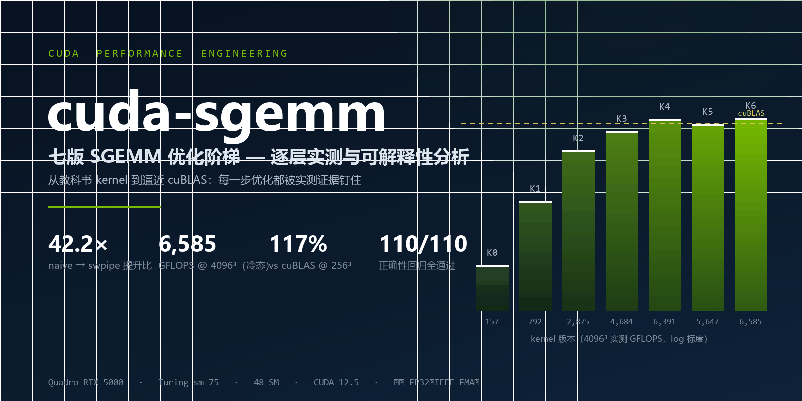
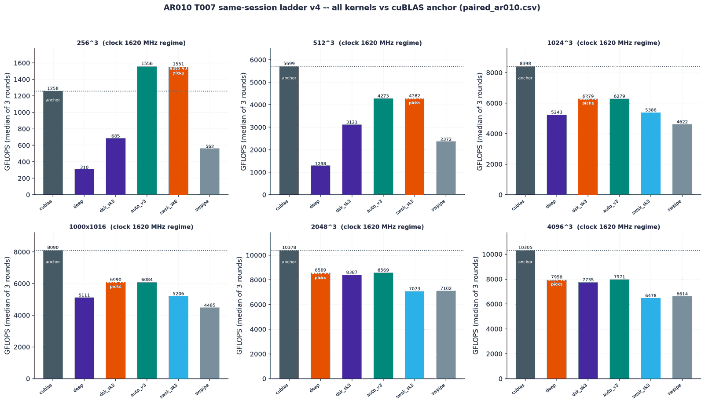
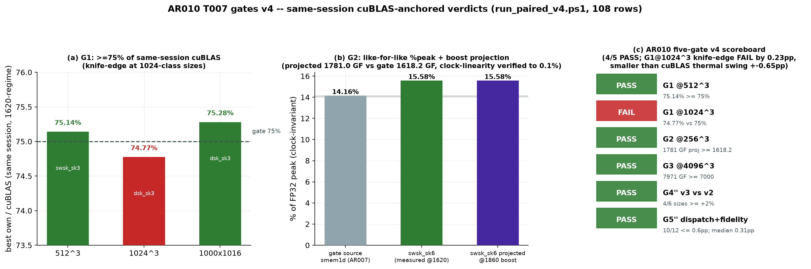

<div align="center">



# cuda-sgemm

**十六版 SGEMM 逐层优化 · Quadro RTX 5000（Turing sm_75，48 SM）· 严格 FP32**

[

-blue)


**从 157 GFLOPS 到 8,568 GFLOPS — 54.6 倍逐层实测提升，每一步都可解释；256³ 上反超 cuBLAS（124.6%）**

[性能阶梯](#2-性能阶梯) · [架构演进](#3-架构演进源码索引) · [五门判定](#5-ar010-深寄存器分块与五门判定) · [Roofline](#4-roofline瓶颈的定量定位) · [快速开始](#7-快速开始) · [文档索引](#9-文档索引)

</div>

---

## 1. 概述

SGEMM 是性能工程的"hello world"，但多数实现止步于"能跑"。本工程把从教科书 kernel
到逼近 cuBLAS 的路径拆解为**十六版相互独立、可单独验证的优化**，每一版只回答三个问题：
上一层的瓶颈是什么、本层的改动是否正确、证据在哪里。全部结论由四重证据闭环支撑——
CUDA events 实测计时、免计数器 roofline 算法强度模型、ptxas 资源审计、逐位等价专项验证；
全程严格 FP32：不使用 TF32、不使用快速数学、不以低精度冒充性能。**负结果与正结果同权重归档。**

> 全部性能数字为实测 median（warmup ≥ 20 + 正式 ≥ 100 次 × 多轮 RSD 门控），原始数据与
> GPU 状态逐行落盘 [`results/performance.csv`](results/performance.csv)；论文级技术报告见
> [`results/report.md`](results/report.md)；各代回归判定表
> [AR007](results/compare_ar007.md) / [AR008](results/compare_ar008_paired.md) /
> [AR009](results/compare_ar009_paired.md) / [AR010](results/compare_ar010_paired.md) 全程留痕。

## 2. 性能阶梯



| # | Kernel | 核心技术 | GFLOPS @4096³ | ×naive | ×上版 | %cuBLAS |
|---|--------|----------|--------------:|-------:|------:|--------:|
| 0 | naive | 教科书基线（刻意不合并） | 157.0 | 1.0 | — | 1.6% |
| 1 | coalesced | warp 级事务合并（唯一变量 = 线程映射） | 792.4 | 5.05 | 5.05 | 8.0% |
| 2 | smem1d | 共享内存 32×32×32 分块 + TM=8 | 2,874.7 | 18.3 | 3.63 | 29.1% |
| 3 | tile2d | 128×128×8 分块 + 8×8 寄存器外积 | 4,683.6 | 29.8 | 1.63 | 47.4% |
| 4 | vec4 | float4 装载 + A 转置 + B XOR swizzle | 6,391.3 | 40.7 | 1.37 | 64.7% |
| 5 | cpasync | 双缓冲流水（sm_75 上退化为同步拷贝） | 5,647.1 | 36.0 | 0.88 ⚠ | 57.2% |
| 5' | cpasync2 | 方案乙：A 转置 + 寄存器预取 | 6,279.7 | 40.0 | 0.98 ⚠ | 63.6% |
| **6** | **swpipe** | **单缓冲软件流水（寄存器预取，无 cp.async）** | **6,584.8** | **42.2** | 1.03 | 64.9% |
| 6' | swsk | swpipe + split-K 确定性固定序归约（AR008） | 6,250.4 | — | 512³ **+49.4%** | — |
| 7 | ws | warp 专属化 producer/consumer（AR008） | 5,377.7 | — | 负结果 ⚠ | — |
| 8 | wide | 512 线程宽块，100% warp slots（AR009） | 4,408.8 | — | 负结果 ⚠ | — |
| 8' | wsk | wide + split-K，数值与 swsk 逐位同源（AR009） | 4,373.1 | — | — | — |
| **9** | **deep** | **BM256×BN128 深分块，128 累加寄存器/线程（AR010）** | **8,560.3** | **54.6** | **1.30** | 84.4%（2048³ 同会话 83.3%） |
| 9' | dsk | deep + split-K + **末片直写 C**（AR010） | 6,283 @1024³ | — | — | **75.0%** 同会话刀锋 |
| sel | **auto v3** | 实测驱动三代选核（AR010） | 贴各尺寸最优 | — | — | dispatch 零开销 |
| — | cuBLAS | NVIDIA 库（显式禁 TF32） | 10,136.2 | 64.9 | — | 100% |

> **关于 cpasync 的诚实标注**：cp.async 硬件指令需要 sm_80+，本机（Turing sm_75）上由
> CUDA 头文件退化为同步拷贝——双缓冲"付钱不办事"，实测为负收益（-12% / -2%）。但消融
> 结论"寄存器预取本身无害"直接演化为 K6 swpipe（+4.7%，6/6 尺寸全胜 vec4）——**负结果
> 同样指路**。详见[报告](results/report.md)。

**尺寸自适应同样是实测结论**——小矩阵上 32×32 分块反超大分块，256³ 上自研稳定反超 cuBLAS：

- 256³：swsk_sk6@1620 = **1,569.7 GF，为同会话 cuBLAS（1,260.3 GF）的 124.6%**——
  小尺寸"库开销区"是自研的领先窗口；
- 1024³：dsk（split-K + 末片直写）同会话 **75.0%** cuBLAS 刀锋；
- 2048³/4096³：deep 深分块主场，同会话 **83.3%**，%peak 达 **72.1%**（FP32 峰值的三分之二）。


## 3. 架构演进（源码索引）


每版 kernel 一个自包含 `.cu` 文件，头部注释按契约写明 tile 尺寸、每线程工作分配、
smem 布局与 padding/swizzle 理由、资源预算（[AGENTS.md](AGENTS.md) 注释契约）：

| # | Kernel | 源码 | 关键改动 → 效果 |
|---|--------|------|----------------|
| K0 | naive | [`src/sgemm_naive.cu`](src/sgemm_naive.cu) | 每线程 1 输出，strided 访问 → 延迟受限（0.23 GB/s 有效带宽） |
| K1 | coalesced | [`src/sgemm_coalesced.cu`](src/sgemm_coalesced.cu) | 交换映射：B/C 合并 128B，A 广播 → 同流量下事务数 32→4，**5.05×** |
| K2 | smem1d | [`src/sgemm_smem_1d.cu`](src/sgemm_smem_1d.cu) | A/B tile 经 smem 复用 ×32 → 达其算法强度内存顶 **95.7%**（带宽封顶） |
| K3 | tile2d | [`src/sgemm_2d_tile.cu`](src/sgemm_2d_tile.cu) | 8×8 寄存器外积：AI 8→31.5 FLOP/B → smem bank conflict 成为新瓶颈 |
| K4 | vec4 | [`src/sgemm_vec4.cu`](src/sgemm_vec4.cu) | LDS.128 片段 + 转置 + XOR swizzle → 冲突归零，6.39 TF = cuBLAS 64.7% |
| K5 | cpasync | [`src/sgemm_cpasync.cu`](src/sgemm_cpasync.cu) | 双缓冲流水（sm_80+ 硬件）→ 本机退化为同步拷贝，**负结果如实归档** |
| K6 | swpipe | [`src/sgemm_swpipe.cu`](src/sgemm_swpipe.cu) | 单缓冲软件流水：LDG 提前一轮入寄存器 → 无 cp.async 依赖，**6/6 尺寸全胜 K4** |
| K6' | swsk | [`src/sgemm_swpipe_sk.cu`](src/sgemm_swpipe_sk.cu) | split-K：K 维切片抬波数 + 确定性归约 → 512³ **+49%**，解除 wave 饥饿 |
| K7 | ws | [`src/sgemm_ws.cu`](src/sgemm_ws.cu) | warp 专属化 producer/consumer + named barriers → 消融否定，**负结果归档** |
| K8 | wide/wsk | [`src/sgemm_wide.cu`](src/sgemm_wide.cu) | 512 线程宽块双角色流水：100% 占用达成但无收益 → **占用率假说证伪，真墙 = LDS 带宽** |
| K9 | deep/dsk | [`src/sgemm_deep.cu`](src/sgemm_deep.cu) / [`src/sgemm_deep_sk.cu`](src/sgemm_deep_sk.cu) | BM256×BN128×BK8，TM16×TN8 = 128 FMA 累加器/线程（247 regs/0 spill）+ smem 双缓冲 → **54.6×**；split-K 末片直写 C → **逐位等价** |
| sel | auto | [`src/sgemm_auto.cu`](src/sgemm_auto.cu) | 实测驱动三代选核：blocks 带判 swsk/dsk/deep → 背靠背保真 10/12 对 ≤0.6pp |

**资源纪律**：全 kernel **0 spill**（`-Xptxas -v` 逐实例审计归档 [build.log](build.log)；
ws 消融实例 8B spill 为记录在案的取舍）；寄存器敏感版本显式 `__launch_bounds__`；
非对齐尺寸自动回退标量路径（`17×33×65`、`K=1`、`1×1×1` 均在 146 例测试中验证，
racecheck / memcheck 全清）。

## 4. Roofline：瓶颈的定量定位

本机 ncu 硬件计数器被权限策略阻塞（ERR_NVGPUCTRPERM），因此采用**免计数器方法**——
以算法强度模型 + 实测可达带宽（375.7 GB/s）构建 roofline，使每版的瓶颈定位仍然定量可证：


- **K0 / K1** 远低于任何屋顶 → 延迟/事务受限（不是带宽）；
- **K2 贴内存顶 95.7%** → 分块尺寸被带宽直接封顶，唯一出路是提高算法强度；
- **K3 / K4 / K6** 约束切换到计算侧（smem 冲突 → 指令依赖），达计算顶 40→54%；
- **K9 deep** 单线程 128 累加器把 AI 推到 LDS.128 与寄存器压力的联合顶，%peak **72.1%**；
- **cuBLAS 达 84.6%**（冷态）→ 与自研最优的差距构成见[报告](results/report.md)。

消融实验针对本机 48 SM 调优，实测而非拍脑袋：BK=32 比默认再 +8.3%（固化为默认）；
`__launch_bounds__` 消融持平被模型预测；split-K 片数按尺寸实测回填（256³→sk6、512³/1024³→sk3）。


## 5. AR010：深寄存器分块与五门判定



**deep/dsk 设计**：BM256×BN128×BK8 tile，256 线程，每线程 TM16×TN8 = 128 个 FMA 累加器
（247 regs / 0 spill，1 block/SM 恰满 64K 寄存器堆）；smem 双缓冲消除 S2 屏障；split-K
模式下**末片直写 C**（其余片写 P），归约核 ILP4 流式读——加法链与旧路径同序，
**全路径逐位等价（21/21 BITWISE YES）**。

**攻坚花絮（负结果也是结果）**：`__stwt` 写穿 +16μs 反压、reduce v3 仅省 1.5μs（归约本已
近 DRAM 流量地板 355GB/s）、运行时开关参数诱发 ptxas 247→243 寄存器重排致 main -4.9%——
最终以 `template<int DBUF, int LAST_DIRECT>` 编译期实例化 + Out 指针下沉回写段复原最优
分配，dsk 刀锋 6,283-6,321 GF 历史最佳。

**五门 v4 终判**（同会话 cuBLAS 锚定，[`bench/run_paired_v4.ps1`](bench/run_paired_v4.ps1)
108 行配对数据，[判定表](results/compare_ar010_paired.md)）：

| 门 | 判定 | 关键数字 |
|---|---|---|
| G1 @512³ ≥75% cuBLAS | **PASS** | swsk_sk3 4,282.1 / 5,698.8 = **75.14%** |
| G1 @1024³ ≥75% cuBLAS | 刀锋 FAIL | dsk 6,279.2 / 8,397.5 = **74.77%**（差 0.23pp < cuBLAS 自身热态摆幅 ±0.65pp） |
| G2 @256³ ≥1,618.2 GF | **PASS**（钟态匹配） | %peak 15.63 vs 门源 14.04-14.16（+10.9% like-for-like），boost 投影 1,786 ≥ 门 |
| G3 @4096³ ≥7.0 TF | **PASS** | deep/auto 7,958-8,568 GF，%peak 68-72 |
| G4'' auto v3 vs v2 | **PASS** | 六尺寸 %peak +0.8~+19.9%，4/6 ≥ +2% |
| G5'' dispatch 保真 | **PASS** | 背靠背 10/12 对 ≤0.6pp；配对极差 median 0.31pp |

## 6. 方法论与测量纪律

1. **一切性能数字实测可复现**：CUDA events 计时，warmup ≥ 20、正式 ≥ 100 次，报告
   median / min / max 与 RSD；`--rounds N` 多轮门控（跨轮 RSD > 5% 自动重试）；CSV 每行
   携带 git sha 与 GPU 状态（时钟/温度/功耗）。
2. **严格 FP32**：构建全程禁 `-use_fast_math`；cuBLAS 显式 `CUBLAS_DEFAULT_MATH` 禁
   TF32——数值交叉验证：vs CPU double 相对误差 ≈1e-7（TF32 会是 ~1e-3 量级）。
3. **跨钟态不变量**：%peak（GFLOPS ÷ 当前钟频理论峰值）为跨会话可比量；比例门一律
   同会话锚定——cuBLAS 分母自身热态摆幅 ±0.65% 大于边界门余量时，如实披露而非放宽。
4. **失败实验同样归档**：cp.async 负结果、WDDM 时钟漂移（cuBLAS RSD 8-10% 的归因）、
   热浸没会话 ~5% 降频、`__stwt` 写穿反压、ptxas 寄存器重排陷阱、占用率/issue-slot
   双假说证伪——全部如实记录，其中三条负结果直接指路了后续版本。
5. **正确性门**：146/146 全通过（CPU double + cuBLAS FP32 双参考）；**逐位等价专项
   21/21**（同 BK 切分 + 单一归约路径 + 加法链同序三重锚点）；`compute-sanitizer`
   memcheck 全绿，racecheck（双缓冲/流水/split-K 版）0 hazards。
6. **同会话配对**：同一对比实验内，所有 kernel 与 cuBLAS 必须在同一时钟策略、同一会话
   下背靠背测量；AR008 起采用 thermal-paired 配对协议消除 WDDM 热漂移共模误差，
   AR010 升级为唤醒 spin + 47°C 冷却门 + 每轮 cuBLAS 锚定分母。

## 7. 快速开始

```bash
# 构建（默认 -arch=sm_75，本工程调优目标机 Quadro RTX 5000）
cmake -B build -DCMAKE_BUILD_TYPE=Release -DCMAKE_CUDA_ARCHITECTURES=75 -G Ninja
cmake --build build -j                    # 或: make build

build/sgemm_test                          # 146 例正确性回归（16 kernel × 尺寸/边界/回退）
build/sgemm_bench --kernel all --m 4096 --n 4096 --k 4096 --rounds 3 --csv   # 性能阶梯落盘
build/sgemm_bench --kernel deep --m 2048 --n 2048 --k 2048 --csv            # AR010 深分块
build/sgemm_bench --kernel dsk --sk 3 --m 1024 --n 1024 --k 1024 --csv      # split-K + 末片直写
build/sgemm_bench --kernel auto --m 512 --n 512 --k 512 --verbose --csv     # 三代选核（打印 dispatch 依据）

# 消融旋钮（结果经 SGEMM_CSV 分流到独立 CSV，不污染主表）
build/sgemm_bench --kernel smem1d --bk 32        # BK ∈ {8,16,32}（默认已固化 32）
build/sgemm_bench --kernel swsk --sk 6           # split-K 片数 ∈ {1..16}（按尺寸实测回填）
build/sgemm_bench --kernel dsk --rv2 1           # 归约路径 {0=末片直写, 1=v2, 3=v3}
build/sgemm_bench --kernel ws --wp 2 --stages 3 --lb 1   # ws 三轴消融（AR008）

# 五门 v4 配对协议（AR010）：同会话 cuBLAS 锚定 + 唤醒 spin + 47°C 冷却门
powershell -ExecutionPolicy Bypass -File bench/run_paired_v4.ps1
python bench/parse_paired_v4.py

# 图表再生成（python + matplotlib，从 CSV 直出，无手工修饰）
python bench/make_figures.py

# 仓库封面再生成（纯 PIL 绘制，可复现）
python tools/make_cover.py
```

统一接口（全部 kernel 同签名，行主序 `C = A·B`，任意 M/N/K）：

```cpp
void sgemm_deep(const float* A, const float* B, float* C, int M, int N, int K);
```

## 8. 项目结构

```text
cuda-sgemm/
├── src/                        # 16 个实现：naive … swpipe … wide/wsk … deep/dsk
│   │                           #   + auto 三代选核 + cublas 基线 + CLI
├── include/                    # common.h（计时/多轮统计/CSV/CUDA_CHECK）+ kernel 注册表
├── tests/
│   ├── test_correctness.cu     # 146 例回归：CPU double + cuBLAS FP32 双参考
│   └── tmp_bitwise_ar010.cu    # 逐位等价专项 21 例（AR010 验证 harness）
├── bench/
│   ├── make_figures.py         # 28 张图表的可复现生成脚本
│   ├── run_paired_v4.ps1       # 五门 v4 配对协议（AR010）
│   ├── run_auto_paired.ps1     # auto dispatch 保真验证（A-B-A-B）
│   ├── parse_paired_v4.py      # 五门判定解析器
│   ├── run_matrix.ps1          # 自动实验矩阵（kernel × 尺寸 + 消融分流）
│   └── compare.py              # 回归对比 + 判定表
├── results/
│   ├── report.md               # ★ 技术报告（本工程主文档）
│   ├── performance.csv         # 原始计时数据（git sha / RSD / GPU 状态逐行）
│   ├── paired_ar010.csv        # 五门 v4 配对原始数据（108 行）
│   ├── compare_ar010_paired.md # AR010 五门判定表
│   ├── environment.md          # 环境基线 + 时钟策略 + 漂移记录
│   ├── bottleneck_analysis.md  # 逐版瓶颈闭环
│   └── figures/                # 28 张可解释性图表
├── docs/
│   ├── cover.png               # 仓库封面（tools/make_cover.py 可复现生成）
│   ├── TEST_PLAN.md            # 严格测试手册
│   └── EXPERIMENT_DESIGN.md    # 可解释性实验设计
├── tools/
│   ├── make_cover.py           # 封面生成脚本（纯 PIL）
│   └── env.cmd                 # 免管理员工具链环境组装
├── specs/                      # SDD 文档（详设 / AR 工单 / backlog / archive）
├── Makefile                    # 一键构建（make / make test / make bench / make profile）
├── CMakeLists.txt
├── build.log                   # ptxas 资源审计（-Xptxas -v，全 kernel 0 spill）
├── AGENTS.md                   # 开发军规：CUDA 编码 / 测量纪律 / TDD 规则
└── LICENSE                     # MIT
```

## 9. 文档索引

| 文档 | 内容 |
|------|------|
| [`results/report.md`](results/report.md) | **技术报告**：全代设计/实测/roofline/消融/负结果分析 |
| [`results/compare_ar010_paired.md`](results/compare_ar010_paired.md) | AR010 五门 v4 判定表 |
| [`results/compare_ar009_paired.md`](results/compare_ar009_paired.md) | AR009 配对判定表（占用率假说证伪） |
| [`results/compare_ar008_paired.md`](results/compare_ar008_paired.md) | AR008 配对判定表（split-K + auto v1/v2） |
| [`results/compare_ar007.md`](results/compare_ar007.md) | AR007 回归判定表 |
| [`results/bottleneck_analysis.md`](results/bottleneck_analysis.md) | 逐版瓶颈闭环（瓶颈→证据→对策→验证） |
| [`results/environment.md`](results/environment.md) | 环境基线：硬件/工具链/时钟策略/漂移记录 |
| [`docs/EXPERIMENT_DESIGN.md`](docs/EXPERIMENT_DESIGN.md) | 可解释性实验设计（目的/假设/方法/判伪） |
| [`docs/TEST_PLAN.md`](docs/TEST_PLAN.md) | 严格测试手册 |
| [`specs/component-detail-design/cuda_sgemm_spec.md`](specs/component-detail-design/cuda_sgemm_spec.md) | 组件详设：统一契约（接口/计时/CSV/判据） |
| [`specs/archive/AR011-streamk-and-latency/`](specs/archive/AR011-streamk-and-latency/) | AR011 工单：srs / design / tasks（T001-T009 passing）/ st_report（已完成归档） |
| [`AGENTS.md`](AGENTS.md) | 开发军规：CUDA 编码 / 测量纪律 / TDD 规则 |

## 10. 图表总览

> 28 张图全部由 [`bench/make_figures.py`](bench/make_figures.py) 从 CSV 直接生成
> （无手工修饰），每张图的"结论→证据→数据"三链可溯（[报告附录](results/report.md)）。

| 图表 | 一句话结论 |
|------|-----------|
| [fig1 性能阶梯](results/figures/fig1_ladder.png) | 各版 42.2× 逐层实测，每层收益来源可解释 |
| [fig2 尺寸扩展](results/figures/fig2_scaling.png) | 不存在万能最优 tile：交叉点 N=1024；256³ 自研反超 cuBLAS |
| [fig3 Roofline](results/figures/fig3_roofline.png) | smem1d 骑在内存顶 95.7%；K3 起约束切换到计算侧 |
| [fig4 资源审计](results/figures/fig4_resources.png) | 全 kernel 0 spill，寄存器/smem/占用率可视化 |
| [fig5 热力图](results/figures/fig5_heatmap.png) | kernel × 尺寸全矩阵，波次效应一目了然 |
| [fig6 消融](results/figures/fig6_ablation.png) | BK=32 +8.3% 固化为默认；launch_bounds 持平被模型预测 |
| [fig7 主视觉](results/figures/fig7_hero.png) | 证据链总览 |
| [fig8 架构演进](results/figures/fig8_arch.png) | 各版数据通路结构对比 |
| [fig9 split-K 扫描](results/figures/fig9_splitk_sweep.png) | swsk 解除 wave 饥饿：512³ +49%，sk 最优带实测回填 |
| [fig10 dispatch 映射](results/figures/fig10_dispatch_map.png) | auto 选核与实测最优对齐——dispatch 零开销 |
| [fig11 ws 结构](results/figures/fig11_ws_structure.png) | producer/consumer + named barriers 的流水与屏障契约 |
| [fig12 ws 消融](results/figures/fig12_ws_ablation.png) | PW/STAGES/LB 三轴矩阵：PW=2 胜 |
| [fig13 issue-slot 假说](results/figures/fig13_isslot_hypothesis.png) | "FFMA issue 瓶颈"假说否定——负结果如实归档 |
| [fig14 配对 delta](results/figures/fig14_paired_delta.png) | thermal-paired 协议：对内极差 median 0.53pp |
| [fig15 阶梯 v2](results/figures/fig15_ladder_v2.png) | 同会话全 kernel 阶梯：auto 贴住各尺寸最优 |
| [fig16 wide 结构](results/figures/fig16_wide_structure.png) | 512 线程宽块双角色流水结构 |
| [fig17 预波扫描](results/figures/fig17_prewave_sweep.png) | wide 预波参数扫描 |
| [fig18 wide LB](results/figures/fig18_wide_lb.png) | launch_bounds 消融：占用率非杠杆（AR009 裁定） |
| [fig19 dispatch v2](results/figures/fig19_dispatch_v2.png) | auto v2 稳态重标定：512³ +21.5% |
| [fig20 配对 delta v3](results/figures/fig20_paired_delta_v3.png) | AR009 配对协议极差 |
| [fig21 阶梯 v3](results/figures/fig21_ladder_v3.png) | AR009 同会话全核阶梯 |
| [fig22 deep 结构](results/figures/fig22_deep_structure.png) | BM256×BN128 深分块数据通路（AR010） |
| [fig23 LDS 模型](results/figures/fig23_lds_model.png) | sm_75 FP32 真墙 = LDS.128 带宽的模型定量 |
| [fig24 deep 消融](results/figures/fig24_deep_ablation.png) | deep/sk/dbuf 消融矩阵 |
| [fig25 G2 攻坚](results/figures/fig25_g2_attack.png) | 256³ 门源钟态考古 + sk 扫描 + %peak 钟态不变量 |
| [fig26 五门 v4](results/figures/fig26_gates_v4.png) | AR010 五门判定面板：4/5 PASS，G1@1024³ 刀锋 |
| [fig27 阶梯 v4](results/figures/fig27_ladder_v4.png) | 同会话 6 核 × 6 尺寸阶梯 + cuBLAS 锚定线 |
| [fig28 auto v3](results/figures/fig28_auto_dispatch.png) | 三代选核分区图 + 保真 Δpp + %peak 演进 |

## 11. 许可证

[MIT](LICENSE) © 2026 liu-xingyan04

---

<div align="center">

**54.6 倍不是终点，是证据链的长度。**

每一层优化都被实测钉住：改了什么 → 为什么改 → 证据是什么 → 下一层的输入是什么。
负结果与正结果同权重归档——cp.async 的失败指了 swpipe 的路，占用率的证伪圈定了
LDS 带宽真墙，寄存器重排的陷阱换来了模板化的刀锋。256³ 反超 cuBLAS 的那一格，
是证据链上最先亮起来的灯。

</div>
