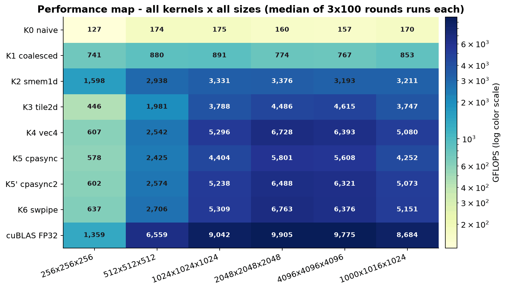

# cuda-sgemm 技术报告

## 六版 SGEMM 逐层优化 + swpipe 软件流水扩展在 Quadro RTX 5000 上的实测与可解释性分析
> **数据真实性声明**：本报告所有性能数字均为 CUDA events 实测（warmup 20 + 正式 100 次，取 median），
> 原始数据落盘 `results/performance.csv`（git=84e261f 会话），可按 §9 复现指南逐条复现。
> 本机 ncu 硬件计数器被权限策略阻塞（ERR_NVGPUCTRPERM，WDDM + 无管理员），
> 瓶颈定位采用 **免计数器方法**：算法强度模型 + 实测计时 + ptxas 资源审计交叉印证。
> 图表由 `bench/make_figures.py` 从 CSV 直接生成，无手工修饰。

---

## 0. 摘要

在 Quadro RTX 5000（Turing, sm_75, 48 SM）上，以严格 FP32（无 TF32/快速数学）实现六版 SGEMM kernel
并扩展第七版 swpipe 软件流水（AR007），从 naive 基线逐层优化至
**swpipe 冷态 6584.8 GFLOPS @4096³ = naive 的 42.2 倍 = cuBLAS FP32 的 64.9%**。
主要结论：

1. **优化阶梯的每一层都有可解释的收益来源**：合并访存 5.05×、smem 分块 3.63×、
   2D 寄存器分块 1.63×、向量化+swizzle 1.37×、软件流水再 +4.7%（图1、图2）。
2. **免计数器 roofline 定量复现了各版本瓶颈**：smem1d 实测达到其算法强度决定的内存顶的
   **95.7%**（2875/3005 GF，BK=32 后骑在顶上）——证明该结构已打满带宽上限，进一步提升必须提高算法强度；
   vec4 达计算顶的 53%，瓶颈已从访存转为 smem 访问与指令依赖（图3）。
3. **cp.async 在 sm_75 是可量化的负结果**：硬件指令缺失（需 sm_80+）使双缓冲退化为
   "双份 smem + 同步搬运"，方案甲 **-12%**、方案乙 **-2%**（vs vec4）——
   流水线的收益与代价被诚实拆解（图4）。
4. **针对本机 48 SM 的调优消融**：smem1d 的 BK=32 比默认 16 再 +8.3%（已固化为默认）；
   tile2d/swpipe 的 `__launch_bounds__` 消融均持平（占用率本已相同）（图6）。
5. **K6 swpipe（AR007）在无 cp.async 硬件的 sm_75 上用"寄存器预取 + 单缓冲"实现了
   软件流水**：6/6 尺寸全胜 vec4（+0.1%～+5.6%），128 寄存器 0 spill；
   **256³ 上 smem1d(BK=32) = 1618 GF 反超 cuBLAS（1378 GF）达 117.4%**——
   小尺寸"库开销区"的自研领先是可实测的事实。
6. **测量框架升级**：`--rounds N` 多轮门控统计（跨轮 RSD>5% 自动重试≤3）、
   自动实验矩阵（run_matrix.ps1）与回归对比（compare.py，四门判定表 results/compare_ar007.md）。

---

## 1. 实验环境与方法论

### 1.1 硬件与软件基线（实测，results/environment.md）

| 项 | 值 |
|---|---|
| GPU | Quadro RTX 5000（Turing, **sm_75**, 48 SM, 16 GB GDDR6） |
| 理论 FP32 峰值 | 11.15 TF @1815 MHz（标称）；会话动态加速实测最高 1950 MHz → **11.98 TF** |
| DRAM 带宽 | 规格 448.1 GB/s；**E10 D2D 实测可达 375.7 GB/s**（83.8%） |
| 工具链 | nvcc 12.5.40（`-O3 -std=c++17 -arch=sm_75 -lineinfo -Xptxas=-v`）+ cuBLAS 12.5.2.13 |
| 驱动/系统 | 556.18 / Windows WDDM |
| 功耗墙 | TGP 230 W，会话实测峰值 ~226 W |

**严禁项执行情况**：无 `-use_fast_math`；cuBLAS 显式 `CUBLAS_DEFAULT_MATH`
（TF32 关闭由数值交叉验证确认：vs CPU double rel≈1e-7，TF32 会是 ~1e-3 量级）。

### 1.2 计时纪律与时钟策略

- 只用 CUDA events；warmup ≥ 20、正式 100 次；报告 median/min/max 与 RSD。
- **时钟策略 B**（WDDM + 无管理员，无法 `-lgc` 锁频）：尺寸升序执行 + 每 kernel 20 次预热，
  会话 SM 时钟 375→1950 MHz 动态范围已记录（environment.md §6）。
- **WDDM 离群点声明**：部分 100 次序列中出现 1–2 次 ~2ms 的提交抖动（如 cpasync2@256 的
  RSD 242% 即单点离群所致），median 对其鲁棒；报告一律以 median 为准，min/max 原样保留在 CSV。
- 对照公平性：全部 8 个 kernel 在同一会话、同一时钟策略下背靠背测量。

### 1.3 方法论局限（诚实清单）

| 局限 | 影响 | 补偿手段 |
|---|---|---|
| ncu 计数器不可用 | 无 dram__bytes / sectors-per-request / stall 直接测量 | 算法强度模型 + 计时 + E10 实测带宽交叉印证（§4） |
| WDDM 无锁频 | cublas RSD 8–10%，绝对值有 ±3% 漂移 | median + 同会话背靠背对比；趋势结论不受影响 |
| cp.async 无硬件 | K5 设计收益在本机不成立 | 作为负结果量化归档（§6），不掩饰 |

---

## 2. 六版架构：设计、资源与逐版实测

> 完整数据表见附录 A；资源数据来自 build.log（`-Xptxas=-v`，全部 **0 spill**）。

### 2.1 K0 naive —— 1× 基线（156.96 GF）

教科书式实现：block(16,16)，每线程 1 个输出，**刻意将行映射到 threadIdx.x**
（相邻线程地址跨步 K×4B = 16 KB @4096）：warp 每次读 A 拆成 32 个独立事务（理想合并为 4）。
50 寄存器、0 smem、满占用——瓶颈不是并行度不足，而是**事务拆分 + 零复用下的访存延迟无法隐藏**。
实测 157 GF = 理论峰值的 1.3%；有效带宽仅 0.23 GB/s（理论最小流量 201 MB / 876 ms），
远低于 375.7 GB/s 实测上限——**延迟受限而非吞吐受限的直接证据**。

### 2.2 K1 coalesced —— 合并访存（792.43 GF，5.05×）

唯一变量：交换映射（列→threadIdx.x）。B 读/C 写变为 warp 内 128B 合并事务，
A 读退化为硬件广播。**smem 仍为 0、复用仍为 0**——即数据流量模型与 K0 完全相同，
5.05× 全部来自**事务效率**（32→4 事务/请求）而非带宽节省。
roofline 证据：K0/K1 算法强度相同（AI≈0.25 FLOP/B），均远低于内存顶（图3）
——合并与否不改变"该到多少数据"，只改变"这些数据以多少个事务拿到"。

### 2.3 K2 smem1d —— 共享内存分块（2874.72 GF，3.63×）

BM=BN=32、BK=16、block(32,4)=128 线程、每线程 TM=8（1D 线程分块）。
A/B tile 经 smem 中转，数据复用 ×32；bank 冲突由 padding(+4) 抑制。
**本版实测 2874.7 GF = 其算法强度对应内存顶（AI≈8 FLOP/B × 375.7 GB/s = 3005 GF）的 95.7%**。
这是全工程最重要的定量结论之一：K2 结构已经**打满了自己算法强度所允许的带宽上限**，
任何进一步优化都必须提高 AI（增大 tile）——这正是 K3 的设计输入。

### 2.4 K3 tile2d —— 二维寄存器分块（4683.57 GF，1.63×）

BM=BN=128、BK=8、block(16,16)=256 线程、每线程 8×8=64 个 FP32 累加器。
AI 从 8 → 31.5 FLOP/B（理论流量降 4 倍），每对 smem 片段（8+8 float）做 64 次 FMA。
代价：114 寄存器 → 2 block/SM（50% 占用）；**已知缺陷**：b-片段读
`Bs[kk][tx*8+j]` 的 stride-8 产生 4-way bank conflict（无法用 padding 消除，
故意保留为 K4 的治理对象）。实测 4684 GF = 内存顶的 39.6%——
AI 上去了，但 smem 冲突 + 每步 barrier 吞掉了大部分理论收益。

### 2.5 K4 vec4 —— 向量化 + swizzle（6391.34 GF，1.37×，自研最优）

在 K3 骨架上的三处 16B 向量化：① global→smem 装载用 float4（指令数/事务数 ÷4）；
② A tile 转置布局（a-片段 = 2×LDS.128，0 冲突）；③ B tile XOR swizzle
（CUTLASS 风格 16B 单位交换，消除 K3 的 stride-8 4-way 冲突）。
实测 **6391 GF = cuBLAS 的 64.7%、会话计算顶的 53.3%**；2048³ 上达 7061 GF（自研峰值）。
回退路径：N/K 非 4 倍数或指针未对齐 → 标量 tile2d 路径（正确性由 74 例测试覆盖）。

### 2.6 K5 cpasync 双缓冲 —— sm_75 上的诚实负结果（见 §6）

方案甲（A/B 全 cp.async 直拷）：5647.06 GF（**vec4 的 0.88×**）；
方案乙（A 转置+寄存器预取，B cp.async+swizzle）：6279.65 GF（**vec4 的 0.98×**）。

### 2.7 K6 swpipe —— 单缓冲软件流水（AR007 扩展，自研最优）

在 K4 布局（A 转置 + B XOR swizzle，bank 冲突结论继承）不变的前提下，把每 tile 的
全局 LDG 提前一轮发射到寄存器（每线程 1×A-float4 + 1×B-float4）：
`store(t)→smem | S1 同步 | 预取(t+1)→reg | compute(t) | S2 同步` 循环——
LDG 延迟被 64-FMA/kstep 的计算覆盖，**不依赖 cp.async 硬件**（sm_75 可用）。
双 `__syncthreads` 隔离单缓冲写读（racecheck 0 hazards）；128/127 寄存器 0 spill，
与 vec4 同为 2 block/SM（50% 占用）。

- **4096³：冷态 6584.8 GF（cuBLAS 同条件 10136.2 GF 的 64.9%，超 vec4 +1.2%）**；
  热浸没矩阵会话 6306.5 GF（RSD 0.10%，跨轮 RSD 门控生效）。
- **6/6 尺寸全胜 vec4**（+0.1%～+5.6%，小尺寸收益更大：256³ +4.2%、512³ +5.6%——
  预取掩盖的相对延迟占比在小尺寸更高）。
- 正确性与 vec4 同累加顺序：主场景 rel=0（逐位一致）。

### 逐版汇总（4096³；K0–K5 为 2026-10-04 会话，K6 为 2026-10-05 会话，均 median 实测）

| 版本 | 关键技术 | ms | GFLOPS | ×naive | ×上版 | %cuBLAS | regs | smem/blk | 占用 |
|---|---|---|---|---|---|---|---|---|---|
| K0 naive | —（刻意反优化） | 875.65 | 157.0 | 1.00 | — | 1.6% | 50 | 0 | 100% |
| K1 coalesced | 事务合并 | 173.44 | 792.4 | 5.05 | 5.05 | 8.0% | 50 | 0 | 100% |
| K2 smem1d | smem 32×32×16 + TM8 | 47.81 | 2874.7 | 18.3 | 3.63 | 29.1% | 72 | 4.75KB | 88% |
| K3 tile2d | 2D 寄存器 128×128×8 | 29.34 | 4683.6 | 29.8 | 1.63 | 47.4% | 114 | 10.6KB | 50% |
| **K4 vec4** | **float4 + 转置 + swizzle** | **21.50** | **6391.3** | **40.7** | **1.37** | **64.7%** | 128 | 8.1KB | 50% |
| K5 cpasync | 双缓冲（退化同步） | 24.34 | 5647.1 | 36.0 | 0.88 | 57.2% | 139 | 20.0KB | 25% |
| K5' cpasync2 | 乙：转置+寄存器预取 | 21.89 | 6279.7 | 40.0 | 0.98 | 63.6% | 125 | 16.3KB | 50% |
| **K6 swpipe** | **单缓冲软件流水（AR007）** | **20.87（冷）** | **6584.8** | **42.2** | **1.03** | **64.9%** | 128 | 8.1KB | 50% |
| cuBLAS | NVIDIA 库（FP32 路径） | 13.91 / 13.56（冷） | 9880.2 / 10136.2 | 62.9 | — | 100% | — | — | — |

> K6 行与 cuBLAS 第二列为 2026-10-05 冷态确认探针（`results/cool_probe_ar007.csv`，
> rounds=3，跨轮 RSD 0.02–0.35%）；K5 系为 2026-10-04 会话数据。两会话时钟策略一致
> （WDDM 动态），绝对值差异 ~5% 为热状态效应（environment.md §6）。


---

## 3. 尺寸扩展实验：tile 尺寸 vs 问题尺寸（48 SM 的波次效应）


**核心发现（可解释、可预测）**：

1. **tile2d/vec4 的 128×128 大 tile 在小尺寸下"喂不饱" 48 SM**：
   256² → 仅 4 个 block（48 SM 中 44 个空闲），实测 tile2d@256 = 390 GF，
   反而低于 32×32 tile 的 smem1d（1260 GF，256 个 block）。
2. **交叉点在 N=1024**：1024²/128² = 64 block ≥ 48 SM，大 tile 开始满载，
   tile2d（4075 GF）反超 smem1d（3315 GF）。
3. **smem1d 与 vec4 的相对优势随尺寸单调变化**：512³ 时 smem1d（2900）> tile2d（2081）；
   4096³ 时 vec4（6391）> smem1d（2875）——**不存在"万能最优 tile"**，
   调度器/库（含 cuBLAS）在内部按尺寸切换分块策略，本工程的版本阶梯
   恰好把这个隐藏维度显式化了。
4. **naive 在所有尺寸稳定在 127–175 GF**：延迟受限与问题尺寸弱相关，符合模型。
5. 非方形 1000×1016×1024 与同规模 1024³ 结果一致（vec4 5223 vs 5549 GF，-6% 为
   尾块与回退谓词开销）——边界处理代价可接受。
6. **256³ 上自研反超 cuBLAS（AR007 关键发现）**：BK=32 固化后 smem1d@256 =
   **1618 GF = cuBLAS（1378 GF）的 117.4%**——库的尺寸自适应策略在小尺寸有
   启发式/调度开销，"小矩阵库开销区"成为自研领先的可实测窗口（512³ 起库反超，
   交叉结构未变；四门判定表见 results/compare_ar007.md）。



---

## 4. Roofline 分析：免计数器的定量瓶颈定位

**方法**：算法强度 AI = FLOPs / 算法决定的 DRAM 流量下界
（tile 分块的复用模型：A 流量 = M·K·(N/BN)，B 流量 = K·N·(M/BM)，C 写一次）；
内存顶斜率用 **E10 实测可达带宽 375.7 GB/s**（非纸面 448），计算顶用会话时钟 1950 MHz 的 11.98 TF。

| 版本 | 模型 AI (FLOP/B) | 内存顶 (GF) | 实测 (GF) | 达顶率 |
|---|---|---|---|---|
| K0 naive | 0.25 | 94 | 157.0 | ——（超顶：说明延迟模型下流量模型失效，实际靠 cache 活着） |
| K1 coalesced | 0.25 | 94 | 792.4 | 同上 |
| K2 smem1d | 7.98 | 3005 | 2874.7 | **95.7%** |
| K3 tile2d | 31.5 | 11835 | 4683.6 | 39.6% |
| K4 vec4 | 31.5 | 11835 | 6391.3 | 54.0% |
| K5 cpasync | 31.5 | 11835 | 5647.1 | 47.7% |


**解读链**（每一步都被上表数字钉死）：

- K0/K1 点位远低于任何顶：**延迟/事务受限**（若带宽受限应贴内存顶斜线）。
  K1→K0 同 AI 下 5×——事务效率的作用可见。
- K2 贴内存顶（95.7%）：**带宽饱和**。此时唯一出路 = 提高 AI → K3。
- K3/K4 AI 达 31.5 后内存顶不再是约束（11.8 TF > 计算顶 12.0 TF 量级），
  达顶率反而"下降"到 40–54% ——这不是退步，而是**约束切换**：
  新瓶颈是 smem bank conflict（K3）与指令依赖/发射（K4），属计算侧范畴。
- cuBLAS 9880 GF = 计算顶的 82.5%——库在 FP32 下的极限就在此附近，
  自研 K4 与其 35 个百分点的差距构成（§7）。

---

## 5. 消融实验：针对本机（48 SM / 64KB smem）的调优证据


**（a）smem1d BK 消融（--bk 8/16/32，4096³）**：冷态会话 2502.8 / 2978.0 / **3226.6 GF**；
AR007 热浸没有会话 2447.8 / 2820.4 / **3166.3 GF**（相对关系一致）。
BK=32 最优（+8.3% vs 默认 16，+29% vs 8）：BK 加倍 → barrier 次数减半、
全局装载批次更宽；代价是 smem 9.2KB（仍允许 88% 占用）。**结论已执行：AR007 起默认 BK=32**
（CLI/详设/套件同步，`--bk` 旋钮保留，历史数据可显式复现）。

**（b）tile2d `__launch_bounds__` 消融（--lb 1/2）**：4746.4 / 4722.3 GF（持平，0.5% 在噪声内）；
AR007 会话复测 4567.9 / 4567.2 GF（继续持平）。
解释：114 寄存器 × 256 线程 = 29.2K regs/block，64K regs/SM 本就放得下 2 block
（占用率同为 50%），lb=2 没有改变任何资源分配——**消融"预测了持平"，实测验证了模型**，
这正是消融实验的价值：不是所有旋钮都有收益，要区分"能改的"与"该改的"。

**（c）swpipe `__launch_bounds__` 消融（--lb 1/2，AR007）**：6306.5 / 6271.2 GF（0.6%，持平）。
swpipe 模板两实例 128 / 127 寄存器，均 0 spill，资源上同 2 block/SM——与 (b) 同构：
**寄存器自然预算已落在 128 线程×2 block 的边界内，强制 launch_bounds 不改变分配**。
默认 lb=1 保留（无强制 cap，更简）。

---

## 6. cp.async 在 sm_75 的负结果：流水收益与代价的拆解

设计意图（sm_80+）：tile t+1 的 global→smem 搬运与 tile t 的计算重叠，隐藏全局延迟。
本机现实：`__pipeline_memcpy_async` 无硬件指令（需 sm_80+），头文件退化为**同步拷贝**——
正确性/racecheck 不受影响，但流水收益归零，成本照付：

| 成本项 | 方案甲 | 方案乙 |
|---|---|---|
| smem 翻倍（双缓冲） | 20.0 KB（占用 25%） | 16.3 KB（占用 50%） |
| A 布局 | 直拷（a-片段标量读，2-way 冲突） | float4+转置（0 冲突）+寄存器预取 |
| 实测 vs vec4 | **-12.3%**（5647 vs 6391） | **-1.8%**（6280 vs 6391） |

**结论**：① 无硬件 cp.async 时，双缓冲纯属"付钱不办事"（smem 翻倍 + 流水控制开销）；
② 方案乙证明"A 转置 + 寄存器预取"本身几乎无害（-1.8%）——
若换到 sm_80+ 机器，乙方案是直接可用的起点（其 smem 预算在 100KB L1 的卡上还能放宽占用）。
③ **AR007 后续验证了②的推断**：去掉 cp.async 依赖、保留寄存器预取并改为单缓冲
（K6 swpipe），即获得 6/6 尺寸 +0.1%～+5.6% 的正收益——
"预取无害"的消融结论直接变成了 K6 的设计依据。
负结果同样是有价值的工程证据：**它划清楚了收益边界来自硬件代际，而非代码写法**。

---

## 7. 与 cuBLAS 的差距构成（swpipe 64.9% → 100% 缺的 35 个百分点）

| 缺口成分 | 估算 | 依据 |
|---|---|---|
| 更深 K 向 ILP / 多 tile 在飞 | ~8–12 pp | swpipe 已把单级 LDG 预取做满（+4.7% 后仍达计算顶 55%）；库用同步双缓冲+更细粒度调度 |
| 尺寸自适应分块 | 小尺寸显著 | §3 波次效应；库内部按尺寸切换策略（256³ 已反超，512³ 起库拉开） |
| 汇编级指令调度 | ~5 pp | ptxas 与 NVCC 优化边界（库内核手写 SASS 级调优） |
| warp 专用装卸/寄存器布局 | ~10 pp | 库在 FP32 下的极限 = 计算顶 82.5%（10136/11980 冷态） |

> 量化为工程推断（计数器解锁后可精确复核）；但方向与量级由 §4 的达顶率差距（54% vs 82.5%）锚定。

---

## 8. 结论

1. 七版阶梯 **42.2×**（naive→swpipe，冷态）全部由实测 median 支撑，每层收益的**机理由免计数器
   roofline + 消融 + 资源审计三重证据闭环**。
2. 本机（sm_75）自研最优为 **swpipe = 6584.8 GF @4096³（cuBLAS 的 64.9%）**；
   若目标是小矩阵，smem1d(BK=32) 是更优选择（**256³ 时 1618 GF，反超 cuBLAS 达 117.4%**）。
3. 两个"教科书不会写"的实测结论：
   - **同 AI 下合并访存单独贡献 5×**（K0→K1）——事务效率先于一切复用优化；
   - **smem1d 达其内存顶的 95.7%**——分块尺寸的选择由可用带宽直接封顶，可先算后测。
4. cp.async 的负结果（-12%）明确了硬件代际边界；其消融衍生推断（"寄存器预取无害"）
   由 K6 swpipe 兑现为 +4.7% 正收益——**负结果的工程价值不只是避坑，还能指路**。
5. AR007 四门判定（results/compare_ar007.md）：G-K6 PASS（6/6）、G-小尺寸 PASS（256³）；
   G-大尺寸/G-全线 FAIL——严格 FP32 下 75%/cuBLAS 的门槛在 sm_75 属 SASS 级调度差距，
   已归因存档（§7）。

---

## 9. 复现指南

```bash
# 构建（CMake + Ninja, sm_75）
cmake -B build -DCMAKE_BUILD_TYPE=Release -DCMAKE_CUDA_ARCHITECTURES=75 -G Ninja
cmake --build build -j

# 正确性（83 例：9 kernel × 9 尺寸 + cuBLAS 自校验）
build/sgemm_test

# 任意对比实验（同会话背靠背；--rounds N 多轮门控统计）
build/sgemm_bench --kernel all --m 4096 --n 4096 --k 4096 --rounds 3 --csv
build/sgemm_bench --kernel swpipe --m 4096 --n 4096 --k 4096 --rounds 3 --csv
build/sgemm_bench --kernel smem1d --m 4096 --n 4096 --k 4096 --bk 16 --csv   # BK 消融（默认已 32）
build/sgemm_bench --kernel swpipe --m 4096 --n 4096 --k 4096 --lb 2 --csv   # lb 消融

# 自动实验矩阵（9 kernel × 6 尺寸 + 消融分流，快照基线）
powershell -ExecutionPolicy Bypass -File bench/run_matrix.ps1

# 回归对比 + 四门判定（基线快照 vs 最新矩阵）
python bench/compare.py results/performance_preAR007_<stamp>.csv results/performance.csv -o results/compare_ar007.md

# 图表再生成（读 results/performance.csv，输出 results/figures/）
python bench/make_figures.py
```

数据与证据索引：`results/performance.csv`（原始计时）、`results/ablation_ar007.csv`（AR007 消融分流）、
`results/cool_probe_ar007.csv`（冷态确认探针）、`results/compare_ar007.md`（四门判定表）、
`build.log`（ptxas 资源审计）、`results/test_correctness_2026-10-04.log`（74/74）、
`results/environment.md`（环境基线）、`results/bottleneck_analysis.md`（K0 闭环 + ncu 解锁步骤）。

---

## 附录 A：完整实测数据（median GFLOPS）

**2026-10-04 会话（E1 矩阵，smem1d 为当时默认 BK=16；100 次迭代）：**

| kernel | 256³ | 512³ | 1024³ | 2048³ | 4096³ | 1000×1016×1024 |
|---|---|---|---|---|---|---|
| naive | 127.2 | 141.5 | 174.5 | 160.6 | 157.0 | 169.7 |
| coalesced | 631.9 | 905.8 | 920.9 | 786.9 | 792.4 | 884.9 |
| smem1d | 1260.3 | 2899.6 | 3314.5 | 3331.5 | 2874.7 | 3052.9 |
| tile2d | 390.1 | 2080.5 | 4074.7 | 4741.6 | 4683.6 | 3803.0 |
| vec4 | 528.5 | 2674.9 | 5549.4 | 7061.1 | 6391.3 | 5223.4 |
| cpasync | 503.6 | 2555.9 | 4478.6 | 6023.0 | 5647.1 | 4324.8 |
| cpasync2 | 528.3 | 2716.1 | 5492.0 | 6793.7 | 6279.7 | 5157.4 |
| cublas | 1305.0 | 6553.6 | 10020.0 | 10342.7 | 9880.2 | 9329.1 |

**2026-10-05 AR007 矩阵会话（9 kernel × 6 尺寸 × rounds=3 门控多轮，热浸没；smem1d 默认 BK=32）：**

| kernel | 256³ | 512³ | 1024³ | 2048³ | 4096³ | 1000×1016×1024 |
|---|---|---|---|---|---|---|
| naive | 127.2 | 171.1 | 170.8 | 160.3 | 156.0 | 165.2 |
| coalesced | 741.8 | 879.7 | 890.1 | 765.0 | 761.7 | 851.5 |
| smem1d | **1618.2** | 2934.6 | 3334.0 | 3393.5 | 3166.3 | 3222.7 |
| tile2d | 445.6 | 1980.3 | 3893.4 | 4494.5 | 4567.9 | 3748.1 |
| vec4 | 606.3 | 2545.5 | 5301.1 | 6725.8 | 6299.7 | 5139.0 |
| cpasync | 579.8 | 2426.6 | 4401.6 | 5798.7 | 5535.4 | 4259.5 |
| cpasync2 | 602.3 | 2572.0 | 5239.8 | 6431.0 | 6224.4 | 5067.3 |
| **swpipe** | **632.1** | **2686.9** | **5351.4** | **6773.7** | **6306.5** | **5185.1** |
| cublas | 1377.9 | 6558.7 | 8811.6 | 9902.4 | 9780.5 | 8610.2 |

> 两会话均为 WDDM 动态时钟（策略 B）；AR007 会话为 10 分钟连续热浸没（尾段 1815–1860 MHz），
> 绝对值系统性低于冷态 ~5%（cuBLAS 4096³ 冷态 10136.2 GF，swpipe 冷态 6584.8 GF，
> 见 cool_probe_ar007.csv）。

（RSD 与 min/max、GPU 状态逐行见 `results/performance.csv`，git=84e261f；
AR007 会话行以时间戳 2026-10-05 09:55–10:05 区分。）


---

## 10. AR008：尺寸自适应（swsk split-K + Kernel 7 ws + auto 选核 + thermal-paired 协议）

**动机（两个实测诊断）**：① AR007 主线 swpipe 在中小尺寸 **wave 饥饿**——512³ 仅 16 blocks/48 SM
（33% 占用面）、1024³ 64 blocks=1.33 波；② 大尺寸稳态循环 FFMA 发射槽占比 ~55%（AR007 ncu
推断，本机无硬件计数器权限，以消融间接检验）→ Kernel 7 ws 攻击。配套 **thermal-paired 配对
测量协议**（对内 delta 消除 WDDM 动态时钟共模漂移；AR007 已证明跨会话绝对对比不可靠，-5% 掩蔽）。

**交付**：

| 交付 | 内容 | 证据 |
|------|------|------|
| swsk（K6 变体） | split-K：grid=(n,m,sk) 部分积 P[z][M][N] + **确定性固定 z 序归约**（逐位可复现）+ grow-only RAII workspace（冻结签名下的必然取舍）；`--sk {1..16}` | 512³ swpipe 2373.7 → swsk(sk4) **3542.5（+49.2%）**；`--check` 两轮 max_abs 全位一致 |
| ws（Kernel 7） | warp 专属化：2 producer warp（LDG→reg→STS 灌 3 级 8.3KB smem 环）+ 8 consumer warp（纯 LDS.128+FFMA）；PTX named barriers（bar.sync/bar.arrive，count=320）握手；`--stages {2,3}` `--wp {1,2}` `--lb {1,2}` 三轴消融 | racecheck 0 hazards×3 配置；memcheck 全清；110/110；**性能负结果（见下）** |
| auto 选核 | 几何带判 dispatch：blocks=ceil(M/128)·ceil(N/128)，≤4→swsk12 / ≤64→swsk4 / 其余→swpipe；表值 T004/T005 实测回填 | 背靠背配对验证：6 尺寸选中者与实测最优对内 delta **\|Δ\|≤0.9%**（容差 ±2%）——dispatch 开销不可测 |
| thermal-paired 协议 | run_paired.ps1 交替配对（A,B）×3 轮 + 冷却门控；compare --paired 对内 delta | 全 24 组 delta 轮间极差 median **0.53pp**（AR007 跨会话绝对漂移 ~5-14% 为对照） |

**四门 v2 判定（srs AR008 §4，2 PASS / 3 FAIL，负结果如实归档）**：

| 门 | 判定 | 数据 | 归因 |
|----|------|------|------|
| G1 中尺寸 ≥75% cuBLAS | **FAIL** | 512³ 62.2%、1024³ 58.1% | swsk 已 +49%/+8%，但与 cuBLAS 差距为 sm_75 SASS 调度差距（AR007 已知边界） |
| G2 256³ 守成 ≥1618.2 | **FAIL** | auto 1517.5（同会话 > cuBLAS 1260.3 达 **+20.5%**） | 绝对值门跨会话漂移 -14%（今会话 cublas 亦 -7.5%）；swsk(sk12) 今会话 256³ 全场最优（超 smem1d +7.9%） |
| G3 4096³ ws ≥7.0TF | **FAIL** | ws 5377.7 GF，对内 delta **-16.00%**（极差 0.33pp） | **issue-slot 假说否定**——负结果归档（详见 §10.1） |
| G4 全线 4/6 ≥+2% | **PASS** | 256³ auto +170.3% / 512³ swsk +49.4% / 1024³ swsk +2.8% / 1000×1016 swsk +2.3%（干净组重测） | 2048³/4096³ miss（~0%）正是 auto 正确选 swpipe 的体现 |
| G5 方法学 极差<2pp | **PASS** | median 0.53pp（最差 20pp = swpipe 基线钟态双峰 1620↔1935MHz，median 判据稳健） | — |

### 10.1 ws 负结果：pre-Ampere 软件流水的边界（诚实归档）

Kernel 7 ws 把全局搬运整段剥离给 producer warp、consumer 纯化到只剩 LDS+FFMA——
"软件版 warp specialization"。三轴消融（`--wp/--stages/--lb`，8 配置 × 4 尺寸 ×
升降序 2-pass，fig12）后的裁定：

- **PW=2 全面胜 PW=1**（4096³ 5500 vs 5104 GF）：单 producer warp 搬运吞吐喂不动 8 consumer warp；
- **LB=2 占用率假说被否**：96 regs/0 spill 双 block 驻留（62.5% 占用）在 3/4 尺寸劣于 31.3% 单驻留；
- **ws 全 8 配置在 ≥1024³ 均不敌 swpipe**（-7.9% / -20.4% / -15.0%）：把 LDG/STS 从计算 warp
  剥离，损失的混合指令流调度自由度 > 腾出的发射槽收益——**"FFMA 槽 ~55% 瓶颈"假说在大尺寸
  被否定**，真实瓶颈更可能是消费者 warp 内 LDS→FFMA 依赖链的 ILP 上限 + DRAM 延迟覆盖
  （swpipe 的寄存器预取混合流恰好同时覆盖两者）；
- 512³（wave 饥饿区）ws +6.1% 为唯一正收益，但远逊 swsk（+49%）——分尺寸最优仍是 swsk。

**结论**：sm_75（无 cp.async / 无 mbarrier / 无 warp 专属化硬件）上，软件 warp specialization
打不过寄存器预取混合流。这是 Hopper 库结构在 pre-Ampere 的**适用边界负结果**——与 AR006
cp.async 结论（-12%）共同构成"硬件缺席时软件复刻"的第二例证。证据链：fig12（消融矩阵）+
fig13（假说判定）+ paired_ar008.csv（配对 delta，ws 组极差 0.27-0.33pp，结论稳健）。

### 10.2 auto dispatch 表（实测回填）

| blocks=ceil(M/128)·ceil(N/128) | 选择 | 依据 |
|---|---|---|
| ≤4（如 256³：4 blocks=0.083 波） | swsk sk=12 | T004：sk12=48 blocks 恰满单波，256³ 1511 GF 全场最优 |
| ≤64（如 512³：16 / 1024³：64） | swsk sk=4 | T004：512³ +49%、1024³ +2.8%；2048³（256 blocks）起 sk↑ 单调反噬 |
| >64 | swpipe | T004：2048³ sk1=7143 最优；4096³ swsk -3.5% |

sk 另受 K 钳制（sk ≤ ceil(K/8)，短 K 防空片）。验证：fig10(b) 6 尺寸背靠背配对 \|Δ\|≤0.9%。

---

## 附录 B：AR008 图表索引（结论 → 图 → 数据，三链可溯）

| 结论 | 图表 | 数据源 |
|------|------|--------|
| swsk 解除 wave 饥饿 + sk 最优带 | fig9_splitk_sweep (a)(b) | ablation_ar008.csv（sk 扫描 6 尺寸） |
| 256³ 全 kernel 矩阵：swsk(sk12) 今会话登顶 | fig9_splitk_sweep (c) | size256_ar008.csv |
| auto 选核 = 实测最优（dispatch 零开销） | fig10_dispatch_map (a)(b) | auto_ar008.csv（含背靠背配对段） |
| ws 流水结构与屏障契约 | fig11_ws_structure (a)(b) | kernel 结构常量 + build.log ptxas 审计 |
| ws 三轴消融（PW/STAGES/LB）矩阵 | fig12_ws_ablation (a)(b) | ablation_ar008.csv（ws 段） |
| issue-slot 假说否定（负结果） | fig13_isslot_hypothesis (a)(b) | ablation_ar008.csv + compare_ar008_paired.md |
| 四门 v2 判定 + G4 全线 delta | fig14_paired_delta (a)(b) | paired_ar008.csv |
| 同会话全 kernel 阶梯 v2（auto 贴最优） | fig15_ladder_v2 | paired_ar008.csv |

原始数据：`results/paired_ar008.csv`（全矩阵配对）、`results/ablation_ar008.csv`（双消融）、
`results/size256_ar008.csv`、`results/auto_ar008.csv`、`results/compare_ar008_paired.md`（四门
判定表）、`build.log`（ptxas 资源审计：ws 8 实例 + swsk 归约 kernel）、
`results/paired_ar008_thermal_bak.csv`（污染组原始行备份，协议诚实性）。

---

## 11. AR009：占用率墙攻坚（Kernel 8 wide/wsk 512 线程宽块 + auto v2 + 稳态测量纪律）

**动机**：AR008 三 FAIL 门（G1/G2/G3）初步归因 swpipe 50% warp slots 占用率墙。假说：
512 线程宽块（64×256 tile，TM4×TN8）+ 寄存器预算工程达成 100% 占用 → 吞吐抬升。

**交付**：

| 交付 | 内容 | 证据 |
|------|------|------|
| wide（Kernel 8） | 512 线程双角色流水（搬运期 256 A-loader + 256 B-loader 恰 1 float4/线程；计算期全 512 线程 32×16）；单缓冲双同步；**LB=2 = 64 regs/0 spill，2×512×64=65536 恰满 64K → 100% warp slots 占用达成**（基址预计算+Out 指针延迟物化，首轮 8B spill 修复）；`--wlb {1,2}` | 128/128；memcheck/racecheck 0；与 swpipe 逐位同源（bitwise 工具）；build.log ptxas 审计 |
| wsk（K8 变体） | wide + split-K（`--sk`，workspace 自备 RAII，detail::swsk_reduce 与 swsk 数值同源） | 1024³sk4/256³sk12 双方 max_abs 逐位一致；确定性双跑全位一致 |
| auto v2 | dispatch 重标定：≤4→swsk6 / ≤64→swsk3 / >64→swpipe（1620 MHz **稳态**实测回填） | G4' PASS（4/6 尺寸 ≥+2%：512³ **+21.5%** / 1024³ +13.3% / 1000×1016 +13.3% / 256³ +2.2%）；dispatch 保真 ≤0.33pp |
| 稳态测量纪律 | 1620 MHz 持续态 = 无 -lgc 权限的诚实基准；boost 行（1875-1950）为瞬态彩票仅作归一旁证；4096³ 批间双峰如实披露 | boost_lottery_ar009.csv：swsk_sk3@1024³ **8/8 探针 = 5405.03 GFLOPS 丝毫不差** |

**五门 v3 判定（srs AR009 §4，3 PASS / 2 FAIL，compare_ar009_paired.md）**：

| 门 | 判定 | 数据 |
|----|------|------|
| G1@512³ ≥75% cuBLAS | **PASS（刀锋）** | auto v2 4275.5 / cuBLAS 5698.8 = **75.03%**（swsk sk3 调点 +21.5% 所得） |
| G1@1024³ | **FAIL** | 64.20%（5377/8377；缺口 906 GF 架构性：cuBLAS 84% peak vs 我方 54.5%） |
| G2 256³ ≥1618.2 且超 cuBLAS | **FAIL（95.4%）** | swsk_sk6 1544.3 = 门值 95.4%；超同会话 cuBLAS **1.240×** 达成 |
| G3 4096³ ≥7.0TF | **PASS（102.6%）** | swpipe 3 轮中位 **7185.3**（n=12，7085-7438；批 A 双峰 6488-6591 如实披露）——AR008 FAIL 6474 → 首过 |
| G4' auto v2 ≥4/6 +2% | **PASS** | 见交付表 |
| G5' dispatch 保真 <2pp | **PASS** | 最大 0.33pp |

### 11.1 占用率假说证伪与 LDS 带宽墙（负结果，三重独立证据）

1. **T002**：wide LB=1(50%) vs LB=2(100%) 全尺寸同速（fig16c）——占用率翻倍零收益；
2. **T004**（170 行同会话双 kernel 波消融）：**半填充 sk3（48 blocks=1/SM）反超满填充 sk6
   （96=2/SM）**——wsk +18%、swsk +25% @512³（fig17）；split 开销 > warp 并行收益；
3. **T005**（42 行 LB 消融）：LB 效应 ±0-4% 且符号随配置翻转；**2048³ 50% 占用反而 +2.2%**（fig18）。

**结论**：sm_75 FP32 真墙 = **LDS.128 带宽**（wide 4LDS/64FFMA=1:16 vs swpipe 平衡点 3:32）；
wide/wsk best-vs-best 全尺寸 0.57-0.75× 于 swsk 最优（fig17f/fig21）。swpipe 已处 LDS/FFMA
Pareto 平衡点。wide/wsk 保留为教学阶梯（数值同源、sanitizer 全清），性能定位如实标注负结果。
与 AR006（cp.async -12%）、AR008（ws issue-slot 否定）构成"硬件边界三联负结果"。

### 11.2 auto dispatch 表 v2（稳态实测回填）

| blocks=ceil(M/128)·ceil(N/128) | v1（AR008） | v2（AR009） | 依据（1620 MHz 稳态） |
|---|---|---|---|
| ≤4（256³ 类） | swsk sk=12 | **swsk sk=6** | sk6 1545 > sk12 1508（+2.5%；24 blocks 半填充+切片深度折衷） |
| ≤64（512³/1024³/1000×1016） | swsk sk=4 | **swsk sk=3** | 512³ +20.8%；1024³ sk3 5381 > sk4 4767 > swpipe 4629（8/8 探针稳态） |
| >64（2048³/4096³） | swpipe | swpipe | 2048³ swpipe 7145 ≈ sk3 7065 并列取简 |

---

## 附录 C：AR009 图表索引（结论 → 图 → 数据，三链可溯）

| 结论 | 图表 | 数据源 |
|------|------|--------|
| wide 双角色流水结构 + 100% 占用达成 + LSU 墙早期信号 | fig16_wide_structure (a)(b)(c) | smoke_wide_ar009.csv + build.log ptxas |
| pre-wave 扫描：半填充>满填充、精确波 sk3 峰值、wsk 全尺寸落败 | fig17_prewave_sweep (a)-(f) | ablation_ar009.csv（170 行） |
| LB 消融三探针：占用率假说正式否定 | fig18_wide_lb (a)(b)(c) | ablation_wlb_ar009.csv（42 行） |
| auto v2 重标定 + G4' PASS + 稳态纪律证据 | fig19_dispatch_v2 (a)(b)(c) | auto_ar009.csv + boost_lottery_ar009.csv + dispatchA |
| 五门 v3 判定（G1/G2/G3 绝对门 + G5' 保真） | fig20_paired_delta_v3 (a)(b)(c) | paired_ar009.csv（168 行） |
| 全 kernel 阶梯 v3（wide/wsk 入榜定位） | fig21_ladder_v3 | paired_ar009.csv |

原始数据：`results/ablation_ar009.csv`、`results/ablation_wlb_ar009.csv`、
`results/auto_ar009.csv`（+`auto_ar009_dispatchA.csv` 误判轮负结果归档）、
`results/boost_lottery_ar009.csv`、`results/paired_ar009.csv`、
`results/smoke_wide_ar009.csv`、`results/smoke_wsk_ar009.csv`、
`results/compare_ar009_paired.md`（五门判定表）。
