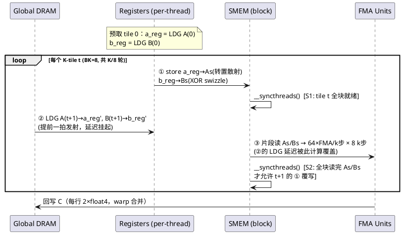
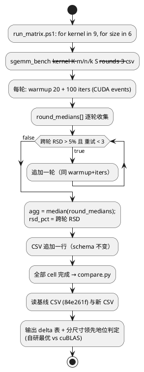

# AR007 详细设计 — rtx5000-deep-tuning（K6 软件流水 + 框架能力升级）

| 组件名称 | cuda-sgemm（严格 FP32 SGEMM 六版阶梯 + 扩展变体） |
| --- | --- |
| AR系统流水号 | AR007 |
| AR描述 | 针对 Quadro RTX 5000 (sm_75) 的深度调优：新增 K6 `sgemm_swpipe` 软件流水 kernel（寄存器预取，无 cp.async 依赖）；bench 框架升级（多轮统计 + RSD 门控 + 自动实验矩阵 + 回归对比）；实测最优参数固化（smem1d BK 默认 32）并修订组件详设。 |

# 2 动态行为

## 交互时序图（K6 软件流水单 tile 周期，线程视角）



# 3 功能点分解

| 序号 | 功能点名称 | 功能点描述 | srs 追溯 |
| --- | --- | --- | --- |
| 1 | K6 swpipe kernel | 单缓冲软件流水：A/B float4 寄存器预取 + vec4 转置/swizzle 布局 + 双屏障写读隔离 | FR3.1 |
| 2 | K6 消融定稿 | `__launch_bounds__(256)` vs `(256,2)`：寄存器/占用率/spill 三元实测取舍 | FR3.1 / NFR 资源 |
| 3 | 多轮统计与门控 | `--rounds N`：逐轮 median、跨轮 RSD>5% 自动重试（≤3），聚合取轮间 median | FR3.2 |
| 4 | 自动实验矩阵 | `bench/run_matrix.ps1`：9 kernel × 6 尺寸 + 消融旋钮一键执行 | FR3.3a |
| 5 | 回归对比工具 | `bench/compare.py`：基线/新会话 CSV → delta 表 + 领先地位判定 | FR3.3b |
| 6 | 参数固化与 spec 修订 | smem1d 默认 BK 32；详设 §4.1/§4.3/§4.6 同步 | FR3.4 |

# 4 实现设计

## 4.1 功能实现思路

1. **K6（方案 A，已批准）**：不引入新布局——As[BK][BM+PAD_A] 转置 + Bs[BK][BN] XOR
   swizzle 与 vec4 完全一致（bank 冲突结论可直接继承）；唯一变化是把「每 tile 的全局
   LDG」从计算循环内提前到上一轮（寄存器中转）。正确性与 vec4 同累加顺序（逐位一致路径）。
2. **框架**：`time_kernel` 保持不动（单轮语义兼容历史数据）；新增
   `time_kernel_rounds` 聚合层。CSV schema 冻结不变（一行一结果），`rsd_pct` 字段在
   rounds>1 时语义为跨轮 RSD（详设 §4.3 补注），rounds=1 行为与历史完全一致。
3. **固化**：默认值改动唯一入口 `g_smem1d_bk`；CLI/详设/测试预期同步，消融旋钮保留
   （bk=8/16/32 三模板已实例化）。

## 4.2 功能实现设计

### 4.2.1 流程图（K6 主循环与屏障契约）

```plantuml
@startuml
start
:分配/初始化 64 累加器 c[8][8];
:计算搬运任务 (ld_a_row, ld_a_kq,\nld_b_krow, ld_b_unit) — 同 vec4 划分;
:a_reg = loadA_guard(tile 0);
b_reg = loadB_guard(tile 0);
while (t < num_tiles) is (还有 tile)
  :store a_reg→As / b_reg→Bs;
  :__syncthreads()  [S1];
  if (t+1 < num_tiles) then (yes)
    :a_reg = loadA_guard(t+1);\nb_reg = loadB_guard(t+1);  # 全局读提前
  endif
  :kk 0..7: 片段读 + 64 FMA（全展开）;
  :__syncthreads()  [S2];
endwhile (结束)
:回写 C（行守卫 + 2×float4）;
stop
@enduml
```

### 4.2.2 流程说明

- **屏障契约**：S1 保证「tile t 的 smem 数据全块可见后才计算」；S2 保证「全块读完
  As/Bs 后下一轮才可覆写」——单缓冲复用的正确性核心（racecheck 抽查义务，srs NFR）。
- **零填充守卫**：`loadX_guard` 越界（行/列/K 越界）返回全零 float4（不访问越界地址），
  主路径条件（N%4==0 ∧ K%4==0 ∧ 16B 对齐）保证 quad 粒度完整，无需部分拷贝。
- **寄存器预算**：64 acc + 8（a_reg+b_reg 持久）+ 瞬态片段；ptxas 结果决定占用率，
  消融（lb∈{1,2}）以实测定稿——spill=0 为硬门，若 lb=2 强制 spill 则弃用并记录。
- **回退**：非对齐 → `sgemm_2d_tile`（与 vec4 相同谓词，`--verbose` 打印）。

### 4.2.3 流程图（框架：多轮门控与自动矩阵）



## 4.3 接口描述

**新增（内部，全部为本仓内部接口，无服务器/第三方交互）：**

```cpp
// include/sgemm_kernels.h —— 冻结签名兼容的扩展变体（第 9 个注册项）
void sgemm_swpipe(const float* A, const float* B, float* C, int M, int N, int K);
// 注册表：K_SWPIPE = 7（插在 K_CPASYNC2 与 K_CUBLAS 之间），KERNEL_COUNT 8→9
// 消融旋钮：namespace sgemm { extern int g_swpipe_min_blocks; }  // 默认 1

// include/common.h —— 多轮统计（time_kernel 单轮语义保持不变）
struct MultiRoundStats {
    int rounds;                    // 实际执行轮数（含自动重试）
    std::vector<double> round_ms;  // 逐轮 median
    double agg_ms;                 // 轮间 median（最终报告值）
    double cross_rsd;              // 跨轮 RSD（百分数）
    double max_within_rsd;         // 最大轮内 RSD
    TimingStats best_round;        // agg 对应轮的完整 min/max/median
};
template <class Launch>
MultiRoundStats time_kernel_rounds(Launch launch, int warmup, int iters,
                                   int rounds, double rsd_gate_pct = 5.0,
                                   int max_retries = 3);
```

**CLI 扩展**：`--rounds <n>`（默认 1）；`--kernel swpipe`；`--lb` 同时服务 tile2d 与
swpipe（按 kernel 名分派到对应旋钮）。

**脚本接口**：`bench/run_matrix.ps1 [-Sizes ...] [-Kernels ...] [-Rounds 3]`；
`bench/compare.py <baseline.csv> <new.csv> [-o report.md]`（退出码 0=可比对完成）。

## 4.4 代码设计

```text
cuda-sgemm/
├── include/sgemm_kernels.h        # [改] +sgemm_swpipe 声明/注册/旋钮；KERNEL_COUNT=9
├── include/common.h               # [改] +MultiRoundStats/time_kernel_rounds；CLI --rounds
├── src/sgemm_swpipe.cu            # [新] K6 kernel（自包含，注释契约齐全）
├── src/main.cu                    # [改] usage/旋钮分派/--rounds 路由
├── src/sgemm_smem_1d.cu           # [改] g_smem1d_bk 默认 16→32
├── tests/test_correctness.cu      # [不改] 按 KERNEL_COUNT 动态遍历 → 自动 83 例
├── CMakeLists.txt                 # [改] KERNEL_SOURCES + sgemm_swpipe.cu
├── bench/run_matrix.ps1           # [新] 自动实验矩阵
├── bench/compare.py               # [新] 回归对比 + 领先地位判定
├── bench/make_figures.py          # [改] KERNELS+swpipe；阶梯/热力图等纳入 K6
└── specs/component-detail-design/cuda_sgemm_spec.md   # [改] §4.1/§4.3/§4.6
```

模块化要点：kernel 侧零耦合（新文件自包含、注册表单点扩容）；框架侧分层清晰
（计时内核 time_kernel / 聚合层 time_kernel_rounds / 编排层 run_matrix / 分析层
compare+figures），各层可独立复用。

# 5 重构设计

无破坏性重构。唯一行为变化：smem1d 默认 BK（16→32），属 srs §3.4 授权的契约变更，
详设 §4.6 同步修订；历史 CSV 中 bk=16 数据保留可溯（旋钮仍可显式回设 16）。

# 6 测试设计

## 6.1 单元测试（UT）

- TDD Red：注册表先加 `swpipe`（fn=nullptr 占位）→ 套件输出 9 行 FAIL（fn 未接入，
  退出码非零）——Red 可观察（沿用 AR001 防护逻辑）。
- Green：实现后 9 尺寸全 PASS（判据 rel≤1e-4；主场景预期与 vec4 同路径 rel=0 或 1e-6 级）。

## 6.2 接口测试

- CLI 合规：`--list-kernels` 列出 9 项；`--kernel swpipe` 可用；`--rounds 0/负数` 报
  CLI_ERROR（沿现有校验风格）；`--bk/--lb` 对应 kernel 分派正确。
- 回退路径：`1023x1024x511`（K%4!=0）与 `130x257x66`（N%4!=0）→ `--verbose` 打印
  "scalar fallback"。

## 6.3 业务场景测试（ST 验收四门）

| 门 | 判定数据 | 通过条件 |
| --- | --- | --- |
| G-小尺寸 | 新会话 256³（及 512³） | 自研最优 > cuBLAS 实测 median |
| G-大尺寸 | 新会话 4096³ | 自研最优 ≥7.2 TF 且 ≥cuBLAS 的 75% |
| G-全线 | 6 尺寸 × 全 kernel delta 表 | ≥4/6 尺寸刷新纪录（≥2%） |
| G-K6 | 4096³ swpipe vs vec4 | swpipe > vec4（负结果如实归档） |

## 6.4 异常场景测试

- WDDM 抖动：`--rounds 3` 下 cuBLAS 跨轮 RSD 报告与门控重试行为（srs FR3.2 验收）；
- 边界退化：K=1 / 1x1x1 / 17x33x65 对 swpipe 的守卫路径（零填充，不越界）；
- 资源异常：ptxas 审计 spill≠0 即缺陷（修复或按消融记录取舍）；
- racecheck：K6 单缓冲写读交替 → `--tool racecheck` 0 hazards。
