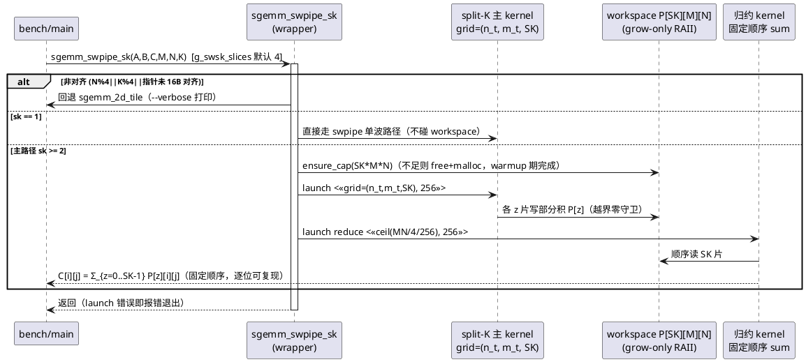
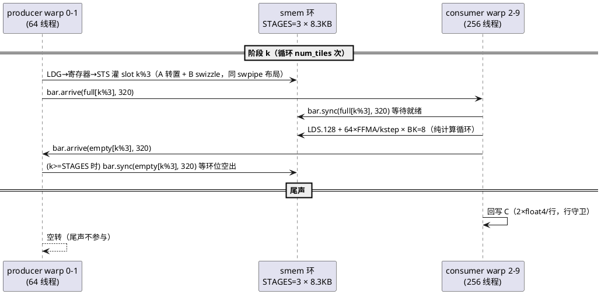
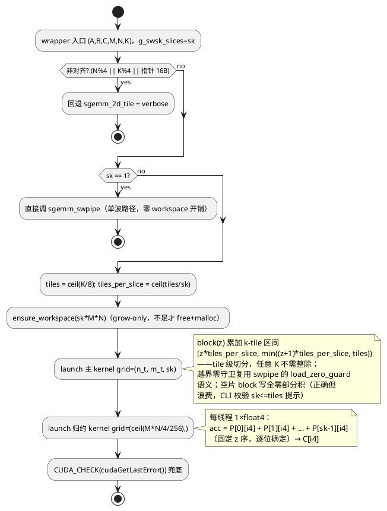
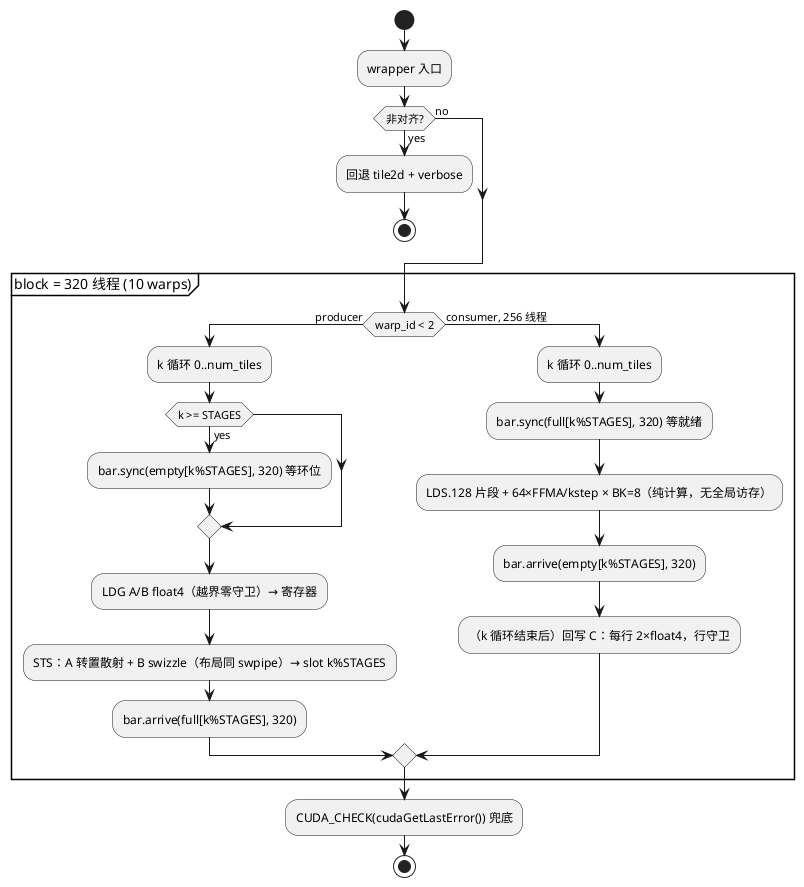

# 1 AR概述

| 组件名称 | cuda-sgemm（Quadro RTX 5000 / sm_75 严格 FP32 SGEMM 教学优化工程） |
| --- | --- |
| AR系统流水号 | AR008 |
| AR描述 | 尺寸自适应 SGEMM：swsk（swpipe 的 split-K 变体，解除中/小尺寸 wave 饥饿）、Kernel 7 ws（warp 专属化 producer/consumer 软件流水，攻击大尺寸 issue-slot 竞争）、`--kernel auto` 实测驱动选核表、thermal-paired 配对测量协议（消除 WDDM 热漂移掩蔽） |

# 2 动态行为

## 交互时序图

swsk 双 kernel 流（wrapper 内两次启动，均落在 bench 计时区——诚实测量全部工作）：



ws 流水（block 内 warp 专属化，named barriers 握手）：



# 3 功能点分解

| 序号 | 功能点名称 | 功能点描述 | 追溯 |
| --- | --- | --- | --- |
| 1 | swsk split-K 变体 | 3D grid + 部分积 workspace + 确定性归约 + `--sk` 旋钮 | FR3.1 |
| 2 | ws（Kernel 7） | 2 producer + 8 consumer warp 专属化，3 级 smem 环，PTX named barriers | FR3.2 |
| 3 | auto 自适应选核 | 实测驱动 dispatch 表 + 几何公式种子 + verbose 依据打印 | FR3.3 |
| 4 | thermal-paired 协议 | run_paired.ps1 交替配对 + 冷却门控；compare v2 对内 delta | FR3.4 |
| 5 | 消融 | sk 扫描 / warp 配比 / 环深度 / ws launch_bounds | FR3.5 |
| 6 | 文档与图表同步 | 详设 §4.1/§4.3/§4.6/§5、AGENTS、report/README/figures | FR3.5 |

# 4 实现设计

## 4.1 功能实现思路（含方案取舍）

三个独立设计问题，各自比较后选定：

**问题 1：中/小尺寸 wave 饥饿 → split-K 归约策略**

- 方案 A（选定）：**workspace + 独立归约 kernel**。部分积落 P[SK][M][N]，
  固定顺序归约。优点：确定性（run-to-run 逐位可复现，延续学风）、归约 kernel
  可 float4 向量化、带宽成本透明可测（都在计时区内）。缺点：额外 SK×M×N×4B
  写+读流量（512³ sk=8 约 17MB，占带宽 ~15%，远小于利用率 33%→90% 的收益）。
- 方案 B（弃）：atomicAdd 直接累加 C。优点：零 workspace、一次启动。缺点：
  非确定浮点累加序（违背可复现学风）、需先清零 C（污染调用方数据语义）、
  26 万原子操作的 L2 争用不可控。
- 方案 C（弃）：cublasGemmEx 内部分割。违背"自研祛魅"目标。

**问题 2：大尺寸 issue-slot 竞争 → 延迟剥离手段**

- 方案 A（选定）：**warp 专属化（ws）**。2 producer warp 专职 LDG→STS 灌
  3 级 smem 环，8 consumer warp 纯 LDS+FFMA。消费者发射槽几乎全给 FFMA，
  DRAM 延迟整段移出关键路径（环深 3 覆盖 ~2 tile 的抖动）。
  同步用 PTX `bar.sync`/`bar.arrive`（named barriers，sm_75 合法）。
- 方案 B（弃）：swpipe 预取深度 2（寄存器双缓冲）。需 +32 寄存器 → 159 regs
  → 2 blocks 需 81408 regs > 64K/SM → 占用率 50%→25%，得不偿失（AR007 T003
  已有教训：占用与深预取冲突）。
- 方案 C（弃）：增大 block 到 512 线程摊薄加载占比。寄存器预算同样爆（128×512
  > 64K），且 smem 布局需重设计，教学阶梯断裂。

**问题 3：热漂移掩蔽 → 测量协议**

- 方案 A（选定）：**交替配对 + 对内 delta**。基线/挑战者背靠背成对执行，
  共模热漂移在对内相消；配对组间冷却门控（温度阈值 + 超时如实标注）。
- 方案 B（弃）：请求 admin 锁频。环境事实：无权限（AR001 起记录在案）。
- 方案 C（弃）：延长冷却不做配对。AR007 已证明跨会话绝对对比不可靠（-5% 掩蔽）。

## 4.2 功能实现设计

### 4.2.1 swsk 流程图



**关键设计点：**
- **主 kernel = swpipe kernel 的参数化复用**：把 `sgemm_swpipe_kernel` 的
  k-tile 循环区间改为 `[k_begin, k_end)`（模板或运行时参数），输出改写
  `P + z*M*N`（行主序子矩阵，与 C 同构）——布局/搬运/守卫全部继承，仅
  3 处改动：循环界、输出基址、尾片空块早退写零。
- **workspace 契约（冻结签名的必然选择）**：匿名 namespace 内
  `struct Workspace { float* p; size_t cap; ~Workspace(){ if(p) cudaFree(p);} }`
  静态实例——RAII（进程退出释放），grow-only（free+malloc 仅在扩容时发生，
  bench warmup 期完成，计时区零分配）。该取舍在 kernel 头注释与详设中显式记录。
- **归约 kernel**：`MN4 = M*N/4`（N%4==0 保证整除与 16B 对齐）；每线程
  处理 1 个 float4，循环 s=0..sk-1 累加后单写。读合并（连续 idx）、写合并。
- **确定性**：归约固定 z 序 → run-to-run 逐位可复现；与单 kernel 累加序不同
  属正常（rel ≤ 1e-4 判据），测试新增「swsk 两次运行逐位相等」用例固化该性质。

### 4.2.2 ws 流程图



**关键设计点：**
- **线程拓扑**：320 线程 = 2 producer（warp 0-1）+ 8 consumer（warp 2-9）。
  Consumer 256 线程 × 64 acc（TM=TN=8）= 128×128 tile ✓（与 swpipe 同输出
  划分，bank 冲突结论第三次继承）。
- **named barrier 契约**：`full[s]`/`empty[s]` 各 STAGES 个 barrier id
  （s ∈ {0,1,2} → id ∈ 1..6；0 保留给 __syncthreads 语义不用）。
  producer `bar.arrive(full_s, 320)` 非阻塞通知；consumer `bar.sync(full_s, 320)`
  阻塞等待（64 arrive + 256 sync = 320 释放）。empty 方向对称。首轮
  `k < STAGES` 时 producer 跳过 empty 等待（环初态视为空）。
- **环与占用**：stage = As[8][132]+Bs[8][128] = 8.3KB；STAGES=3 → 25KB
  ≤ 32KB/block。寄存器：consumer 64 acc + 片段（≈128，与 swpipe 同）；producer
  角色代码量小但 ptxas 按 kernel 统一分配 → 全 block 128 regs。
  320×128 = 40960 → **1 block/SM（31% 占用）**；消融轴 `__launch_bounds__(320, LB)`
  LB=2 时 ptxas 上限 102 regs——若 0 spill 可达则 2 blocks/SM（62.5% 占用），
  与 swpipe 的 50% 对比是本设计的核心实验变量。
- **尾声**：consumer 独占回写；producer 空转退出（不参与 barrier，无死锁面）。
- **死锁防护**：环满/空由 barrier 语义天然保证；`num_tiles < STAGES` 的短 K
  由首轮跳过规则覆盖；racecheck 0 hazards 为发布硬门。

### 4.2.3 auto 选核设计

```
dispatch(M, N, K):
  blocks128 = ceil(M/128) * ceil(N/128)          # swpipe 类 tile 的波数几何
  tiles     = ceil(K/8)
  if 非对齐            -> tile2d（各 kernel 自带回退，auto 显式选 tile2d）
  elif min(M,N) <= 256 -> smem1d（256³ 实测反超区，bk=32）
  elif blocks128 < 96  -> swsk, sk = clamp(ceil(192/blocks128), 2, min(16, tiles))
                          # 目标 3-4 波；512³: blocks=16 → sk=12→实测表修正
  elif blocks128 < 192 -> swsk, sk = 2~4（1024³: 64 blocks → sk=4）
  else                 -> ws（若 T008 实测胜 swpipe）否则 swpipe
  实测覆盖表（T004/T009 数据回填）优先于公式；verbose 打印「选择 + 依据 + 表来源」
```

- 表存放：`sgemm_ws.cu`/main.cu 内 constexpr 结构数组
  `{m,n,k 上界, kernel_id, sk}`，逐条先到先得；未命中走几何公式；公式也未覆盖
  （异常值）→ swpipe 安全默认。**表内容必须来自本 AR 实测行**（数据真实性军规，
  每条注明来源 CSV 行）。

### 4.2.4 thermal-paired 协议设计

- **run_paired.ps1（新脚本，不动 v1）**：
  ```
  for size in 6 基准尺寸:
    cooldown_gate(温度 ≤ 45°C 或 120s 超时→标注)
    for challenger in {swsk(该尺寸最优 sk), ws, auto}:
      for r in 1..3:   # 对内轮
        bench(swpipe,  warmup=20, iters=100)   # 立即接
        bench(challenger, warmup=20, iters=100) # 背靠背
        两行连续落 results/paired_ar008.csv（14 列 schema 不变，顺序即配对）
  ```
- **compare v2（compare.py 扩展 `--paired` 模式）**：按 (size, challenger) 分组，
  对内 delta = challenger_gf − swpipe_gf（同轮同热状态）；报告 per-round delta 的
  median 与 **delta-RSD**；G4 判定用 median delta ≥ +2%，G5 判定用 delta-RSD < 2%。
- 主 performance.csv 照常追加绝对阶梯（跨会话可比性维持），paired CSV 独立分流
  ——CSV schema 冻结不受影响。

## 4.3 接口描述

```cpp
// 注册表扩展（sgemm_kernels.h；插入位在 K_SWPIPE 之后、K_CUBLAS 之前）
K_SWSK = 8, K_WS = 9, K_CUBLAS = 10, KERNEL_COUNT = 9 -> 11
"swsk", "ws" 注册名；fns 表对应扩容

// 冻结签名不变（内部 workspace，见 4.2.1 契约）
void sgemm_swpipe_sk(const float* A, const float* B, float* C, int M, int N, int K);
void sgemm_ws       (const float* A, const float* B, float* C, int M, int N, int K);

// 旋钮（main CLI 注入；详设 §4.6 同步）
namespace sgemm {
extern int g_swsk_slices;   // --sk，默认 4；kernel==swsk 时生效
extern int g_ws_stages;     // ws 环深度（消融 2/3，默认 3）
extern int g_ws_min_blocks; // ws __launch_bounds__ 消融（1/2，默认 1）
}
```

- CLI：`--kernel …|swsk|ws|auto|all`；`--sk N`（1..16，越界 CLI_ERROR；
  非 swsk 上下文忽略并 usage 提示）。`auto` 在 bench/test 两条路径均可选
  （test 套件不自动跑 auto——auto 的正确性由其成员 kernel 保证 + 专项用例）。
- 详设 §4.3 追加：`--sk` 语义行 + paired CSV 分流说明。

## 4.4 代码设计

```
src/sgemm_swpipe_sk.cu   [新] split-K 主 kernel（swpipe 参数化复用）+ 归约 kernel
                              + workspace RAII + wrapper（含 sk=1 旁路/回退）
src/sgemm_ws.cu          [新] producer/consumer 双角色 kernel（模板 LB/STAGES 消融）
                              + PTX named barrier 内联 + wrapper（回退）
src/sgemm_swpipe.cu      [改] kernel 增加模板参数 <int LB, bool SPLITK>（或独立
                              拷贝——取舍：参数化复用优先，避免 400 行复制漂移；
                              编译产物与 swpipe 逐位一致由 ptxas 审计验证）
src/main.cu              [改] CLI --sk/--kernel 扩展 + auto 分派函数 + paired 提示
include/sgemm_kernels.h  [改] 声明/注册表/旋钮
include/common.h         [改] CliOptions.sk 解析校验 + usage
tests/test_correctness.cu[不改] 注册表动态遍历自动扩至 11×9+2=101 例；
                              swsk 确定性用例（两次运行逐位相等）以专项 main 检查
                              （bench --check --rounds 2 交叉验证替代，见 6.1）
bench/run_paired.ps1     [新] 配对协议执行器
bench/compare.py         [改] --paired 模式（对内 delta/G4/G5）
bench/make_figures.py    [改] swsk/ws/auto 纳入 + 配对协议图（fig 阶梯扩展）
CMakeLists.txt           [改] KERNEL_SOURCES += 两文件
```

模块边界：ws/swsk 均自包含单文件（延续"每版一个 .cu"军规）；swpipe 的参数化
改造以"编译产物不变"为验收（ptxas 逐行比对），不引入跨文件模板头。

# 5 重构设计

- `sgemm_swpipe_kernel` 参数化（SPLITK 分支）：编译期模板零开销，非 SPLITK
  实例的 SASS 与现版一致（build.log ptxas 审计比对）。属低风险重构。
- 注册表扩容沿用 AR007 模式（插位 + KERNEL_COUNT 递增），test 套件零改动受益。
- 无接口签名变更；CSV schema 不变。

# 6 测试设计

## 6.1 单元测试（UT）

- 套件自动扩至 **101 例**（11 kernel × 9 尺寸 + cuBLAS 自校验 2 例）：
  swsk/ws 覆盖主场景、快速回归、非方阵、边界（1023×1024×511 与 130×257×66
  走回退路径——回退正确性是军规 §4.6 专项）、退化（K=1、1×1×1、17×33×65）。
- swsk 确定性：`--kernel swsk --rounds 2 --check` 两轮结果逐位相等
  （CUDA_CHECK 累加序固定；round 间无随机性）——落 bench --check 路径验证。
- auto 专项：6 基准尺寸 `--kernel auto --verbose` 断言选中者与实测最优一致
  （±2% 容差），17×33×65 断言选中 tile2d 且 PASS。

## 6.2 接口测试

- `--sk 0` / `--sk 17` → CLI_ERROR exit≠0；`--sk 8 --kernel swpipe` → usage
  提示 + 正常执行（忽略）；`--kernel auto` 不带尺寸 → 默认主场景。
- 注册表 `--list-kernels` 含 11 项；`kernel_fn(K_SWSK/K_WS)` 非空。

## 6.3 业务场景测试（四门 v2，thermal-paired 会话）

| 门 | 判定数据 | 通过条件 |
| --- | --- | --- |
| G1 中尺寸 | 512³、1024³ swsk/auto 对内及 vs 同会话 cuBLAS | 各 ≥ cuBLAS 的 75% |
| G2 小尺寸守成 | 256³ auto/swsk | ≥ 1618.2 且 > cuBLAS |
| G3 大尺寸 | 4096³ ws vs swpipe 冷态配对 | ≥ 7.0 TF（力争 7.2）；或负结果归档 |
| G4 全线 | 6 尺寸 paired 对内 delta | ≥ 4/6 尺寸 delta ≥ +2% |
| G5 方法学 | paired delta-RSD | < 2% |

## 6.4 异常场景测试

- workspace 扩容失败（模拟超大 M·N·SK）：报错退出（不静默降级）。
- ws named barrier：racecheck 0 hazards 硬门；`num_tiles < STAGES` 短 K
  （如 17×33×65 对齐子集 4×8×8 之类构造用例）不死锁。
- swsk `sk > tiles`（如 K=8, sk=16）：空片写零路径正确（套件 K=1 用例覆盖）。
- 热污染：冷却超时组标注 `thermal-contaminated` 且不参与门判定（协议诚实性）。

## 6.5 实验与图表产出纪律（AGENTS.md §6，本 AR 落实）

每个任务完成时即交付实验数据与图表（禁止"做完代码、图表最后凑数"），全部由
`make_figures.py` 从 CSV 可复现生成、无手工修饰；AR008 新增图表规划：

| 图表 | 支撑结论 | 数据源 | 任务 |
|------|---------|--------|------|
| fig_paired_protocol | 配对协议使热漂移相消（G5） | 协议自证实验（配对 vs 顺序 delta 方差） | T001 |
| fig_splitk_sweep | split-K 解除 wave 饥饿（G1）+ 带宽开销拐点 | ablation_ar008.csv（sk 扫描 6 尺寸） | T004/T005 |
| fig_dispatch_map | auto 选核与实测最优一致 | auto 验证表（6 尺寸 + verbose 记录） | T006 |
| fig_ws_structure | ws 流水与屏障契约 | 结构参数表（时空示意由数据表绘制） | T007 |
| fig_ws_ablation + fig_isslot_hypothesis | 消融取舍 + issue-slot 假说检验（G3 正/负） | ablation_ar008.csv + 冷态配对 | T008 |
| fig_paired_delta + fig_ladder_v2 | 四门 v2 判定 + 全线刷新（G4） | paired_ar008.csv + 矩阵 CSV | T009 |

负结果同样上图（ws 若不胜 swpipe，fig_isslot_hypothesis 即"pre-Ampere 软件流水
边界"的负结果证据）——数据真实性军规的图表化表达。
