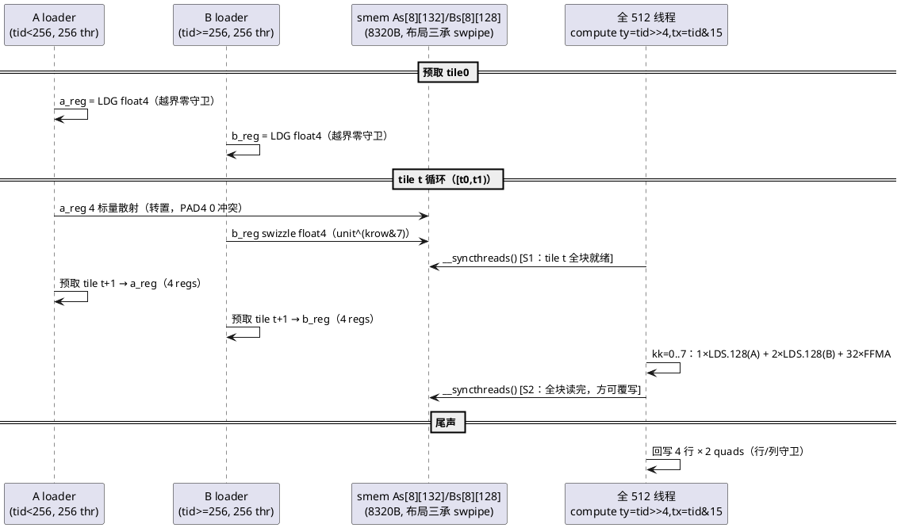
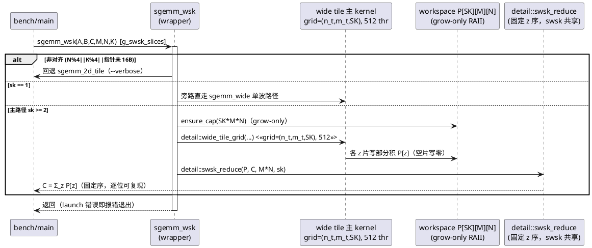
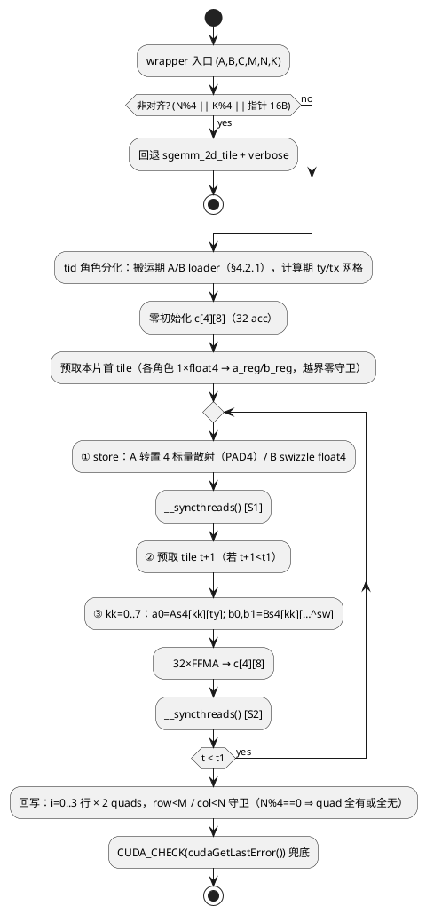

# 1 AR概述

| 组件名称 | cuda-sgemm（Quadro RTX 5000 / sm_75 严格 FP32 SGEMM 教学优化工程） |
| --- | --- |
| AR系统流水号 | AR009 |
| AR描述 | 宽块占用率攻坚（Gate-Closing）：Kernel 8 **wide**（512 线程宽块 × TM4×TN8，寄存器预算 64 → 100% 占用，破除 swpipe 系 128 regs → 50% 占用天花板）、**wsk**（wide 的 split-K 变体，精确波对齐消融补齐 sk∈{3,6}）、auto v2 dispatch 实测回填、三门 v2 复判（G1/G2/G3 为 AR008 遗留 FAIL 门） |

# 2 动态行为

## 交互时序图

wide kernel 单缓冲双同步流水（block=512 线程，双角色：搬运期按 tid 分 A/B loader，计算期全员 32×16 网格）：



wsk 双 kernel 流（与 swsk 同构，主体换 wide、归约跨单元共享）：



# 3 功能点分解

| 序号 | 功能点名称 | 功能点描述 | 追溯 |
| --- | --- | --- | --- |
| 1 | wide（Kernel 8） | 512 线程宽块 × TM4×TN8（32 acc），寄存器预算 ≤64 → 2 block/SM = **100% 占用**；布局/流水结论三承 swpipe | FR1 |
| 2 | wsk | wide 主体参数化复用（z 切片 + Out_base）+ 确定性归约跨单元 detail 共享 + `--sk` 双生效 | FR2 |
| 3 | 精确波对齐消融 | wsk sk∈{1,2,3,4,6,8,12,16} + swsk 补 {3,6}；满驻留波=96 blocks 的倍数点实证 | FR3 |
| 4 | LB 消融 | wide/wsk `--wlb {1,2}`（默认 2）；LB=1 为 spill 保底实例；占用率→效率假说直接检验 | FR1 |
| 5 | auto v2 | dispatch 表按 AR009 实测胜出行回填（禁凭空）+ 背靠背配对验证 | FR4 |
| 6 | 三门 v2 复判 + 文档 | paired 协议复测 G1/G2/G3 + 守成 G4'/G5'；详设/AGENTS/report/README/figures 同步 | FR5 |

# 4 实现设计

## 4.1 功能实现思路（含方案取舍）

**问题 1：如何破 50% 占用墙（本 AR 核心）**

- 方案 A（选定）：**宽块 512 线程 × TM4×TN8**。把每线程累加器 64→32，
  寄存器预算 ~62 ≤ `__launch_bounds__(512,2)` 上限 64 → 2 block/SM =
  1024 线程 = **100% 占用**（sm_75 线程上限 1024/SM 恰好容纳，64K regs
  恰好分满：2×512×64=65536）。优点：单 kernel 破墙、布局/流水/swizzle
  结论全部继承（第四次复用）、保底路径明确（LB=1 仍 50% 但单块 warp
  翻倍改善中尺寸聚合占用）。缺点：每 FFMA 的 smem 读流量 +50%（§4.2.4
  量化：仍计算主导，75% LSU 利用率）。
- 方案 B（弃）：256 线程 × TM4×TN4（16 acc）压寄存器到 ~48。指令效率
  崩塌：16 FFMA/4 LDS.128 = 4 FFMA/LDS（swpipe 为 16），LSU 先于
  FP32 成瓶颈（每 SM 每 kstep LDS 4096B×… 折算 256 cy LDS vs 128 cy
  FFMA）——用带宽换占用，方向性错误。
- 方案 C（弃）：寄存器双缓冲 smem（减 acc 不减线程）——AR008 ws 消融
  已证明"50% 占用内重排指令流"无益（issue-slot 假说否定），本方案
  同属此类，无新信息。

**问题 2：wsk 归约如何避免复制漂移**

- 方案 A（选定）：`launch_reduce` 从 swpipe_sk.cu 匿名命名空间**提升为
  `sgemm::detail::swsk_reduce`**（声明进 sgemm_kernels.h，实现留
  swpipe_sk.cu），wsk 跨编译单元调用——与 `detail::swpipe_tile_grid`
  同构的既定共享模式；数值路径单一来源，确定性归约语义逐位一致。
- 方案 B（弃）：复制归约 kernel 到 wide_sk.cu。~40 行复制漂移面，
  违背 AR008 已确立的共享先例。

**问题 3：LB 消融旋钮承载**

- 方案 A（选定）：新增 `--wlb {1,2}`（默认 2），注入 `g_wide_min_blocks`，
  仅 wide/wsk 上下文生效。理由：全局 `--lb` 默认 1（tile2d 语义），而
  wide 的设计目标即 LB=2（100% 占用）——默认值不同必须分钮，避免
  跨 kernel 默认语义污染（ws 引入 --stages/--wp 同理）。
- 方案 B（弃）：复用 `--lb`。会把 tile2d/ws 默认一并改成 2 或把 wide
  默认错设为 1，二者均违背"旋钮默认值=实测最优"军规。

## 4.2 wide kernel 实现设计

### 4.2.1 线程拓扑与搬运划分

```
block = 512 线程（16 warp），tile 128×128×BK8（smem 布局三承 swpipe）

计算网格（全 512 线程）：
  ty = tid >> 4   ∈ 0..31   行方向 32 × TM4 = 128
  tx = tid & 15   ∈ 0..15   列方向 16 × TN8 = 128

搬运划分（每 tile A+B 共 512 quads = 512 线程 × 恰 1 quad/线程）：
  tid <  256 : A loader（与 swpipe 逐位同型）
               ld_a_row = tid >> 1（0..127），ld_a_kq = tid & 1（0..1）
  tid >= 256 : B loader（与 swpipe 逐位同型，tid' = tid-256）
               ld_b_krow = tid' >> 5（0..7），ld_b_unit = tid' & 31（0..31）
```

- 512 quads 恰等于线程数是 BK=8 的自然 fit（BK=16 则 2 quad/线程，
  预取寄存器 4→8，预算爆 64——BK 固化 8，见 §4.1 方案 A 缺点项）。
- **bank 冲突结论继承论证**：计算期访问模式与 vec4/swpipe 逐位同型——
  A 读 `As4[kk][ty]` warp 内 16 线程广播 2 地址（0 冲突）；B 读
  `(tx*2)^sw / (tx*2+1)^sw`，tx∈0..15 与 vec4 完全一致（XOR swizzle
  消 4-way 冲突结论第三次继承，AR006 ncu 实测锚定）。

### 4.2.2 流程图



（split-K 参数化：循环界 [t0,t1) = z 切片、Out = Out_base + z·M·N、
空片自然写零——与 swpipe 参数化三处改动逐位同构，§4.3。）

### 4.2.3 寄存器预算（ptxas 达标判据的依据）

| 项 | regs | 说明 |
| --- | --- | --- |
| 累加器 c[4][8] | 32 | TM=4 × TN=8（swpipe 为 64） |
| 预取 a_reg **或** b_reg | 4 | 单角色单 quad（swpipe 双角色 8） |
| A 片段 a0 | 4 | 1×float4 = As[kk] 行 ty 的 4 连续 m |
| B 片段 b0+b1 | 8 | 2×float4 swizzle |
| 寻址/循环/守卫 | ~14 | tid/ty/tx/基址/t/kk/谓词 |
| **估计合计** | **~62** | `__launch_bounds__(512, 2)` 上限 **64** |

**ptxas 审计判据（T002 验收）**：LB=2 实例 ≤64 regs 且 **0 spill**
→ 2 block/SM = 100% 占用。若不可达：LB=1 实例（≤128 regs，1 block/SM
= 16 warp = 50%）为保底，`--wlb` 默认翻转为 1 + 取舍如实记录
（AGENTS §4 军规）；LB=1 下 512×128=65536 恰满 64K regs，仍 0 spill
要求（spill 即缺陷）。

### 4.2.4 占用率与吞吐量化（设计自检）

| 配置 | block/SM | 线程/SM | 占用率 | 聚合 warp |
| --- | --- | --- | --- | --- |
| swpipe（256thr, 128regs） | 2 | 512 | 50%（现状墙） | 16 |
| wide LB=2（512thr, 64regs） | 2 | **1024** | **100%** | **32** |
| wide LB=1（512thr, 128regs） | 1 | 512 | 50% | 16（单块翻倍） |

- 每 SM 每 kstep（满驻留 2 block）：LDS 2×512×3×16B=48KB → 384 cy
  @128B/cy；FFMA 2×512×32=32768 → 512 cy @64/cy。**计算仍主导，
  LSU 利用率 ~75%**（swpipe 为 50%）——用 +50% smem 流量换 +100%
  占用。若实测不达标，第一嫌疑指标：ncu `l1tex__data_pipe_lsu_wavefronts_mem_shared`（无权限则以 LB 消融间接检验）。
- 中尺寸聚合占用（LB=1 保底亦受益）：1024³ = 64 blocks × 16 warp /
  1536 warp = **67%**（swpipe 现状 33%）；512³(sk4, LB=2) = 64×32/1536
  = 67%（swsk4 现状 33%）；256³(sk12, LB=2) = 48×32/1536 = 50%
  （swsk12 现状 25%）。

### 4.2.5 wsk（split-K 变体）

- 主体：`sgemm_wide_kernel` 参数化（tps/num_tiles/z/Out_base），
  经 `sgemm::detail::wide_tile_grid` 跨单元暴露——镜像
  `swpipe_tile_grid` 契约（grid=(grid_n, grid_m, grid_z)；单波路径
  grid_z=1, tps=num_tiles 与原语义逐位等价）。
- 归约：复用 `detail::swsk_reduce`（§4.1 问题 2），固定 z 序确定性
  语义与 swsk 逐位一致。
- workspace：sgemm_wide_sk.cu 自包含 grow-only RAII（与 swsk 同构
  ~20 行，不跨单元共享内存管理——共享的仅数值路径）。
- 边界：sk=1 旁路直走 `sgemm_wide`；sk>tiles 空片写零；非对齐回退
  tile2d；`--sk` 旋钮对 swsk/wsk 双生效。

## 4.3 接口描述

```cpp
// 注册表扩展（sgemm_kernels.h；追加尾部，既有 id 全部稳定）
K_WIDE = 12, K_WSK = 13, KERNEL_COUNT = 12 -> 14
names += "wide", "wsk"；fns 表对应扩容（T001 Red 阶段 fn=nullptr）

// 冻结签名不变
void sgemm_wide(const float* A, const float* B, float* C, int M, int N, int K);
void sgemm_wsk  (const float* A, const float* B, float* C, int M, int N, int K);

// 旋钮与 detail 入口（main CLI 注入）
namespace sgemm {
  extern int g_wide_min_blocks;   // --wlb，默认 2（消融 1/2；wide/wsk 生效）
  namespace detail {
    // wide tile 主体参数化入口（wsk 共享；契约同 swpipe_tile_grid）
    void wide_tile_grid(const float* A, const float* B, float* Out_base,
                        int M, int N, int K, int tps, int num_tiles,
                        int grid_n, int grid_m, int grid_z);
    // 确定性归约（自 swpipe_sk.cu 提升；swsk/wsk 共享单一数值路径）
    void swsk_reduce(const float* P, float* C, long long mn, int sk);
  }
}
```

- CLI：`--kernel …|wide|wsk|all`；`--wlb <1|2>`（默认 2，越界
  CLI_ERROR，非 wide/wsk 上下文 note 提示后忽略）；`--sk <1..16>`
  语义扩展为 swsk/wsk 双生效（非二者上下文 note 提示）。
- 组件详设 §4.1/§4.6/§5/CLI 表的同步落在 T008（沿用 AR008 文档
  收尾惯例），本设计 §4.3 为契约唯一权威源。

## 4.4 代码设计

```
src/sgemm_wide.cu         [新] Kernel 8 wide：模板 <int LB> 两实例
                                （LB=2 目标 / LB=1 保底）+ 双角色流水主体
                                + detail::wide_tile_grid + sgemm_wide wrapper
src/sgemm_wide_sk.cu      [新] wsk：workspace RAII + sk=1 旁路 + 对齐回退
                                + 调 detail::wide_tile_grid / detail::swsk_reduce
src/sgemm_swpipe_sk.cu    [改] launch_reduce 提升为 detail::swsk_reduce
                                （实现不动，仅暴露入口）
include/sgemm_kernels.h   [改] 声明/注册表/旋钮/detail 入口
include/common.h          [改] --wlb 解析校验 + usage + kernel 名单
src/main.cu               [改] CLI 接线（--wlb 注入；--sk/--wlb note 提示）
src/sgemm_auto.cu         [改] T006 dispatch v2 实测回填
tests/test_correctness.cu [不改] 注册表动态遍历自动扩至 14×9+2 = 128 例
bench/run_wsk_ablation.ps1 [新] 精确波扫描（wsk sk{1,2,3,4,6,8,12,16}
                                 + swsk 补 {3,6}；2-pass 升降序 + 冷却门控）
bench/run_wide_lb.ps1      [新] LB 消融（wide/wsk × --wlb{1,2} × 尺寸）
bench/run_paired.ps1       [改] 挑战者扩 wide/wsk（v3，baseline 仍 swpipe）
bench/compare.py           [微改] 三门 v2 判定行（G4'/G5' 守成逻辑不变）
bench/make_figures.py      [改] fig16-fig21（§6.5 表）
CMakeLists.txt            [改] KERNEL_SOURCES += sgemm_wide.cu sgemm_wide_sk.cu
```

模块边界：wide/wsk 自包含双文件（镜像 swpipe/swpipe_sk 结构）；
跨单元仅经 `sgemm::detail` 两个入口（wide_tile_grid / swsk_reduce），
无头文件模板扩散。

# 5 重构设计

- `launch_reduce` → `detail::swsk_reduce` 提升：实现零改动，仅命名空间
  与声明位置变化；swsk 调用点同步替换（编译产物等价由 128 例回归 +
  确定性 --check 双轮逐位相等验证）。低风险。
- 注册表扩容沿用既定模式（尾部追加 + KERNEL_COUNT 递增），test 套件
  零改动自动扩容。
- 无冻结签名变更；CSV schema 不变（新 kernel 行按既有 14 列落表）。

# 6 测试设计

## 6.1 单元测试（UT）

- 套件自动扩至 **128 例**（14 kernel × 9 尺寸 + cuBLAS 交叉 2 例）：
  wide/wsk 覆盖主场景、快速回归、非方阵、边界（1023×1024×511 与
  130×257×66 走回退路径）、退化（K=1、1×1×1、17×33×65）。
- **数值序专项**：wide 1024³ 与 swpipe **逐位同值**断言（同 k 升序
  FMA 链，同累加序——ws T007 已有先例 rel=1.179e-06 逐位一致）。
- wsk 确定性：`--kernel wsk --rounds 2 --check` 两轮逐位相等。
- wsk sk>tiles（K=8, sk=16）空片写零正确性（套件 K=1 用例覆盖）。

## 6.2 接口测试

- `--wlb 0` / `--wlb 3` → CLI_ERROR exit≠0；`--wlb 2 --kernel swpipe`
  → note 提示 + 正常执行（忽略）。
- `--list-kernels` 14 项；`kernel_fn(K_WIDE/K_WSK)` 非空（Green 后）。
- `--sk 8 --kernel wide` → note 提示 + 正常执行（wide 无 split-K 语义）。

## 6.3 业务场景测试（三门 v2 复判，thermal-paired 会话）

| 门 | 判定数据 | 通过条件 |
| --- | --- | --- |
| G1 | 512³、1024³ wide/wsk/auto 最优 vs 同会话 cuBLAS | 各 ≥ 75% |
| G2 | 256³ wide/wsk/auto 最优 | ≥ 1618.2 GF（绝对门，同会话 cuBLAS 对照并报） |
| G3 | 4096³ wide（vs swpipe） | ≥ 7.0 TF（力争 7.2） |
| G4' | 6 尺寸 auto v2 对内 delta | ≥ AR008 auto 水平（≥4/6 尺寸 delta ≥ +2% 维持，不允许回退） |
| G5' | paired delta 轮间极差 | median < 2pp 维持 |

判定协议沿用 AR008 run_paired.ps1（背靠背配对 + 冷却门控 + 污染组
剔除重测）；负结果如实归档军规不变。

## 6.4 异常场景测试

- memcheck：wide/wsk 主路径（512³/4096³）+ 回退（130×257×66）0 errors
  硬门；racecheck 对 wide 抽查（双同步单缓冲结构，预期 0 hazards）。
- workspace 扩容失败（超大 M·N·SK）：报错退出（不静默降级）。
- ptxas spill：LB=2 实例 spill ≠ 0 → 触发 §4.2.3 保底翻转流程
  （默认改 LB=1 + 取舍记录），LB=1 spill ≠ 0 → 缺陷必须修复。
- 热污染：冷却超时组标注 `thermal-contaminated` 不参与门判定。

## 6.5 实验与图表产出纪律（AGENTS.md §6，每任务强制）

| 图表 | 支撑结论 | 数据源 | 任务 |
|------|---------|--------|------|
| fig16_wide_structure | wide 拓扑/资源包络/占用率对比（50%→100% 破墙可视化） | ptxas 审计 + 结构常量 | T002 |
| fig17_prewave_sweep | 精确波对齐（96-block 波倍数点）+ wsk vs swsk 占用差 | ablation CSV（sk 全集） | T004 |
| fig18_wide_lb | LB 1/2 消融 + 占用率→效率假说直接检验 | LB 消融 CSV | T005 |
| fig19_dispatch_v2 | auto v2 表与实测最优一致 | auto 配对验证 CSV | T006 |
| fig20_paired_delta_v3 | 三门 v2 判定（G1/G2/G3/G4'/G5' 面板） | paired v3 CSV | T007 |
| fig21_ladder_v3 | 同会话全 kernel 阶梯刷新（自研最优 vs cuBLAS） | paired v3 CSV | T007 |

负结果同样上图（如 LB=2 spill 翻转、wsk 某尺寸不敌 swsk）——数据
真实性军规的图表化表达；全部经 make_figures.py 从 CSV 可复现。
