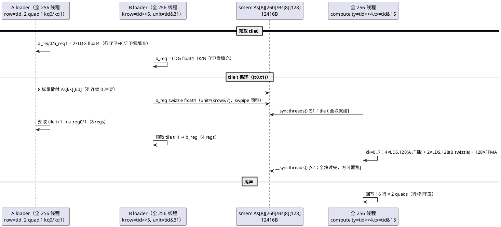
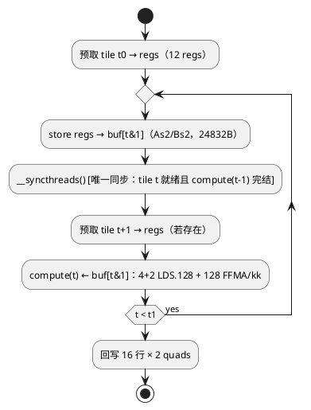
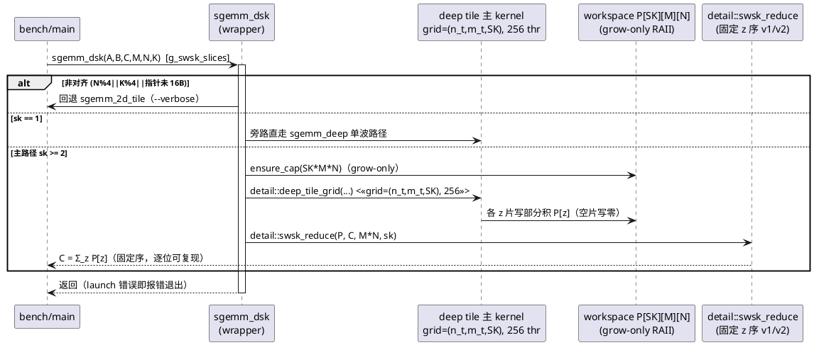

# 1 AR概述

| 组件名称 | cuda-sgemm（Quadro RTX 5000 / sm_75 严格 FP32 SGEMM 教学优化工程） |
| --- | --- |
| AR系统流水号 | AR010 |
| AR描述 | 128-acc 深分块攻坚（Gate-Closing）：Kernel 9 **deep**（TM16×TN8 = 128 acc/thread，tile 256×128×BK8，LDS:FFMA 1:21.3，ILP 替代 TLP 直击 AR009 实证的 LDS.128 带宽墙）+ **dsk**（deep 的 split-K，1024³ sk3 = 2 精确波）+ 归约 ILP2 升级（--rv2）+ G2 细粒度精调（swsk sk{4..8} / smem1d 中继）+ auto v3 + 五门 v4 复判 + CCF-A 级实验报告与面试叙事交付 |

# 2 动态行为

## 交互时序图

deep kernel 单缓冲双同步流水（block=256 线程，搬运：每线程 2×A quad + 1×B quad；计算：16×16 网格 TM16×TN8）：



--dbuf=1 双缓冲变体（单同步/ tile，同步开销减半；屏障正确性：buf 周期 2，
iter t+1 的 store 写 buf[(t+1)&1]，与 compute(t-1) 读的 buf 同名 buffer 之间
隔着 iter t 的 barrier，全块 compute(t-1) 必已完结）：



dsk 双 kernel 流（与 swsk/wsk 同构，主体换 deep、归约共享 detail::swsk_reduce
[--rv2 选 v1/v2 实现]）：



# 3 功能点分解

| 序号 | 功能点名称 | 功能点描述 | 追溯 |
| --- | --- | --- | --- |
| 1 | deep（Kernel 9） | TM16×TN8 = 128 acc，tile 256×128×BK8，256 线程，LDS:FFMA 1:21.3，25% 占用 + 128 独立 FMA 链（ILP 替代 TLP）；模板\<DBUF\> 双实例 + --dbuf 消融 | FR1 |
| 2 | dsk | deep 主体参数化复用（z 切片 + Out_base）+ 确定性归约共享 + --sk 三生效；1024³ sk3 = 96 blocks = 2 精确波 | FR2 |
| 3 | 归约 ILP2 | detail::swsk_reduce 双实现 v1（1 f4/线程）/v2（2 f4/线程，逐位等价），--rv2 全局旋钮，数据裁定默认 | FR3 |
| 4 | G2 精调 | swsk sk{4,5,6,7,8} 细扫 + dsk 探针 + smem1d 同会话中继 + rv2 A/B → 优胜者回填 | FR4 |
| 5 | auto v3 | dispatch 表按 AR010 实测胜出者回填（禁凭空）+ 背靠背配对验证 | FR4/FR5 |
| 6 | 五门 v4 + 交付 | G1/G2/G3/G4''/G5'' 判定 + fig22-27 + CCF-A 报告 + 面试叙事 + 文档同步 | FR5 |

# 4 实现设计

## 4.1 功能实现思路（含方案取舍）

**问题 1：如何攻 LDS.128 带宽墙（本 AR 核心）**

- 方案 A（选定）：**TM16×TN8 深寄存器分块**。每线程 128 累加器把
  acc-per-LDS.128 从 16（swpipe）抬到 21.3，每 FFMA 的 smem 读流量 -25%；
  128 条独立 FMA 链提供充足 ILP，在 25% 占用（8 warp/SM）下维持 FFMA
  issue。cuBLAS 同会话 84% peak（1024³ 8377 GF）证明该设计点在本机可达。
  预测区间（acc-per-LDS 经验律插值）：60-70% peak = 6.0-7.0 TF@1024³，
  覆盖 G1 门 6283 GF。
- 方案 B（弃）：TM8×TN16（tile 128×256）。B 片段 16 连续列 = stride-4 quad
  访问，任意 16B XOR swizzle 均留下 mod-8 双残留类（quad≡{r, r+4} mod 8）
  → 每相位 8-way bank conflict，swizzle 不可救；且与"列连续 frag"绑定的
  C 回写/全局搬运模式全部恶化。**TM>TN 是 B 侧无冲突的必要条件**（stride-2
  quad 全残留类覆盖恰为 swpipe 已实证的 swizzle 消解域）。
- 方案 C（弃）：BK=16 深化（tile 256×128×16）。smem 翻倍（24.8KB）、loader
  每 tile 4+2 quads/线程、预取 24 regs——寄存器预算爆（128 acc 下无余量）；
  且 LDS:FFMA 比率不变（每 k 步片段 LDS 数同比例增长），对带宽墙无增益。

**问题 2：A 侧广播是否浪费 LDS 带宽**

- 选定：接受冗余（每 A 值被 16 线程重复 LDS）。量化：A 侧 4 LDS.128 为
  warp 广播（同一地址多播，1 次 smem 读服务整个 warp），**广播事务不计
  conflict 且 LSU 波前数按地址去重**——A 侧实际 LSU 开销 ≪ 名义 4/6 占比；
  B 侧 2 LDS.128 为真正带宽消费者。故有效 acc-per-LDS 优于名义 21.3，
  这是方案 A 相对 cuBLAS（A 侧同样广播）的结构对齐点。
- 弃选：A 片段寄存器暂存跨 kk 复用（a 值逐 kk 变化，无复用面）。

**问题 3：25% 占用下 DRAM/同步延迟如何覆盖**

- 三重对冲：①寄存器预取（12 regs，LDG 提前 1 tile 发射——swpipe 实证
  覆盖 ~600cy DRAM 延迟）；②128 独立 FMA 链的 warp 内 ILP（FFMA 依赖链
  深度 1，调度器可连续发射）；③--dbuf=1 双缓冲（同步 2→1/ tile，24832B
  ≤ 48KB 静态 smem 上限）作为延迟对冲消融路径。三者独立可观测
  （T004 消融矩阵 DBUF×sk×尺寸）。
- 方案 B（弃）：cp.async 多级流水——AR006 已证本机负收益；sm_75 无
  cp.async 硬件依赖前提不变。

**问题 4：G2@256³ 的 4.8% 缺口从哪里来**

- 诊断分解（T005 实测定量）：①sk6 尾片失衡（32 tiles = 6×5+2，末片仅
  1/3 负载）→ sk5（7,7,7,7,4）均衡候选；②归约+P 写出开销（P=1.5MB
  流量，全程 21.7μs 中占比待 verbose 分段计时定界）；③smem1d 历史冠军
  1618.2（无 split 开销，64 blocks 天然满波）未入 auto 候选。三路并测，
  优胜者回填，禁单点拍脑袋。

**问题 5：reduce v2 的逐位等价如何保证**

- v1：每线程 1 个 float4 元素，s=0..sk-1 顺序累加；v2：每线程 2 个相邻
  float4 元素，各自独立 s=0..sk-1 顺序累加——**逐元素的加法链与 v1 完全
  相同**（仅线程-元素映射改变），输出逐位一致；--check 双轮确定性
  + swsk/dsk 交叉验证双锚点。A/B 经 --rv2 全局旋钮（默认 0 = v1，
  T005 数据裁定后固化默认值，详设 §4.6 同步）。

## 4.2 deep kernel 实现设计

### 4.2.1 线程拓扑与搬运划分

```
block = 256 线程（16×16），tile 256×128×BK8

计算网格：
  ty = threadIdx.y ∈ 0..15   行方向 16 × TM16 = 256
  tx = threadIdx.x ∈ 0..15   列方向 16 × TN8  = 128

搬运划分（每 tile A 512 quads + B 256 quads = 768 quads = 256 线程 × 3）：
  A：row = tid（0..255，逐行负责），每线程该行 2 个 k-quad：
      quad 地址 = (by*256 + tid)*K + k0 + {0,4}（行内 32B 连续）
  B：krow = tid>>5（0..7），unit = tid&31（0..31）——与 swpipe 逐位同型
```

- **bank 冲突闭环论证（第五次布局继承）**：
  - A loader STS：As[kk][tid] 8 连续标量 store，行距 260 ≡ 4 (mod 32)，
    consecutive lanes → consecutive banks，0 冲突；
  - B loader STS：unit^(krow&7) swizzle float4，与 swpipe 逐位同型，0 冲突；
  - 计算期 A LDS：As4[kk][ty*4+q]（q=0..3）——16 lanes（ty 同值）同一
    quad 地址 → 硬件广播，0 冲突；
  - 计算期 B LDS：Bs4[kk][(tx*2)^sw / (tx*2+1)^sw]——与 swpipe/vec4 完全
    同型（AR006 ncu 实测锚定 swizzle 消 4-way），0 冲突。

### 4.2.2 寄存器预算（ptxas 达标判据依据）

| 项 | regs | 说明 |
| --- | --- | --- |
| 累加器 c[16][8] | 128 | TM=16 × TN=8 |
| 预取 a_reg0/1 + b_reg | 12 | 3×float4（A 2 quad + B 1 quad） |
| A 片段 a0..a3 | 16 | 4×float4 广播读 |
| B 片段 b0/b1 | 8 | 2×float4 swizzle |
| 寻址/循环/守卫 | ~20 | tid/ty/tx/基址/t/kk/谓词/Out 指针 |
| **估计合计** | **~184** | `__launch_bounds__(256, 1)` 上限 **255** |

**ptxas 审计判据（T002 验收）**：≤255 regs 且 **0 spill**（256×255 =
65280 ≤ 64K，1 block/SM）。溢出即缺陷：首选寻址重构（预计算基址 +
Out 延迟物化——wide T002 已验证手段），次选片段两段流式装载。
smem：DBUF=0 = 12416B / DBUF=1 = 24832B（两实例独立审计）。

### 4.2.3 资源与波几何（设计自检）

| 尺寸 | deep grid | sk | blocks | 波（48 slots/波 @1/SM） |
| --- | --- | --- | --- | --- |
| 256³ | 1×2 = 2 | {4,8,16} | 8/16/32 | 探针（K 切片过浅预期弱） |
| 512³ | 2×4 = 8 | 6 | 48 | **1 精确波** |
| 1024³ | 4×8 = 32 | 3 | 96 | **2 精确波** |
| 1000×1016 | 4×8 = 32 | 3 | 96 | 2 精确波（行/列守卫） |
| 2048³ | 8×16 = 128 | 1 | 128 | 2.67 波（尾波 32/48） |
| 4096³ | 16×32 = 512 | 1 | 512 | 10.67 波（饱和） |

- AI（算术强度）= 2·256·128·8 / (8·(256+128)·4) = 33.9 FLOP/B → 6283 GF
  仅需 185GB/s ≤ 375 —— DRAM 非约束，纯 issue/带宽墙检验场。
- sm_75 LSU 量化（满驻留 1 block/SM）：LDS 8×6×16B = 768B/kstep·SM →
  6 cy @128B/cy；FFMA 256×128 = 32768 → 512 cy @64/cy。LSU 利用率
  **~1.2%名义 / 实际以 B 侧计 ~0.4%**——彻底移出 LSU 墙域（对照 wide
  50%/swpipe 25-50%），首次进入纯 FFMA-issue 检验区。

### 4.2.4 dsk（split-K 变体）

- 主体：deep kernel 参数化（tps/num_tiles/z/Out_base）经
  `sgemm::detail::deep_tile_grid` 跨单元暴露（契约同 swpipe_tile_grid /
  wide_tile_grid：grid=(grid_n, grid_m, grid_z)；单波 grid_z=1 与原语义
  逐位等价）。
- 归约：复用 detail::swsk_reduce（--rv2 选 v1/v2）。
- workspace：sgemm_deep_sk.cu 自包含 grow-only RAII（第三次复制同构
  ~20 行——内存管理不跨单元共享的既定边界）。
- 边界：sk=1 旁路 sgemm_deep；sk>tiles 空片写零；非对齐回退 tile2d；
  `--sk` 三生效（swsk/wsk/dsk）。
- P 容量极值：1024³ sk3 = 12MB；4096³ sk1 旁路无 P。

### 4.2.5 归约 ILP2（detail::swsk_reduce 内部双实现）

```
v1（现状）：grid = ceil(mn4/256)，每线程 1 f4：for s: acc += p4[s*mn4+i]
v2（新增）：grid = ceil(mn4/2/256)，每线程 2 相邻 f4（i0=2*idx, i1=i0+1）：
           for s: {v0,v1} 双发射 → acc0 += v0; acc1 += v1
           尾护卫：i1 < mn4 才写 acc1（mn4 奇数边界）
逐位等价：逐元素 z 升序加法链不变（仅线程映射改变）
```

- 动机：归约为 DRAM 延迟受限流（P 跨 z 片 stride=MN×4B），v2 每线程
  2× 独立 load 链（MLP 翻倍）；256³ P=1.5MB < 4MB L2 部分命中下进一步
  缩短暴露延迟。
- --rv2 旋钮全局生效（swsk/wsk/dsk 单一数值路径军规）。

## 4.3 接口描述

```cpp
// 注册表扩展（sgemm_kernels.h；尾部追加，既有 id 全部稳定）
K_DEEP = 14, K_DSK = 15, KERNEL_COUNT = 14 -> 16
names += "deep", "dsk"；fns 表扩容（T001 Red 阶段 fn=nullptr）

// 冻结签名不变
void sgemm_deep(const float* A, const float* B, float* C, int M, int N, int K);
void sgemm_dsk  (const float* A, const float* B, float* C, int M, int N, int K);

// 旋钮与 detail 入口（main CLI 注入）
namespace sgemm {
  extern int g_deep_dbuf;    // --dbuf，默认 0（消融 0/1；deep/dsk 生效）
  extern int g_reduce_ilp2;  // --rv2，默认 0（消融 0/1；swsk/wsk/dsk 归约生效）
  namespace detail {
    // deep tile 主体参数化入口（dsk 共享；契约同 swpipe/wide_tile_grid）
    void deep_tile_grid(const float* A, const float* B, float* Out_base,
                        int M, int N, int K, int tps, int num_tiles,
                        int grid_n, int grid_m, int grid_z);
    // 确定性归约（--rv2 内部选 v1/v2；逐位等价）
    void swsk_reduce(const float* P, float* C, long long mn, int sk);
  }
}
```

- CLI：`--kernel …|deep|dsk|all`；`--dbuf <0|1>`（默认 0，越界
  CLI_ERROR，非 deep/dsk 上下文 note 提示后忽略）；`--rv2 <0|1>`（默认 0，
  全局生效语义注记）；`--sk <1..16>` 语义扩展三生效。
- 组件详设 §4.1/§4.6/§5/CLI 表同步落在 T008；本设计 §4.3 为契约唯一权威源。

## 4.4 代码设计

```
src/sgemm_deep.cu          [新] Kernel 9 deep：模板 <int DBUF> 两实例
                                （单缓冲双同步 / 双缓冲单同步）+ detail::deep_tile_grid
                                + sgemm_deep wrapper（对齐回退 tile2d）
src/sgemm_deep_sk.cu       [新] dsk：workspace RAII + sk=1 旁路 + 对齐回退
                                + 调 detail::deep_tile_grid / detail::swsk_reduce
src/sgemm_swpipe_sk.cu     [改] detail::swsk_reduce 内部双实现（--rv2 选路，
                                v1 语义/实现保留为默认）
include/sgemm_kernels.h    [改] 声明/注册表/旋钮/detail 入口
include/common.h           [改] --dbuf/--rv2 解析校验 + usage + kernel 名单
src/main.cu                [改] CLI 接线（--dbuf/--rv2 注入；--sk/--dbuf note）
src/sgemm_auto.cu          [改] T006 dispatch v3 实测回填
tests/test_correctness.cu  [不改] 注册表动态遍历自动扩至 16×9+2 = 146 例
bench/run_deep_ablation.ps1 [新] deep/dsk DBUF×sk×尺寸消融 + swsk/swpipe/cublas
                                 同会话对照（2-pass 升降序 + 冷却门控）
bench/run_g2_attack.ps1     [新] G2 攻坚：swsk sk{4..8} + dsk 探针 + smem1d
                                 中继 + rv2 A/B @256³
bench/run_paired.ps1        [改] v4：挑战者扩 deep/dsk（baseline 仍 swpipe
                                 交替配对 ×3 轮 + 热身 spin + 冷却门）
bench/make_figures.py       [改] fig22-fig27（§6.5 表）
CMakeLists.txt             [改] KERNEL_SOURCES += sgemm_deep.cu sgemm_deep_sk.cu
```

模块边界：deep/dsk 自包含双文件（镜像 swpipe/swsk、wide/wsk 结构）；
跨单元仅经 `sgemm::detail` 三入口（deep_tile_grid / swsk_reduce /
既有两入口），无头文件模板扩散。

# 5 重构设计

- detail::swsk_reduce 内部双实现：v1 代码路径零改动（--rv2=0 默认），
  v2 为新增分支；swsk/wsk 调用点零改动；146 例回归 + 逐位等价专项
  （swsk --rv2 0/1 输出 memcmp 相等）守护。低风险。
- 注册表扩容尾部追加 + KERNEL_COUNT 递增，test 套件零改动自动扩容
  （146 = 16×9 + 2）。
- 无冻结签名变更；CSV schema 不变。

# 6 测试设计

## 6.1 单元测试（UT）

- 套件自动扩至 **146 例**（16 kernel × 9 尺寸 + cuBLAS 交叉 2 例）：
  deep/dsk 覆盖主场景、快速回归、非方阵、边界（1023×1024×511 与
  130×257×66 走回退）、退化（K=1、1×1×1、17×33×65）；1000×1016×1024
  行/列守卫专项（deep grid_m=4 部分块 + N=1016 列守卫）。
- **数值序专项**：deep 1024³/1000×1016 与 swpipe 主路径**逐位同值**
  断言（同 k 升序 FMA 链——TM16×TN8 不改变逐元素加法序）；--dbuf=1
  实例同锚点逐位一致（缓冲策略不改变数值）。
- dsk==swsk 逐位一致（同 BK=8 k-tile 切分 + 单一归约路径）；dsk
  确定性双轮 --check 逐位相等；dsk sk>tiles（K=8, sk=16）空片写零。

## 6.2 接口测试（IT）

- `--dbuf 2` / `--rv2 2` → CLI_ERROR exit≠0；`--dbuf 1 --kernel swpipe`
  → note 提示 + 正常执行（忽略）。
- `--list-kernels` 16 项；kernel_fn(K_DEEP/K_DSK) 非空（Green 后）。
- `--sk 8 --kernel deep` → note 提示 + 正常执行（deep 无 split-K 语义）。

## 6.3 业务场景测试（五门 v4，thermal-paired 会话）

| 门 | 判定数据 | 通过条件 |
| --- | --- | --- |
| G1@512³ | deep/dsk/auto 最优 vs 同会话 cuBLAS | ≥75%（守成 75.03% 刀锋） |
| G1@1024³ | 同上 | ≥75%（≥6283 GF 主攻） |
| G2@256³ | 全候选最优 | ≥1618.2 GF（绝对门；cuBLAS 对照并报） |
| G3@4096³ | deep/swpipe 最优 | ≥7.0 TF（守成 + 增收） |
| G4'' | auto v3 vs v2 6 尺寸配对 | ≥4/6 尺寸 ≥+2% 且无 <-2% |
| G5'' | dispatch 保真 + 轮间极差 | ≤2pp / median <2pp |

判定协议沿用 run_paired v3（背靠背配对 + 热身 spin + 冷却门 47C +
污染组剔除重测 + 行级 gpu_state 逐行核钟态）。

## 6.4 异常场景测试

- memcheck：deep/dsk 主路径（512³/1024³/4096³）+ 双缓冲实例 + 回退
  （130×257×66）0 errors 硬门；racecheck 对 deep 两实例抽查（DBUF=0
  双同步 / DBUF=1 单同步均为预期 0 hazards——后者屏障正确性经
  §2 时序论证 + racecheck 双重验证）。
- workspace 扩容失败：报错退出（不静默降级）。
- ptxas spill：两实例任一 spill≠0 → 缺陷必须修复（无保底翻转——
  LB=1 已是设计点，255 regs 上限内无理由溢出）。
- --rv2=1 逐位等价：swsk 1024³ --rv2 {0,1} 输出 memcmp 全等。

## 6.5 实验与图表产出纪律（AGENTS.md §6，每任务强制）

| 图表 | 支撑结论 | 数据源 | 任务 |
|------|---------|--------|------|
| fig22_deep_structure | deep 拓扑 / 寄存器预算 / ILP-vs-TLP 资源对比（swpipe 50%·64 链 vs deep 25%·128 链）+ 冒烟 | ptxas 审计 + 结构常量 + smoke CSV | T002 |
| fig23_lds_model | **主图**：acc-per-LDS.128 → %peak 经验律散点（naive→deep 全 kernel + cuBLAS，同会话稳态），AR010 点落于预测带 | deep 消融 + AR009 配对（同会话重测锚点） | T004 |
| fig24_deep_ablation | deep/dsk DBUF×sk×尺寸消融 + best-vs-best vs swsk/swpipe（含 2048³ 尾波 / 4096³ 饱和） | deep_ar010.csv | T004 |
| fig25_g2_attack | G2 缺口分解：sk 均衡性 / 归约 ILP2 A/B / smem1d 中继 / 终值 vs 门线 | g2_ar010.csv | T005 |
| fig26_gates_v4 | 五门 v4 判定面板 + dispatch v3 分区与实测锚点 | paired_ar010.csv + auto_ar010.csv | T007 |
| fig27_ladder_v4 | 同会话全 kernel 阶梯刷新（16 kernel 排名 + auto v3 标注） | paired_ar010.csv | T007 |

负结果同样上图（deep 若未达预测带、dsk 某尺寸不敌 swsk、--dbuf 无益）；
全部经 make_figures.py 从 CSV 可复现。
