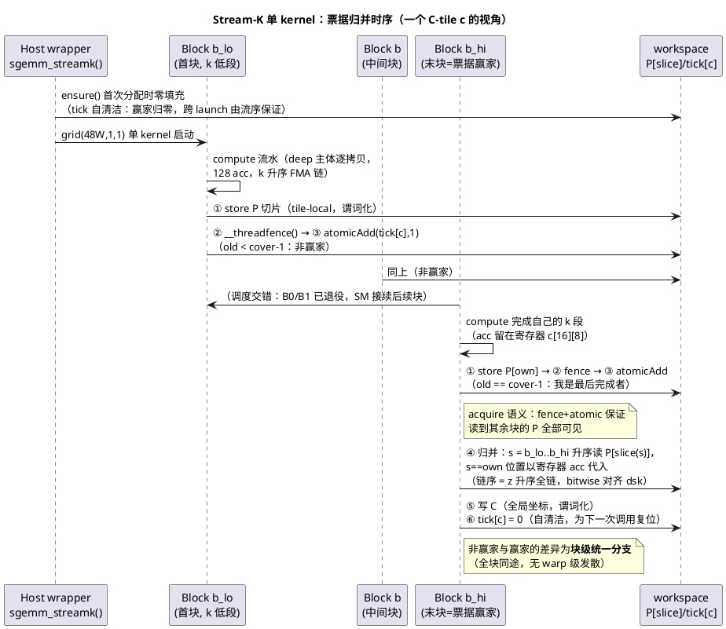
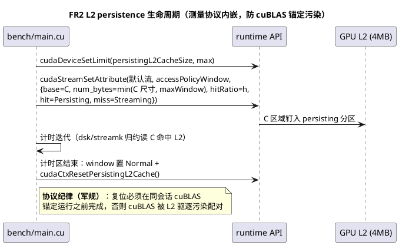
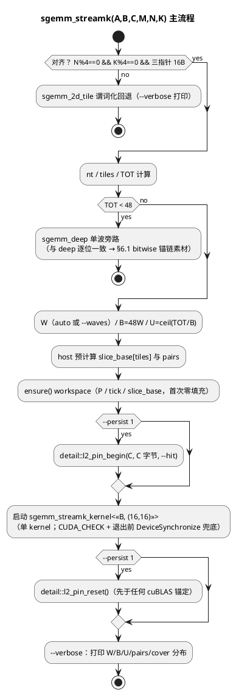
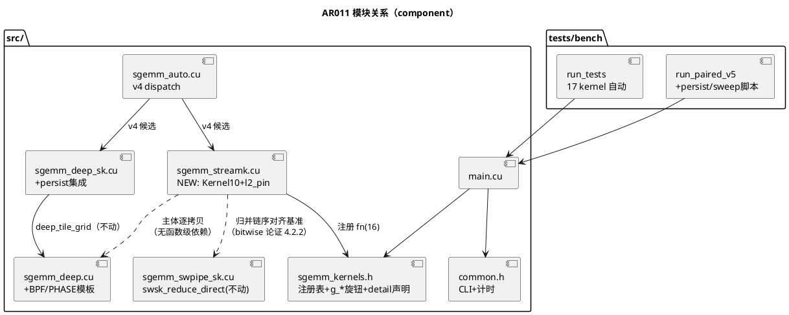

# 1 AR概述

| 组件名称 | cuda-sgemm（Quadro RTX 5000 / sm_75 / 48 SM，严格 FP32 SGEMM 七版 kernel 逐层优化工程） |
| --- | --- |
| AR系统流水号 | AR011 |
| AR描述 | Stream-K 统一调度（Kernel 10：迭代空间连续切分 + per-tile 票据归并，消灭波量化与归约第二 kernel）+ L2 persistence 钉 C + 主核延迟覆盖微优化消融（B 片段预取 / kk 错相）+ auto v4 + 几何 sk 公式 + 工程卫生。目标：G1@1024³ 翻门（74.77%→≥75%，预期 77%+）、新增 G6@2048³ ≥85% cuBLAS 门。 |

**需求源**：`results/2026107.md`（AR010 收官分析报告）。三个数据事实驱动本 AR（详见 srs §1）：

1. 1024³ 门缺口折算仅 **1.05μs**（342.0 vs 341.0μs）——归约侧任何 >1.1μs 结构性节省即翻门；
2. deep 设计点 LSU 吞吐利用率仅 37.5% → 28pp 缺口是**延迟覆盖**而非带宽墙；
3. 波量化（2048³ 尾波 -11%）+ 归约独立 kernel（41μs + 启动 3μs + P 自片 DRAM 往返）是两项可被 Stream-K 统一消除的结构性浪费。

# 2 动态行为

## 交互时序图





# 3 功能点分解

| 序号 | 功能点名称 | 功能点描述 | 来源 FR |
| --- | --- | --- | --- |
| 1 | P0 测量解锁与归因 | admin/TCC 条件任务：ncu stall 四分类（E-A）、cuBLAS 反测（E-B）、锁频五门（E-C）；不可得走替代协议 | FR1 |
| 2 | L2 persistence 钉 C | accessPolicyWindow + hitRatio 消融 + 分段净效应配对 + 协议内复位 | FR2 |
| 3 | B 片段 kk 预取（BPF） | template 消融：B 片段(kk+1) 先 LDS 入寄存器，128 FFMA 期间覆盖延迟 | FR3a |
| 4 | kk 轮转错相（PHASE） | template 消融：warp 轮转偏移打破屏障后同相停顿（数值口径降级声明） | FR3b |
| 5 | Stream-K 块映射 | 迭代空间 tile-major 线性化连续切分为 48W 块，变长 k 区间 | FR4 |
| 6 | per-tile 票据归并 | atomic 票据 + fence + 固定序归并 + 寄存器代入 + 自清洁 | FR4 |
| 7 | auto v4 + 几何 sk 公式 | dispatch 吸收胜者 + sk = clamp(ceil(48W/blocks),2,16) + 补充尺寸 | FR5 |
| 8 | 工程卫生与交付收尾 | __stwt 过时注释 / ws spill 豁免 / 五件套文档 / 全量自检 / 推送 | FR6 |

# 4 实现设计

## 4.1 功能实现思路（含方案取舍）

### 问题 1：块映射——迭代空间如何切？

以迭代空间单元 u = (C-tile c, k-tile kt)，总数 **TOT = grid_n·grid_m·nt**（nt = ceil(K/BK)）。

- **方案 A（均匀 per-tile split，= dsk 现状）**：每 C-tile 独立切 sk 份，grid=(n,m,sk)。
  缺点：blocks = tiles·sk 未必是 48 整倍数 → 波量化依旧（2048³ 128 块 2.67 波正是本病）；归约需第二 kernel。
- **方案 B（tile-major 连续切分，**推荐**）**：u 线性化 **u = c·nt + kt**（c 为高维、kt 低维），把
  [0, TOT) 连续切成 B = 48·W 块，每块 U = ceil(TOT/B) 单元。同块单元天然聚在同 C-tile
  且 k 连续；C-tile c 恰被**连续块号区间 [b_lo(c), b_hi(c)]** 覆盖（块号升序 ≡ k 升序）。
  blocks 恒为 48 整倍数 → 波填充率恒 100%；变长 k 区间复用 deep_tile_grid 的
  t0/t1 参数化语义。
- **方案 C（k-major 切分）**：u = kt·tiles + c。每块跨大量 C-tile → P 写散射、acc 无法驻留
  寄存器、归并参与块数爆炸。弃选。

**裁定：方案 B。** 例（1024³，W=2）：tiles=32，nt=128，TOT=4096，B=96，U=43；
tile0 由块 {0,1,2} 覆盖，k 切点 {43, 86}——与 dsk sk3 的 tps=ceil(128/3)=43 切点**逐点重合**
（此重合性是 §6.1 bitwise 锚链的构造基础）。

### 问题 2：归并同步——谁执行、如何序？

- **方案 A（全局单块归并）**：AR008 已否决——单块串行化全部归并，尾延迟不可接受。维持否决。
- **方案 B（per-tile 票据，**推荐**，对否决案的正确变体）**：每 C-tile 一个 32-bit 计数器，
  块完成该 tile 自己的 k 段后 `__threadfence()` → `atomicAdd`；看到 `old == cover(c)-1`
  的块（最后完成者）执行该 tile 的归并。96 块各自归并自己的 256×128 区域——
  **无全局串行化**，翻案成立（srs §2 FR4 翻案声明）。
- **方案 C（host 侧两段同步/协作组）**：冻结签名 + 单 kernel 语义下不可表达或多 launch；
  弃选。

**裁定：方案 B。** 关键性质：赢家分支是**块级统一**的（atomic 返回值对全块线程一致），
无 warp 级发散。

### 问题 3：主体复用方式——改 sgemm_deep.cu 还是自包含新文件？

- **方案 A（扩展 deep_tile_grid 加参数）**：单主体多模式。缺点：deep/dsk 已 passing 实例的
  codegen 被 ptxas 重排的风险（AR010 T007 实证：仅加运行时分支即使 241→243 重排、main -4.9%）；
  模板参数矩阵膨胀交叉污染。
- **方案 B（sgemm_streamk.cu 自包含，**推荐**）**：逐拷贝 deep 计算主体（流水/布局/128 acc
  一字不动），叠加 tile 循环 + tile-local P epilogue + 票据归并。符合 AGENTS.md §2
  "每版 kernel 一个 .cu、自包含"军规；既有路径零风险。**srs 所称"复用主体"在此解释为
  复用设计与代码文本（逐拷贝），非函数级共享**——设计裁定记录于门控记录。

**裁定：方案 B。** deep/dsk 唯一改动 = FR3a/3b 消融模板参数（见 §5）。

## 4.2 功能实现设计

### 4.2.1 块映射数学（host 侧预计算，device 侧闭式推导）

```
nt    = ceil(K / BK)                    // k-tile 数
tiles = grid_n · grid_m                 // C-tile 数（grid_n = ceil(N/BN), grid_m = ceil(M/BM)）
TOT   = tiles · nt
W     = (g_streamk_waves == 0) ? auto : clamp(g_streamk_waves, 1, 8)
      auto = clamp(floor(TOT/48), 1, 8)（且满足 U ≥ 16 的 k 深度下限，见 4.2.6）
B     = 48 · W                          // 恒 48 整倍数 → 波填充率 100%
U     = ceil(TOT / B)                   // 每块单元配额
适用条件：TOT ≥ 48 且对齐（N%4==0 && K%4==0 && 三指针 16B）；
        不适用 → 回退阶梯：非对齐 → sgemm_2d_tile；TOT < 48 → sgemm_deep 单波
```

**块 b（0 ≤ b < B，空块 b·U ≥ TOT 立即退出）的覆盖推导**：

```
u_lo(b) = b·U,  u_hi(b) = min((b+1)·U, TOT)             // [u_lo, u_hi) 单元区间
c_lo(b) = floor(u_lo / nt),  c_hi(b) = floor((u_hi-1) / nt)   // 覆盖的 C-tile 闭区间
块 b 对 tile c ∈ [c_lo, c_hi] 的 k-tile 区间（tile 内坐标）：
  t0 = max(b·U  - c·nt, 0)
  t1 = min((b+1)·U - c·nt, nt)        // t0 ≥ t1 不会出现（c 取自上述闭区间即非空）
```

**tile c 的覆盖块闭区间（归并参与集，块号升序 ≡ k 升序）**：

```
b_lo(c) = floor(c·nt / U),  b_hi(c) = floor((min((c+1)·nt, TOT) - 1) / U)
cover(c) = b_hi(c) - b_lo(c) + 1       // 全部非空（空块 u_lo ≥ TOT 天然排除）
```

**P 切片索引（c-major 前缀和，host 预计算 slice_base[tiles] 传参）**：

```
slice(c, b) = slice_base[c] + (b - b_lo(c))
P 总切片数 pairs = Σ_c cover(c) ≈ tiles·(B/tiles) ± tiles（跨界块各多 1）
容量上限按 tiles + B 保守分配（grow-only RAII，复用 dsk Workspace 模式）
```

**波几何对照表（验收锚点）**：

| 尺寸 | tiles×nt=TOT | deep 现状 | Stream-K（W, B, U） | 期望 |
|------|--------------|-----------|--------------------|------|
| 256³ | 2×8=16 | swsk_sk6=48 块 1 波（守擂） | **不适用**（TOT<48）→ dispatch 保持 swsk_sk6 | G2 回归安全 |
| 512³ | 8×64=512 | swsk_sk3 4282 GF | W=1：B=48, U≈11（≈sk6/块深 11）；W 上限由 U≥16 → 实际 W=1 | 与 swsk_sk3 对打，数据定 dispatch |
| 1024³ | 32×128=4096 | dsk_sk3=96 块 2 精确波，342.0μs | W=2：B=96, U=43，cover≈3，切点 {43,86} 与 dsk sk3 重合 | 消灭 launch 3μs + C 复读 + P 自片 → ≤325μs（77-79%） |
| 2048³ | 128×256=32768 | deep 128 块 2.67 波，8568.5（82.6%） | W=5：B=240, U=137，cover≈2 | 5 精确波 vs 2.67 波 → 预期 9.4-9.9TF（90-95%）→ G6@85% 有余量 |
| 4096³ | 512×512=262144 | deep 8566-8113（boost 域） | W=3：B=144 < tiles → 多数 tile cover=1 走快路径（≈deep+跨界 split） | 数据定（4096³ 不做 kernel 攻坚，srs Out-of-Scope） |

### 4.2.2 票据归并与内存序（正确性核心）

**每 tile c、每覆盖块 b 的协议**（§2 时序图的文字规范）：

1. compute：k 区间 [t0, t1) 的 deep 流水，acc 驻留 c[16][8] 寄存器（**k 升序 FMA 链**，与
   deep/dsk 逐元素同型）；
2. store P：epilogue 写 `P[slice(c,b)][ty·TM+i][tx·TN+q]`（**tile-local 坐标**，行谓词
   `by·BM+ty·TM+i < M`、列谓词 `bx·BN+tx·TN+q < N`——与 deep 全局 epilogue 同谓词，
   仅坐标基不同）；
3. `__threadfence()`：P store 对全 device 可见先于票据递增（release）；
4. `old = atomicAdd(&tick[c], 1)`（device 域）；
5. **赢家**（old == cover(c)-1）：s 从 b_lo(c) 到 b_hi(c) 升序归并——
   `s == b` 位置以**寄存器 acc 代入**（免读自身切片），其余读 P[slice(c,s)]；
   按 deep epilogue 同谓词写 C 全局坐标；最后 `tick[c] = 0`（**自清洁**：跨 launch 安全
   由流序保证——下一 launch 必在本 kernel 完成后；首次及异常重入由 ensure() 零填充兜底）。

**cover(c)==1 快路径（B ≤ tiles 的大尺寸关键省流）**：块内可由 `b_lo(c)==b_hi(c)`
闭式判定；此时该 tile 的唯一覆盖块**跳过 store P 与 ticket**，直接以 deep 全局
epilogue 写 C（与单波路径同型，零 P 流量、零原子）。4096³（W=3, B=144 < tiles=512）
大部分 tile 走此路径 → streamk 自动退化为"deep + 少数跨界 tile 的 split"，
P 容量与流量仅按真实 pairs 发生。

**T002 实现修订（2026-10-07，bitwise 正确性驱动）**：

- **归并默认改为 F2（全 P 归并）**：F1（own 以寄存器代入）在 winner 严格居中且
  cover ≥ 3 时产生 `((own+P_{b_lo})+…) ≠ ((P_{b_lo}+own)+…)` 的错误结合序
  （IEEE 交换律仅救首个二元组）；F2 中赢家将 c[i][j] **清零后复用为归并累加器**，
  按 s 升序读**全部** P 切片（含 own）——链 `0+P[b_lo]+…+P[b_hi]` 与 dsk
  全链恒逐位一致，且**与 winner 身份无关**（确定性天然成立）。代价仅赢家多读
  自身切片 128KB/tile。F1 降级为 cover==2 的专属微优化备选（交换律安全域）。
- **P 索引改 per-block 槽位**：`slice(b,c) = b·SLOTS + (c - c_lo(b))`，
  `SLOTS = ceil(U/nt)+1`——免 c-major 前缀表与每次调用的 H2D 拷贝
  （~5-10μs host 同步开销，违反单 kernel 低开销目标）；容量 (B·SLOTS) 较
  真实 pairs 约 ×2，可接受（流量只触达真实槽）。

**数值链序对齐论证（bitwise 基础）**：

- dsk direct 归约链（sgemm_swpipe_sk.cu:153-203）：`acc = P[0] + P[1] + … + P[sk-2] + C`，
  其中 C 值 ≡ 末片部分积——括号序与"全 P z 升序链"**逐位一致**（T007 bitwise 21/21 已实证）；
- Stream-K 归并链：`acc = Σ_{s=b_lo..b_hi, s≠own} P[s]`，own 位置代入寄存器值
  （与 P[own] 逐位同值）→ **同一 z 升序括号链**；
- 两者链序一致性成立的条件 = **切点重合**（§4.2.1 的 1024³ W=2 例）→ §6.1 用构造尺寸
  做逐位锚链；一般尺寸切点不同 → 与 dsk 无逐位关系，走 rel≤1e-4 + 确定性双跑门
  （srs §5 数值口径分级，已在 srs 预声明）。

**内存序依据**：`__threadfence()` + atomicAdd 构成 release-acquire 对（CUDA C++ 编程
指南内存一致性模型：fence 之后的全局写对后续观察到该 fence 序化结果的 atomic 的
读者可见）；P 读在赢家分支内发生于 atomic 返回之后 → 其余块的 P store 均已可见。
racecheck 专项覆盖（§6.4）。

**寄存器代入的时序可行性**：块对 [c_lo, c_hi] 内 tiles **串行**处理——compute(c) →
store P(c) → ticket(c) →（赢家则归并写 C）→ compute(c+1)…；归并发生时当前 tile 的
acc 恰好驻留寄存器（非赢家分支 acc 已死，复用无冲突）。

### 4.2.3 寄存器与资源预算（ptxas 审计硬门）

- 主体逐拷贝 deep：`__launch_bounds__(256, 1)`，DBUF=1 基线 243 regs / 24832B smem / 0 spill；
- 增量：票据与归并代码 ~10-14 寻址/瞬态寄存器（tick 指针、slice_base 指针、b_lo/b_hi、
  归并循环变址）→ **贴 255 上限风险高**；
- **回退阶梯**（T002 实测裁定，逐级记录 build_t002.log）：
  - F1（首选）：寄存器代入归并（省自身切片 128KB 读/tile）；
  - F2：若 ptxas >255 regs 或出现 spill——赢家改**全 P 归并**（own 切片也走 P，
    归并代码与 acc 解耦、寄存器可被编译器回收；代价仅 +1 切片读，bitwise 不受影响：
    own 的 P 值与寄存器值逐位相同）；
  - F3（禁手）：降低 DBUF=0 实例为 streamk 默认——dbuf1 全尺寸 +3~14% 已固化，禁回退。
- smem 与 deep 相同（24832B ≤ 48KB 静态上限）；P/tick workspace 走 global（RAII，见 4.2.6）。

### 4.2.4 L2 persistence 钉 C（FR2）

- **API 序列**（detail 层新工具，声明入 sgemm_kernels.h，实现落 sgemm_streamk.cu，
  dsk 经 extern 复用）：

```cpp
namespace sgemm { namespace detail {
// 成功返回 true；失败（属性不支持/超限）返回 false 并 --verbose 说明（不中断）
bool l2_pin_begin(float* base, size_t bytes, double hit);   // setLimit + window{base,bytes,hit,Persisting,Streaming}
void l2_pin_reset();                                         // window{Normal} + cudaCtxResetPersistingL2Cache()
}}
```

- **尺寸数学**：persisting 上限 = `prop.persistingL2CacheMaxSize`（运行时查询，TU104 实测
  值入 environment.md）；window 上限 = `cudaDevAttrMaxAccessPolicyWindowSize`；
  `num_bytes = min(C 字节, maxWindow)`，`hitRatio = min(hit, persistingMax / num_bytes)`
  （hitRatio ≤ 1 时按比例钉入，正是 hitRatio 的设计用途）；
  1024³ C=4MB 恰在 TU104 L2=4MB 量级——全钉边界情形；2048³ C=16MB → 必然部分钉
  （hitRatio 缩放）。
- **集成点**：`--persist 1` 时 dsk（与 streamk，T005 探索后定）wrapper 在**计时区内**调用
  l2_pin_begin / 计时区后 l2_pin_reset——**复位必须先于同会话 cuBLAS 锚定**（§2 时序图
  协议纪律，违反即污染配对 = 数据真实性事故）。
- **净效应判据**（复用 sgemm_deep_sk.cu:99-136 verbose 分段基建）：reduce 段节省 ≥2μs
  且 main 段退化 <1% 才判净收益；hitRatio {0.6, 0.8, 1.0} 三档消融落独立 CSV
  （SGEMM_CSV 分流，军规）。

### 4.2.5 延迟覆盖微优化（FR3，deep/dsk 路径上的 template 消融）

- **FR3a BPF**（`template <int BPF>`，默认 0）：compute 的 kk 步进循环开头先 LDS
  B 片段(kk+1) 入第二组寄存器（2×float4 = +8 regs），本 kk 的 128 FFMA 期间覆盖其延迟；
  kk=BK-1 步不预取。**不改变加法链序** → bitwise 门适用。
- **FR3b PHASE**（`template <int PHASE>`，默认 0）：warp w 处理 kk 的顺序改为
  `kk' = (kk_base + w) & 7`（w = tid>>5，warp 内统一 → 无 lane 发散；swizzle = kk'&7
  随序一致）。**改变逐元素 k 加法序** → rel≤1e-4 双参考 + run-to-run 逐位确定性门
  （数值口径分级声明同步详设 §4.6 与 tests 注释）。
- **实例矩阵受控**（§4.4 表）：BPF 仅实例化 DBUF=1 族；PHASE 仅实例化 <DBUF=1,
  LAST_DIRECT∈{0,1}, STORE_MODE=0> 消融点——避免 2×2×2×2×2 组合爆炸；
  每实例 ptxas 逐条审计（regs/spill/smem 三列入 build.log）。
  **T004 修订（2026-10-07）**：原表仅单因子实例（BPF 单开/PHASE 单开），实测
  裁定需补 `<1,ld,1,1>` 组合实例——{on,off}² 因果分解要求 both-on 参照
  （组合预取目标按逻辑步 (s+1+wid)&7 修正，见 §4.2.5 FR3a 回绕注）。
  实测结果（lat_cover_ar011.csv）：双因子皆负，组合≈PHASE 单独。
- **既有实例回归门**：新增模板参数后，旧 4 实例（deep/dsk 现役）必须
  ①bitwise 专项全绿（deep==swpipe、dsk==swsk 等 21 项锚链）②1024³ deep/dsk 性能
  落历史噪声带（±1%）——防 ptxas 重排病灶复发（AR010 T007 教训）。

### 4.2.6 workspace、auto 公式与 CLI 旋钮

- **streamk workspace**（sgemm_streamk.cu 内静态 RAII，grow-only，dsk 模式逐拷贝）：
  - `P`：pairs·BM·BN floats 上限按 `(tiles + B)·BM·BN` 保守分配（1024³ W=2 ≈ 12.5MB，
    与 dsk sk3 同量级；2048³ W=5 ≈ cover 2 × 128 tiles × 128KB ≈ 32MB——可接受）；
  - `tick`：tiles 个 uint32（≤ 2KB）；`slice_base`：tiles 个 int32；两者 ensure() 首次
    cudaMemset 零填充，tick 此后靠赢家自清洁跨迭代保持为零。
- **W 的 auto 公式（初版，T005 sweep 校准后由 auto v4 胜者表接管）**：
  `W = clamp(floor(TOT / (48·16)), 1, 8)`——U ≥ 16 k-tile 深度下限防"P 税"
  （切 片过浅时 P 写读流量与流水 fill/drain 开销摊薄不掉）。落点：
  512³（TOT=512）→ W=1（U≈11，浅于下限但为可达最优，披露）；
  1024³（TOT=4096）→ W=5；2048³（TOT=32768）→ W=8 封顶。
  注意 W 的真实最优是**经验量**（P 流量 vs 波填充 vs 归并重叠三力平衡，
  P 流量与 compute 重叠时非串行地板）——`--waves 0` 只给保守起点，
  **auto v4 dispatch 以 T005 实测胜者表为准**（T006 固化）。
- **CLI 三旋钮**（common.h `--kernel` 表 + usage + 校验，main.cu 绑定 g_* 全局）：

| 旋钮 | 语义 | 默认 | 校验 |
|------|------|------|------|
| `--waves <0..8>` | Stream-K 波数 W；0 = auto 公式 | 0 | 越界 CLI_ERROR；非 streamk kernel 打 [note]（--sk 先例） |
| `--persist <0\|1>` | L2 钉 C 开关（dsk/streamk 有效） | 0 | 越界 CLI_ERROR |
| `--hit <0.5..1.0>` | accessPolicyWindow hitRatio | 0.8 | 区间外 CLI_ERROR；--persist 0 时打 [note] |

### 4.2.7 流程图（streamk wrapper 主流程）



## 4.3 接口描述

| 接口 | 签名 | 说明 |
|------|------|------|
| 新 kernel（冻结签名） | `void sgemm_streamk(const float* A, const float* B, float* C, int M, int N, int K)` | 注册 `kernel_fn(16)`，name="streamk"，KERNEL_COUNT 16→**17**；tests/bench 经 KERNEL_COUNT 循环自动纳入 |
| 设备主体 | `template <int DBUF> __global__ __launch_bounds__(256,1) sgemm_streamk_kernel(A, B, C, P, tick, slice_base, M, N, K, U, nt, B_blocks)` | 自包含（§4.1 问题 3 方案 B）；DBUF 沿用 g_deep_dbuf（dbuf1 已固化默认） |
| L2 工具 | `detail::l2_pin_begin / l2_pin_reset`（4.2.4） | 声明入 sgemm_kernels.h detail 层（与 deep_tile_grid/swsk_reduce 同层） |
| 全局旋钮 | `int g_streamk_waves; int g_l2_persist; double g_l2_hit;`（namespace sgemm） | main.cu 按 kernel 名绑定（--sk/--dbuf 先例）；sgemm_kernels.h extern |
| 消融模板 | `sgemm_deep_kernel<DBUF, LAST_DIRECT>` → `<DBUF, LAST_DIRECT, BPF, PHASE>` | 新参数默认 0；实例矩阵见 4.4；旧实例 codegen 回归门见 4.2.5 |

**对外契约不变**：CLI 兼容（新增三旋钮向后兼容）；CSV schema 不变（新 kernel 名入
kernel 列）；cuBLAS 对照协议不变（persistence 复位纪律除外，新增）。

## 4.4 代码设计

**文件改动清单**：

| 文件 | 改动 | 规模 |
|------|------|------|
| `src/sgemm_streamk.cu` | **新增**：设备主体（deep 逐拷贝 + tile 循环 + tile-local P epilogue + 票据归并）+ wrapper + workspace + l2_pin 工具实现 + 头部注释契约（tile 尺寸/工作分配/smem 布局理由/票据协议全量，AGENTS §4 军规 5） | ~300 行 |
| `src/sgemm_deep.cu` | 模板参数扩展 BPF/PHASE（默认 0 实例 = 现役路径）+ FR3a/3b 实现（编译期分支）+ 头部注释补两旋钮 | ~60 行 |
| `src/sgemm_deep_sk.cu` | `--persist` 集成（计时区内 pin/reset）+ :15-17,109 过时 `__stwt`/"45→~33μs" 注释修正（T009，注释契约清偿） | ~25 行 |
| `src/sgemm_kernels.h` | sgemm_streamk 声明 + 3 个 g_* extern + detail::l2_pin 声明 + KERNEL_COUNT 更新（在 main.cu/注册表处） | ~15 行 |
| `src/main.cu` | 注册表 +1 行；旋钮绑定（--waves/--persist/--hit，--sk 先例模式） | ~20 行 |
| `include/common.h` | CliOptions 3 字段 + usage 文案 + 解析与校验 | ~20 行 |
| `src/sgemm_auto.cu` | v4 dispatch 表重写（T006，胜者吸收 + sk 几何公式） | ~40 行 |
| `tests/` | 流程扩至 17 kernel（KERNEL_COUNT 自动）+ bitwise 专项扩展（§6.1 三锚链） | ~40 行 |
| `bench/` | run_paired_v5 / run_streamk_sweep / run_persist_ablation / run_lat_cover_ablation 脚本 + parse 脚本 + make_figures.py fig29-34 | 脚本组 |

**模板实例矩阵（ptxas 逐实例审计表，build.log 必录）**：

| kernel | 实例 | 用途 |
|--------|------|------|
| sgemm_deep_kernel | `<d,ld,0,0>` d∈{0,1}, ld∈{0,1}（现役 4 实例） | deep/dsk 现役路径——**codegen 回归门**（4.2.5） |
| sgemm_deep_kernel | `<1,ld,1,0>` ld∈{0,1} | FR3a BPF 消融（--dbuf 1 固化域） |
| sgemm_deep_kernel | `<1,ld,0,1>` ld∈{0,1} | FR3b PHASE 消融（1024³/2048³ 攻坚点） |
| sgemm_streamk_kernel | `<0>` / `<1>` | Stream-K 主体（DBUF 消融留档，默认 1） |



# 5 重构设计

1. **sgemm_deep.cu 主体不动**（自包含 + ptxas 稳定性双重理由，§4.1 问题 3）；
   streamk 逐拷贝——两文件主体差异必须在双方头部注释中互相引用说明（防后续
   单边修改漂移：deep 改布局须同步 streamk，列入两文件头注释军规段）。
2. **deep kernel 模板参数扩展**（BPF/PHASE）属受控重构：默认值实例承担现役路径，
   回归门双保险（bitwise 锚链 + 性能噪声带，§4.2.5）。
3. **sgemm_deep_sk.cu 注释修正**（T009）：:15-17 `__stwt` 描述与 T007 实测回退结论
   矛盾、:109 "归约 45→~33μs" 与实测 43μs 口径——注释契约违规清偿，不改代码。
4. **ws/wsk 4×8B spill**：T009 评估根治（寄存器重排或减一个瞬态）或显式豁免记录
   （教学阶梯历史版本，非现役路径——豁免成本收益裁定）。

# 6 测试设计

## 6.1 单元测试（UT）

- **146→155 基线扩容**：注册表自动纳入 streamk（17 kernel × 9 尺寸含边界/非对齐/
  极值 130×257×66 等）——判据沿用（CPU 参考 + 现行容差）。
- **bitwise 专项扩展**（tmp_bitwise 件，三锚链）：
  1. `streamk(TOT<48) == deep`（单波旁路路径，任意小尺寸，如 256×512×64）；
  2. **构造切点重合尺寸**：M=1536, N=1024, K=512（tiles=48, nt=64, TOT=3072）：
     `streamk(W=1) == deep`（U=64=nt → cover=1 退化为满 K 单块直写）；
     `streamk(W=2) == dsk(sk=2, direct)`（U=32 切点 {32} 与 dsk tps=32 逐点重合，
     链序论证 §4.2.2 的直接实证）；
  3. 既有 21 项锚链全量回归（deep==swpipe、dsk==swsk、dbuf1==dbuf0 等——
     模板扩展后必须仍绿，§4.2.5 回归门）。
- **确定性双跑门**（新数值序路径通用）：streamk 与 PHASE=1 实例各双跑 memcmp 全位一致
  （票据赢家不确定性不改变归并链序与浮点输入 → 结果必须逐位确定；不满足即缺陷）。

## 6.2 接口测试（IT）

- `--waves`：0（auto）/1..8 正常；9、-1 → CLI_ERROR；非 streamk kernel → [note] 提示；
- `--persist`：0/1 正常；2 → CLI_ERROR；`--hit` 0.5/0.8/1.0 正常；0.4/1.1 → CLI_ERROR；
  `--hit` 单独给（--persist 0）→ [note]；
- `--list-kernels` 17 项；`--kernel streamk` 全尺寸可跑；`--csv` 行 schema 不变。

## 6.3 业务场景测试（门 v5，thermal-paired 会话）

- `run_paired_v5`（v4 协议继承）：cublas 首末锚定 + 47°C 冷却门 + GPU 时钟 spin +
  tools\env.cmd 包裹 + 追加前删旧文件；kernel 集 = deep/dsk/streamk/auto v4/胜者变体/
  swsk/swpipe/cublas × 六尺寸 + 补充尺寸（256×4096、4096×256、1024×2048）；
- 门判（srs §3）：G1@1024³ 翻门（≥75%，预期 77%+）/ G6@2048³ ≥85% / G1@512³、G2、
  G3 回归 / G4''' 增量 / G5''' 保真（10/12 ≤0.6pp + 补充尺寸首测列）；
- A-B-A-B 保真（auto v4 vs winner，双 rep + min/median 双口径，AR010 T006 先例）；
- P0 解锁时：锁频口径五门并行列落盘（不替换 WDDM 历史结论）。

## 6.4 异常场景测试

| 场景 | 期望 | 验证手段 |
|------|------|---------|
| TOT < 48（256³ 等） | 单波旁路 deep，结果逐位一致 | UT 6.1 锚链 1 |
| 空块（b·U ≥ TOT） | 立即退出，不 store 不 ticket，cover 不含空块 | 构造 TOT 非 48 整除尺寸（1000×1016×1024）+ UT |
| 票据跨 100 次迭代自清洁 | 每次迭代 tick 起始为 0 | 确定性双跑 + racecheck |
| 票据/fence 内存序缺陷 | 0 hazards | `compute-sanitizer --tool racecheck` 专项（军规 §6：cp.async 类必查，票据同级别必查）+ memcheck 全版本 |
| C > window / > persistingMax | clamp + hitRatio 缩放，--verbose 披露实际参数 | 2048³（C=16MB）UT/IT + environment.md 记录实测上限 |
| persistence 污染 cuBLAS | 复位先于锚定，锚定值落历史带 | run_paired_v5 首末锚定差值门（AR010 先例：8377↔8432 带宽内） |
| K < BK（nt=1）/ M,N,K=1 | load_zero_guard + 谓词 epilogue 正确 | 146 系列极值尺寸 |
| 非对齐（N%4/K%4/指针） | tile2d 回退，--verbose 打印 | 既有回退测试自动覆盖（streamk 同条件） |
| P workspace 分配失败 | stderr + exit（dsk 先例） | 代码审查 + 构造大尺寸冒烟 |

## 6.5 实验与图表交付物（AGENTS §6，每任务强制）

| 任务 | 实验 | 图表（make_figures.py 可复现） |
|------|------|------|
| T002 | 冒烟 + bitwise 三锚链 + sanitizer | fig29：Stream-K 结构三联（块映射/票据/归并链序） |
| T003 | persistence on/off × hit 三档 × 净效应配对 | fig30：persistence 消融（分段条形 + 净效应瀑布） |
| T004 | BPF/PHASE on/off × 2 尺寸 + ptxas 记录 | fig31：延迟覆盖消融（LSU/FFMA 利用率标注） |
| T005 | W×切法 sweep 全尺寸 + 1024³/2048³ 主战场 | fig32：sweep + 波填充率；fig33：1024³ 时间预算瀑布（342→目标分解） |
| T006 | auto v4 A-B-A-B + 补充尺寸首测 | fig34：v4 dispatch 全景 |
| T008 | 门 v5 终判 | fig35：AR009→AR010→AR011 三代门终态对比 |
