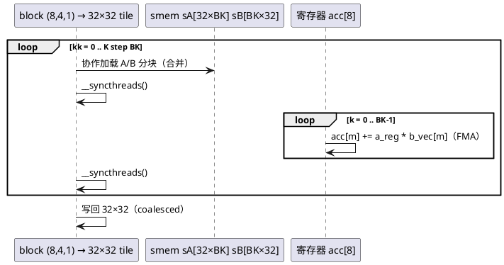

# [AR003] design.md — Kernel 2：共享内存 1D 分块

| 组件名称 | cuda-sgemm / sgemm_smem1d |
| --- | --- |
| AR系统流水号 | AR003 |
| AR描述 | 32×32 输出 tile + BK 深度分块 + 1D 寄存器复用（TM=8），warp 分块消除 DRAM 重复读取 |

# 2 动态行为



# 3 功能点分解

| 序号 | 功能点 | 描述 |
| --- | --- | --- |
| 1 | BK 模板 kernel | `template<int BK>` 单实现三实例（8/16/32），运行期 `--bk` 选择 |
| 2 | 1D 寄存器复用 | 每线程 8 个输出（TM=8），a 元素载入寄存器后跨 8 输出复用 |
| 3 | 边界处理 | K 不整除 BK 的尾块 + M/N 越界守护写回 |
| 4 | BK 消融实验 | E05 数据 → 最优 BK 固化为默认值 |

# 4 实现设计

## 4.1 关键决策

1. **block(8,4) 而非 (4,8)**：row 块 8 线程 × TM=8 = 64 行中每线程负责 8 个不连续行；
   col 4 线程方向覆盖 32 列。acc 布局 `acc[TM]`（每线程一列 8 行），
   B 向量 `b_vec[TM]` 沿 M 方向复用 —— 与 4.2 的 smem 布局联合消冲突。
2. **smem 布局**：sA[BM][BK]（行=32）、sB[BK][BN]；加载时 warp 沿行连续 → 合并。
3. **bank conflict 现状**：本版不治冲突（留给 K3/K4/K5 形成证据链），
   ncu 实测冲突计数记录为 K3 的"Before"基线。
4. **BK 默认 16**：E05 实测后可改默认；模板实例化上限 smem = 2×32×32×4B = 8KB < 48KB。

## 4.2 接口

```cpp
void sgemm_smem1d(const float* A, const float* B, float* C, int M, int N, int K);
// CLI: --kernel smem1d --bk {8,16,32}
```

# 6 测试设计

- 全矩阵回归自动覆盖（含 17×33×65、K=1 边界）；
- E05 BK 扫描：三数据点 + 选型理由落盘 `results/experiments/E05_bk_sweep.md`；
- 资源门：regs ≤ 32、无 spill、smem ≤ 8KB（TEST_PLAN §2 表）。

## 预构建状态记录

代码已实现（src/sgemm_smem_1d.cu，`template<int BK>` + 运行期分发）；
BK 默认值待 E05 实测定稿。
