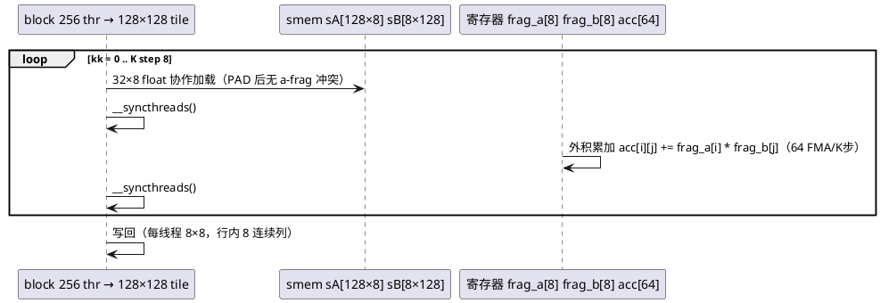

# [AR004] design.md — Kernel 3：2D 分块 + 寄存器外积

| 组件名称 | cuda-sgemm / sgemm_2d_tile（tile2d） |
| --- | --- |
| AR系统流水号 | AR004 |
| AR描述 | 128×128×8 tile、每线程 8×8 寄存器外积、warp 级 32×8 片段、PAD 消 a-frag 冲突、__launch_bounds__ 消融 |

# 2 动态行为



# 3 功能点分解

| 序号 | 功能点 | 描述 |
| --- | --- | --- |
| 1 | tile 形状 | BM=BN=128, BK=8；block(32,8)；每线程 TM=TN=8 |
| 2 | PAD 消冲突 | PAD_A=5（8×13=104≡8 mod 32 → a-frag 0 冲突）；PAD_B=4（b-frag 保留 4-way，K4/K5 治理） |
| 3 | launch_bounds 消融 | `__launch_bounds__(256, lb)`，lb∈{1,2} 编译期两实例，`--lb` 选择 |
| 4 | spill 硬门 | regs 100-168、spill=0；超标即缺陷（srs §3.2） |
| 5 | 误差控制 | FMA 链按 (kk,k) 双层顺序，误差 ≤1e-4 判据 |

# 4 实现设计

## 4.1 关键决策

1. **PAD_A=5 推导**（写入代码注释）：a-frag 8 线程读 `[8k][row]`、stride=BM+PAD=133；
   133≡5 (mod 32)，8×{0,5,10,…,35} mod 32 = 8 个互异 bank → 0 冲突。
2. **PAD_B=4 保留 4-way**：b-frag stride=BN+PAD=132≡4 → 8 线程落 {0,4,…,28} 两两同 bank。
   刻意不治（narrative：K4 swizzle 的"Before"证据），ncu 实测确认 ≤4-way。
3. **寄存器预算**：64 acc + 16 frag + 寻址 ≈ 96-100 基础；`lb=1` 允许 ptxas 放宽到 ≤255，
   `lb=2` 压到 ≤128（可能增 spill）—— E06 以实测裁决，不预设结论。
4. **写回**：每线程 8 行 × 8 列，行内 8 列连续 → 32B 事务（未向量化，K4 的改进点之一）。

## 4.2 接口

```cpp
void sgemm_2d_tile(const float* A, const float* B, float* C, int M, int N, int K);
// CLI: --kernel tile2d --lb {1,2}
```

## 4.3 依赖

依赖 AR001 全部基础设施；与 K2 无代码复用（独立 .cu，保持每版"可单独 diff 讲解"）。

# 6 测试设计

- 全矩阵回归（边界：M/N 非 128 倍数的守护写回；K 非 8 倍数尾块）；
- 资源门（spill=0 硬门）+ E06 lb 消融 + E09 stall 签名（short scoreboard 主导）。

## 预构建状态记录

代码已实现（src/sgemm_2d_tile.cu，lb 模板双实例）；PAD 推导与冲突计数待 ncu 实测复核
（D7 决策：实测与注释冲突时以实测为准修订文档）。
