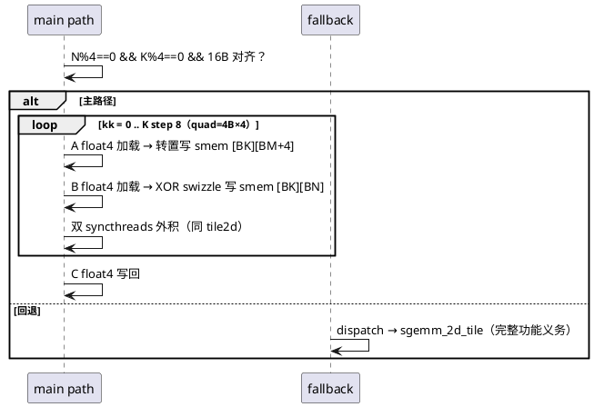

# [AR005] design.md — Kernel 4：float4 向量化 + swizzle 消冲突

| 组件名称 | cuda-sgemm / sgemm_vec4（vec4） |
| --- | --- |
| AR系统流水号 | AR005 |
| AR描述 | 同 tile2d 形状上三处 float4（全局读 A/B、写 C）+ A 转置 smem + B XOR swizzle，主路径 N%4==0 && K%4==0，否则回退 tile2d |

# 2 动态行为



# 3 功能点分解

| 序号 | 功能点 | 描述 |
| --- | --- | --- |
| 1 | 三处 float4 | 全局→smem A/B、smem→寄存器（Frag8 union）、寄存器→C 写回 |
| 2 | A 转置布局 | sA[BK][BM+4]：a-frag 读变为同行连续 → 无冲突，且可 float4 |
| 3 | B XOR swizzle | 物理单元 = 逻辑单元 ^ (kk & 7)，消 b-frag 4-way 冲突 |
| 4 | 回退路径 | 谓词不满足 → 调 sgemm_2d_tile；--verbose 打印选择 |
| 5 | 消融 | E07：swizzle 掩码置 0 的对照版验证收益 |

# 4 实现设计

## 4.1 关键决策

1. **A 转置 + PAD=4**：`[BK][BM+4]` → a-frag 8 线程沿行连续读，stride=1，
   每 quad 4 线程读 16B → 0 冲突；代价是全局 A 加载需 float4 后散写 4 个
   `[kk+r][m]` 元素（转置写，非合并方向）—— 由 float4 全局读的合并收益覆盖。
2. **B swizzle 而非 PAD**：PAD 会使 float4 写 smem 跨 bank 断裂；XOR swizzle
   保持 16B 对齐写，同时把 8 线程的 bank 落点散开。`physical = logical ^ (kk&7)`
   消费端用同一公式还原，无额外寄存器。
3. **Frag8 union**：`union { float4 v; float s[4]; }` —— smem→寄存器一次 16B 传输，
   计算端标量访问。union 的 16B 对齐假设由 smem 数组 `__align__(16)` 声明保证。
4. **回退谓词**：`N%4==0` ⇒ 边界 quad 全有或全无（详设 §5.4 推导），
   回退简化为两个模判断 + 指针 16B 对齐检查；K%4≠0 或 N%4≠0 尺寸
   （1023×1024×511、130×257×66）在 test 中断言走回退。
5. **不引入 cp.async**：本版仍用 ld.global→st.shared 两跳；
   L1 污染与寄存器占用的代价留给 K5 量化（E14 分解归因）。

## 4.2 接口

```cpp
void sgemm_vec4(const float* A, const float* B, float* C, int M, int N, int K);
// 主路径条件：N%4==0 && K%4==0 && A/B/C 16B 对齐；否则 → sgemm_2d_tile
```

# 6 测试设计

- 全矩阵回归 + **回退路径覆盖断言**（--verbose grep，TEST_PLAN §3.4）；
- E07 swizzle 消融：conflict 计数 ≈0 证据（conflict 门）；
- 资源门：spill=0；smem ≈ 8.4KB。

## 预构建状态记录

代码已实现（src/sgemm_vec4.cu，含 Frag8/swizzle/回退）；
swizzle 消冲突效果与转置写代价待 ncu 实测确认。
