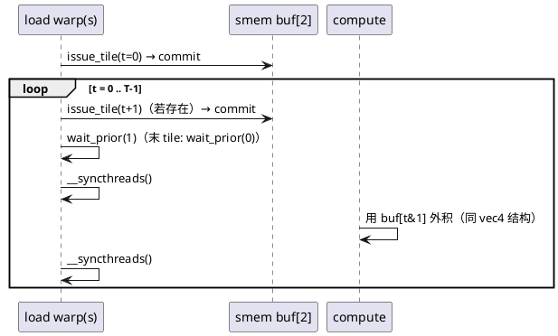

# [AR006] design.md — Kernel 5：cp.async + 双缓冲流水（甲/乙双方案）

| 组件名称 | cuda-sgemm / sgemm_cpasync（cpasync=甲, cpasync2=乙） |
| --- | --- |
| AR系统流水号 | AR006 |
| AR描述 | `__pipeline_memcpy_async` 2-stage 双缓冲：全局→smem 直接传输（绕寄存器与 L1 写污染）；甲/乙两种 A 布局方案并行实现供 GPU 消融定稿 |

# 2 动态行为



# 3 功能点分解

| 序号 | 功能点 | 描述 |
| --- | --- | --- |
| 1 | cp.async 双缓冲骨架 | issue(t+1)→commit→wait(1)→sync→compute→sync；末 tile wait(0) |
| 2 | 方案甲（cpasync） | A 直拷 `[BM][BK]`（PAD=4）+ B cp.async+swizzle；a-frag 标量 2-way 冲突（已知项） |
| 3 | 方案乙（cpasync2） | A float4+转置 smem+**寄存器预取一拍**；B cp.async+swizzle；冲突≈0 |
| 4 | 边界 zfill | 越界 16B 用 zfill=16（src 不读）；src 基址保证合法（已修复：越界时传全局基地址） |
| 5 | 回退路径 | 同 vec4 谓词；不满足 → sgemm_2d_tile，--verbose 打印 |
| 6 | 消融定稿 | E08 甲/乙对比 + E14 流水收益分解 → 胜者为默认 `cpasync` 注册名或按结果重命名 |

# 4 实现设计

## 4.1 关键决策

1. **cp.async 不能转置**（硬件按字节直拷）→ A 布局二选一无法兼得：
   - 甲：直拷保流水纯度，接受 a-frag 2-way 冲突（PAD=4 时 8×4≡8 mod 32 → 2-way）；
   - 乙：float4+转置需经寄存器（一拍延迟），用"预取 t+1 的 A 到寄存器、compute t"
     的寄存器级流水补偿。
   两者代码 90% 同构（模板/宏隔离差异段），**以 GPU 实测定稿，败者保留在仓库**（军规）。
2. **zfill 语义**：`__pipeline_memcpy_async(dst, src, 16, 16)` 时源不被读取（CUDA 11+ 语义），
   越界 quad 直接 zfill；但 src 指针仍须可寻址 → 传全局矩阵基地址（T002 修复）。
3. **同步结构**：每 tile 两次 `__syncthreads()` + `__pipeline_wait_prior`；
   racecheck 若报 pipeline hazard，逐条核对是否结构性误报（TEST_PLAN §8）。
4. **2-stage 而非 3-stage**：smem 预算 2×(128×8+8×128)×4B ≈ 16.6KB（甲）；
   3-stage 超静态 smem 收益边际递减，留作 backlog 讨论。

## 4.2 接口

```cpp
void sgemm_cpasync (const float* A, const float* B, float* C, int M, int N, int K); // 甲
void sgemm_cpasync2(const float* A, const float* B, float* C, int M, int N, int K); // 乙
// CLI: --kernel cpasync | cpasync2
```

# 6 测试设计

- 全矩阵回归 + 回退断言（同 K4）；
- **racecheck 硬门**：两方案 × {4096³, 1023×1024×511}（TEST_PLAN §8）；
- memcheck 边界（zfill 路径）+ E08/E14 消融归因；
- 终验门：胜者 ≥ 6.3 TF 且 ≥ 97% 本机 cuBLAS（±10% 条款，详设 §7）。

## 预构建状态记录

代码已实现（src/sgemm_cpasync.cu，双方案共存 + zfill 边界修复已应用）；
racecheck/memcheck 与甲乙定稿全部待 GPU 环境。
