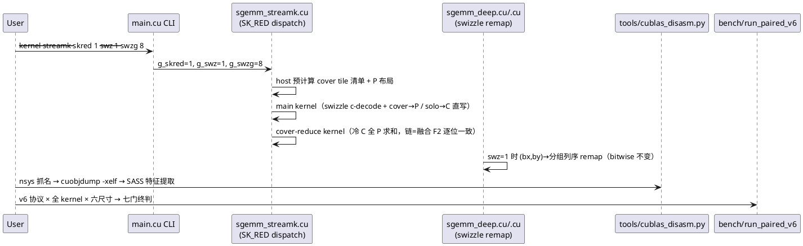
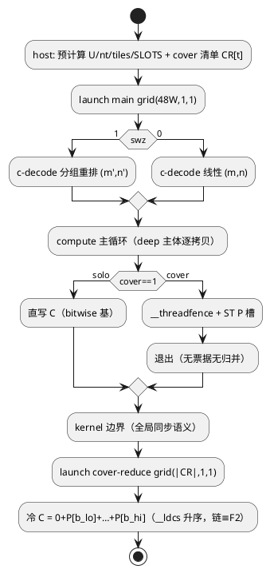

# 1 AR概述

| 组件名称 | cuda-sgemm（Quadro RTX 5000 / sm_75 / CUDA 12.5.40） |
| --- | --- |
| AR系统流水号 | AR012 |
| AR描述 | cuBLAS 追赶：E-B 零权限静态反汇编归因 + L2 块序 swizzle 消融（G7）+ Stream-K cover-only 独立归约结构（SK_RED，G1@1024³ 主攻）+ auto v5 条件吸收 + 门 v6 终判 |

# 2 动态行为

## 交互时序图



# 3 功能点分解

| 序号 | 功能点名称 | 功能点描述 | srs 追溯 |
| --- | --- | --- | --- |
| 1 | swizzle 旋钮与槽位 | --swz/--swzg 注册 + suite 槽位 + CLI 校验 | FR2/T001 |
| 2 | E-B 反汇编流水线 | nsys→cuobjdump→SASS→特征对照报告 | FR1/T002 |
| 3 | deep/dsk swizzle | 2D 分组列序 remap + bitwise 锚 | FR2/T003 |
| 4 | streamk swizzle + G7 消融 | c-decode 重排 + like-for-like 判定 | FR2/T004 |
| 5 | SK_RED separate 结构 | cover-only 独立归约 + G1 判定 | FR3/T005 |
| 6 | auto v5 | 胜者条件吸收 + 决策表/保真 | FR4/T006 |
| 7 | 门 v6 终判 | 七门 + 硬门全量复判 + 图表 | FR5/T007 |
| 8 | 交付收尾 | 文档六处回填 + 全量自检 | FR5/T008 |

# 4 实现设计

## 4.1 功能实现思路（含方案取舍）

### 问题 1：FR3 结构——half-K cover 还是剥离归约？

**裁定：方案 B（SK_RED=separate，cover-only 第二归约）；srs 原设想的 half-K cover
（方案 A）在设计期证伪，srs FR3 附修订注。**

- **方案 A（half-K cover，2 blocks/SM）——双重不可行**：
  ① 96 blocks 下 U=43，切点结构 ≡ AR011 W=2（闭环 #7 已录 1024³ W=1..8 单调负
  5461→3432），无新信息增量；
  ② "2 块/SM"物理不可达：243 regs × 256 thr × 2 blocks = 124416 > 65536（sm_75
  寄存器文件），smem 24832×2 = 49664B 亦逼近 64KB 上限——deep 族恒 1 block/SM
  （25% 占用 = 设计点，详设 §5 Kernel 9）。"dsk 96 块 = 2 块/SM" 的旧注释为
  归因笔误（96 blocks = 2 个串行波，非并发 2 块/SM）。
- **方案 B（SK_RED=separate）——机制对症**：
  1024³ 融合归并（393μs）输给 dsk 二段（297+41+3=341μs）的 52μs 差 = 赢家块
  以 256 线程串行读 ~2×128KB P/tile + **负载不平衡**（早到块非最后写者直接退出
  → SM 空转；真最后者独扛归并）。剥离为独立归约 kernel 后：全网格并行咀嚼
  cover 片（1024³ 仅 ~32 片 vs dsk 96 片 → 归约 41μs → ~14μs + 3μs 启动），
  main 侧免票据/归并。预算：main ≈ 297μs（同 dsk 主核 FFMA 量，且 solo tile
  32 片免 P 流量，P 流量 4MB vs dsk 12MB）+ reduce ≈ 17μs ≈ **314μs →
  ~7000 GF（≈83% cuBLAS）**，G1 门 6288（75%）余量充足；保守界（main 330）亦
  6660 GF（79%）。
  **数值口径**：reduce 链 = 0+P[b_lo]+…+P[b_hi] 升序 ≡ 融合 F2 链 → 两种模式
  **bitwise 一致**（强锚：同输入同 C 逐位相等，tests 专项）。
- **方案 C（C 直写 atomicAdd）**——非确定性（浮点原子序不定）破坏 bitwise/
  确定性双跑锚链军规，弃。

**cover 密度几何判据**（auto v5 用）：U < nt ⟺ tiles < 48·W ⟺ 块均 tile 份额
<1 → 多数 tile 被切（1024³：tiles=32<48 ✓ separate；2048³：tiles=128>48，
仅波界 ~47 tile 被切 ✓ fused 融合归并本就便宜）。

### 问题 2：FR2 swizzle 的诚实先验与机制候选

理想模型下**平方尺寸的总 DRAM 流量对光栅序不变**（线性序 B 面板每波重读 ≡
分组序 A 面板每波重读；波内活跃面板足迹 2048³ 约 21-23MB，任何 48-tile 波形
都塞不进 4MB L2——r+c ≤ 512 无解）。机制候选（G7 实测裁决，先验温和）：
① 波界残留：尾波 32 blocks 的面板与上一波重叠部分命中（序不同残留量不同）；
② 扇区粒度：loader LDG 流的 32B sector 对齐差异（A 行加载 vs B 列加载的
page 局部性）；③ C 写回流的 L2 逐出压力差异。
**设计价值**：G7 为负则存储通路假说空间关闭 → 13pp 差距聚焦 FFMA 发射效率
（E-B 归因主战场）；为正则直接兑现 G6@2048³。两头都是有效信息。

### 问题 3：E-B 流水线的降级链

L1（全链）：nsys profile（trace=cuda，免 admin）跑 cuBLAS bench → sqlite 提
kernel 名 + launch config（grid/block 维度直接读出 tile 形状上界）→ 
`cuobjdump -xelf <name> libcublas64_12.dll` 提 cubin → `--dump-sass` →
特征提取。L2（dll 提不出）：kernel 名解析（cublas 命名通常内嵌 tile 配置）+
launch config 归因。L3（nsys 不可用）：`--verbose` + CUDA_LAUNCH_BLOCKING
时间戳旁证（弱）。逐级降级记录，不阻塞 FR2/FR3。

## 4.2 功能实现设计

### 4.2.1 swizzle remap 数学（host 零成本，device 头部闭式）

**deep/dsk（2D grid (grid_n, grid_m[, grid_z])，bx=n fastest 线性现状）**：
线性 id `l = bx + by·grid_n`；分组列序（组宽 G，组内 m fastest）：

```
g   = l / (grid_m·G)            // 组号
r   = l - g·grid_m·G            // 组内序
G_eff = min(G, grid_n - g·G)    // 尾组收窄（grid_n%G≠0 时）
（r < grid_m·G_eff 恒成立：l < grid_m·grid_n = Σ_g grid_m·G_eff，除法自动落段）
m'  = r % grid_m
n'  = g·G + r / grid_m
→ tile 坐标 (m', n')（swz=0 时 m'=by, n'=bx 原样）
```

寄存器预算：6 整数运算 + 2 活跃寄存器，ptxas 增量 ≤2 硬门（build.log 审计）。
`grid_z`（dsk 切片）与 z 维度不参与重排。

**streamk（1D grid，u = c·nt + kt，c = m·grid_n + n）**：c→(m,n) 解码处套用
同型分组重排（c 先线性分解 (n0,m) → 分组重排 → (m',n')）；**切点/cover/票据/P
索引全部保持线性 c 空间不变**（slice(b,c)=b·SLOTS+(c-c_lo(b))、tick[c] 原样），
仅物理 tile 坐标重排 → 每tile 链不变 → bitwise ✓。

**波足迹核算（2048³，G=8，deep t=128 块 2.67 波）**：
- 线性（现状）：波 = 3m×16n → A 6.3MB + B 16.8MB（B 每波全宽重读）
- 分组 G=8：波 = 8m×6n → A 16.8MB + B 6.3MB（A 每波全高重读）
- G=4：波 = 12m×4n → A 25MB + B 4.2MB —— 旋钮扫描 {4,8,16} 由实测定优

### 4.2.2 SK_RED=separate 结构（streamk 双 epilogue）

```
--skred 0（默认，现状）：融合票据归并（F2 赢家全 P 链）
--skred 1（新增）：cover-only 独立归约
```

**main kernel（--skred 1）**：
- solo tile（cover==1）：直写 C（现状不变，bitwise 基础）
- cover tile：compute → `__threadfence()`（release）→ ST P 槽（per-block
  slice 布局不变）→ **无票据、无归并，直接退出**（kernel 边界即全局同步，
  membar 由 launch 语义保证）
- 寄存器：剥离 tick/赢家/归并路径 → 预算下降（~10 regs 归并寻址消失），
  0 spill 硬门沿袭

**cover-reduce kernel（新增，sgemm_streamk.cu 内自包含）**：
- host 预计算 cover 清单：`CR[t] = {c, b_lo, cover}`（遍历 c 由 b_lo/b_hi
  闭式，O(tiles)），数组 ≤ tiles 项（1024³ ~21 项）
- grid = (cover 数, 1, 1)（<48 → 单波），block 256 线程；每块对冷 C 直写
  `C = 0 + P[b_lo] + … + P[b_hi]`（升序 `__ldcs`，链 ≡ F2 → bitwise）
- 越界谓词同 deep epilogue（row≥M/col≥N 槽不读入）
- 复用 ensure() workspace（P 布局/容量不变）；tick 数组在 skred=1 下不触碰

**时序账（1024³ W=1）**：main 297μs（solo 32 片免 P；cover 4MB P 写）+
reduce ~14μs（32 片 4MB 读 + 4MB C 写 @355GB/s 地板）+ 3μs 启动 ≈ 314μs。

### 4.2.3 资源预算（ptxas 审计硬门）

| 变体 | 预期 regs | 硬门 |
| --- | --- | --- |
| deep/dsk swz=1 | 243 + ≤2 | 0 spill，与 swz=0 差 ≤2 |
| streamk swz=1 | 243 基线 + ≤2 | 同上 |
| streamk skred=1 main | 243 基线 − ~10（归并剥离） | 0 spill |
| cover-reduce kernel | 轻量（~40） | 0 spill |

全部经 `-Xptxas -v` 落 build.log；违反即缺陷（军规 4）。

### 4.2.4 auto v5 区带（条件吸收，双负则保持 v4）

```
blocks ≤ 16                     → swsk（不变）
17 ≤ blocks ≤ 64（1024³ 带）    → G1 翻门成立 ? streamk --skred 1 : dsk（不变）
blocks > 64：
  tiles ≥ 48·W（cover 稀疏）    → streamk 融合（2048³ 带，不变）
  整波/大网格                   → deep（4096³ 带，不变）
G7 正（swz ≥+1%）               → 胜者路径全局叠加 --swz 1 --swzg <最优>
```

### 4.2.5 E-B 工具与协议（T002）

`tools/cublas_disasm.py`：①`nsys profile -t cuda --force-overwrite` 包裹
cublas bench（1024³/2048³/4096³ 各一跑）；②sqlite（`nsys stats` 或直接
sqlite3 读）过滤 `CUPTI_ACTIVITY_KIND_KERNEL` → kernel 名 + grid/block；
③`cuobjdump -xelf <kernel 名匹配> libcublas64_12.dll` → cubin 文件；
④`cuobjdump --dump-sass` → SASS 文本；⑤特征提取：寄存器峰值（R<> 上限）、
`LDGSTS`（cp.async）宽度/排布/成对性、FFMA vs LDS 指令计数比、`BAR.SYNC`
密度、blockIdx 算术模式（**swizzle 判定：IMAD/MAD 于 bx,by 的重组痕迹**）、
unroll 结构（FFMA 连发段长）；⑥输出 `profile/cublas_disasm/report.md`：
逐项 vs 我方 deep（243 regs / LDS:FFMA 1:21.3 / dbuf 双缓冲 / XOR swizzle）
对照表 + 13pp 归因初判。SASS 原文与提取 cubin 一并归档（AGENTS §8 禁大
二进制——cubin/SASS 为文本与小文件，允许）。

### 4.2.6 实验协议（v4+ like-for-like 继承）

- swizzle 消融：`--swz {0,1}×--swzg {4,8,16}×{2048³,4096³}` + canonical
  全尺寸回归；同会话同轮位；非默认参数 `SGEMM_CSV` 分流到
  `results/swizzle_ar012.csv`（git 溯源列沿袭）
- SK_RED 消融：`--skred {0,1}` × {1024³, 512³}（vs dsk/deep/cublas 同会话）
  → `results/skred_ar012.csv`
- G7 判定：swz1 最优 G vs swz0，@2048³/4096³ 各 ≥+1.0% 且 512³/1024³
  回退 ≤0.5pp
- G1 判定：skred1@1024³ ≥ 75.00% × cublas 同会话稳态末锚（r1 冷锚排除）
- 门 v6：run_paired v6 = v5 协议逐项继承（cublas 首末锚定 + 47°C 冷却 +
  GPU 时钟 spin + env.cmd 包裹 + 追加前删旧 + 末锚分母 + K=4096 双制度纪律）

### 4.2.7 流程图（streamk --skred 1 主流程）



## 4.3 接口描述

| 接口 | 变更 |
| --- | --- |
| `void sgemm_x(A,B,C,M,N,K)` 统一签名 | **不变**（军规 2） |
| CLI：`--swz {0,1}` / `--swzg {4,8,16}` / `--skred {0,1}` | 新增；非 deep/dsk/streamk 打 [note]；--swzg 仅 --swz 1 有效；--skred 仅 streamk 有效；非法值 → CLI_ERROR |
| CSV 列 | 追加 swz/swzg/skred 参数列（沿袭 knob 列惯例） |
| suite/tests | 新增槽位：deep_swz1 / dsk_swz1 / streamk_swz1 / streamk_skred1 + bitwise 锚 4 项 |
| 内部全局 | `sgemm::g_swz/g_swzg/g_skred`（沿袭 g_deep_dbuf 模式） |

## 4.4 代码设计

- `include/common.h`：CLI 解析 +3 旋钮（沿袭 --waves 模式）
- `src/main.cu`：旋钮接线 + [note] 语义 + kernel 表注册新槽位
- `src/sgemm_deep.cu`：SWZ 头部 remap（模板参数 `int SWZ=0`，实例 ×2——
  现役 codegen 零扰动沿袭 AR011 T004 手法）+ dsk wrapper 透传
- `src/sgemm_streamk.cu`：①c-decode 重排（同 SWZ 模板）；②SK_RED 双
  epilogue（模板 `int SKRED=0`）；③cover-reduce kernel（自包含）
- `tools/cublas_disasm.py`：新增（纯 host 工具，不入构建）
- `tests/test_correctness.cu`：新槽位 + bitwise 锚（skred0 vs skred1 同
  C 逐位；swz0 vs swz1 同 C 逐位 ×3 kernel）+ 边界谓词（M/N/K 非 128 倍
  × swz1/skred1）+ CLI_ERROR 用例
- `bench/run_skred_ablation.ps1`、`bench/run_swizzle_ablation.ps1`、
  `bench/run_paired_v6.ps1`（v5 复制改造）
- `bench/make_figures.py`：fig35（swizzle 消融三联）/fig36（skred 对比）/
  fig37（七门总览）

# 5 重构设计

无对外重构。srs FR3 附设计修订注（half-K cover → SK_RED separate，
4.1 问题 1 裁定依据）；`sgemm_streamk.cu` 头注"块映射/票据"段补 SK_RED
分支说明；详设 Kernel 10 条目尾部补 skred 变体行（T008）。

# 6 测试设计

## 6.1 单元测试（UT）

- SWZ remap 纯函数性：swz=0/1 下全尺寸 C 一致（bitwise 锚 ×3 kernel：
  deep/dsk/streamk）
- SK_RED 双模式 bitwise：同输入 skred0 vs skred1 C 逐位相等（1024³ W=1、
  512³；链同构证明的实测闭环）
- cover 清单正确性：host CR[t] 与 device b_lo/b_hi 闭式一致（verbose 交叉）
- 边界谓词：M=1000/N=1016/K 非 8 倍数 × swz1/skred1（回退/谓词路径）

## 6.2 接口测试（IT）

- `--swz 2 / --swzg 3 / --skred 7 / --swzg 8 --swz 0` → CLI_ERROR
- `--swz 1 --kernel naive` → [note] 退出 0
- `--skred 1 --kernel dsk` → [note] 退出 0
- CSV 列含新旋钮值（追加行校验）

## 6.3 业务场景测试（门 v6，thermal-paired 会话）

run_paired v6 × 全 kernel × 六尺寸 + 补充尺寸；七门终判表
（G1/G6/G7/G2/G3/G4/G5 + 硬门）；judge 脚本 v6 解析。

## 6.4 异常场景测试

- memcheck：skred1 main + cover-reduce @1024³/2048³ 0 errors
- racecheck：skred1（P 写→kernel 边界→读序）@1024³ 抽查
- cover=0（全 solo，理论不出现但防御：CR 空 → 跳过 reduce launch）
- TOT<48 旁路 + skred1 组合（旁路 deep 不受 skred 影响的 [note] 路径）
- nsys/cuobjdump 缺失 → E-B 降级链逐级记录（负结果路径）

## 6.5 实验与图表交付物（AGENTS §6，每任务强制）

| 任务 | 数据交付 | 图表 |
| --- | --- | --- |
| T002 | profile/cublas_disasm/report.md + SASS 原文 | （引用表，无图） |
| T004 | swizzle_ar012.csv | fig35 三联（G 扫描/波足迹示意/判定） |
| T005 | skred_ar012.csv | fig36（skred 对比 + 314μs 时序账验证） |
| T007 | paired_ar012.csv + compare_ar012_paired.md | fig37 七门总览 |
