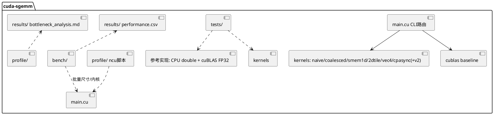

# cuda-sgemm 组件详细设计（组件_spec.md）

> 本文件是组件层全局基准（WHAT 的 single source of truth）。各 AR 的 srs.md/design.md 不得与其冲突；
> 实现过程中若组件契约需要变更，须经用户确认后先修订本文件。

---

## 1. 组件职责与边界

**职责**：在 Quadro RTX 5000（Turing, sm_75, 48 SM —— 2026-10-04 改靶的本机调优目标，
改靶决策与偏差记录见 §2 与 `results/environment.md` §0）上交付六版严格 FP32 的 SGEMM kernel
（Naive → 访存合并 → Smem 分块 → 2D 寄存器分块 → float4 向量化 → cp.async 双缓冲），
配套统一评测框架、数值正确性验证、Nsight Compute 瓶颈分析，最终逼近 cuBLAS FP32 实测值
（原 97% 绝对门按 §2 偏差声明改为相对门）。

**边界（Out of Scope）**：
- 不做 TF32 / Tensor Core / FP16/BF16 / 分块量化等非 FP32 路径；
- 不做批量化（strided-batched）、转置输入（`C=AᵀB` 等）、稀疏矩阵；
- 不支持 M/N/K ≤ 0 之外的非法输入（须报错退出而非崩溃）；
- 不做多 GPU / 多流 / 图（CUDA Graph）优化（可作为未来 AR）。

---

## 2. 运行环境（AR001/T001 已实测回填，2026-10-04）

> **⚠️ 环境偏差声明**：本工程原设计目标机为 RTX 4060 Laptop（sm_89, Ada）。实际执行机为
> **Quadro RTX 5000（sm_75, Turing）**，经用户批准继续（2026-10-04），全量偏差分析与处理原则见
> `results/environment.md` §0。要点：构建 `-arch=sm_75`；**绝对性能门（§4.6 各版本目标 GFLOPS 数值）
> 作废，改用相对门**（vs 本机 cuBLAS FP32 实测百分比 + 相邻版本加速比）；cp.async 硬件指令在 sm_75
> 不存在（需 sm_80+），AR006 的 `__pipeline_memcpy_async` 将退化为同步拷贝，如实归档。

| 项 | 值（实测） |
|----|-----|
| GPU | NVIDIA Quadro RTX 5000（TU104 GL，3072 CUDA cores，16GB GDDR6 256-bit @7001MHz = 448.1 GB/s） |
| SM 架构 | sm_75（Turing），48 SM，每 SM 64 FP32 lanes，64KB smem/SM 可配，寄存器 64K×32bit/SM，L2 4MB |
| 理论 FP32 峰值 | **11.15 TFLOPS**（2 × 3072 × 1.815 GHz boost，deviceQuery 实测 clockRate=1815000kHz） |
| TGP 档位 | 固定 230W（Default=Max=230W，Min=125W，无 Dynamic Boost） |
| 驱动版本 | 556.18（WDDM 模式） |
| CUDA Toolkit | nvcc 12.5.40（官方 redist 免管理员组装）+ ncu 2024.2.0.0 + compute-sanitizer 2024.2.0.0（详见 results/environment.md §4） |
| 时钟策略 | **方案 B：稳态预热**（WDDM + 无管理员权限，`-lgc` 不可用；RSD ≤ 5% 稳态判据；同会话内相对比较有效） |

---

## 3. 系统架构与模块分解



| 模块 | 职责 | 关键约束 |
|------|------|---------|
| `include/common.h` | CUDA_CHECK、CLI 解析、event 计时器、GFLOPS/带宽计算 | 全部 kernel/test/bench 共用，接口冻结于 AR001 |
| `src/sgemm_*.cu` | 七版 kernel（naive→swpipe），每文件自包含 | 统一签名（§4.1），头部注释契约（AGENTS.md §4.5） |
| `src/main.cu` | `--kernel {naive\|coalesced\|smem1d\|tile2d\|vec4\|cpasync\|cpasync2\|swpipe\|swsk\|ws\|auto\|cublas\|all} [--bk 8/16/32] [--lb 1/2] [--sk 1-16] [--stages 2/3] [--wp 1/2] [--rounds N] [--csv] [--verbose] --m --n --k --warmup --iters --check` | CLI 参数表冻结于 AR001；AR007 扩展 swpipe/--rounds/bk 默认 32；AR008 扩展 swsk/ws/auto/--sk（见 §4.6） |
| `tests/` | 参考实现 + 误差判据 + 一键全矩阵回归 | §4.4 |
| `bench/` | 批量跑分 → `results/performance.csv` | §4.3 |
| `profile/` | ncu 采集脚本 + 各版指标导出 + sanitizer 脚本 | §4.5 |
| `results/` | performance.csv、environment.md、bottleneck_analysis.md、阶梯图 | 数据真实性军规 |

---

## 4. 核心契约（冻结项）

### 4.1 Kernel 接口与内存布局

```cpp
// 行主序：A[M×K]，B[K×N]，C[M×N]，C = A·B（不使用 alpha/beta，C 即输出）
void sgemm_naive    (const float* A, const float* B, float* C, int M, int N, int K);
void sgemm_coalesced(const float* A, const float* B, float* C, int M, int N, int K);
void sgemm_smem_1d  (const float* A, const float* B, float* C, int M, int N, int K);
void sgemm_2d_tile  (const float* A, const float* B, float* C, int M, int N, int K);
void sgemm_vec4     (const float* A, const float* B, float* C, int M, int N, int K);
void sgemm_cpasync  (const float* A, const float* B, float* C, int M, int N, int K);
void sgemm_cpasync_v2(const float* A, const float* B, float* C, int M, int N, int K);  // 方案乙（AR006 消融），CLI 注册名 cpasync2
void sgemm_swpipe   (const float* A, const float* B, float* C, int M, int N, int K);  // K6 软件流水（AR007 扩展变体）：A/B 寄存器预取 + 单缓冲，无 cp.async 依赖，CLI 注册名 swpipe
void sgemm_swpipe_sk(const float* A, const float* B, float* C, int M, int N, int K);  // K6 变体（AR008）：split-K + 确定性归约，内部 grow-only workspace，CLI 注册名 swsk
void sgemm_ws       (const float* A, const float* B, float* C, int M, int N, int K);  // Kernel 7（AR008）：warp 专属化 producer/consumer + named barriers + 3 级 smem 环，CLI 注册名 ws
void sgemm_auto     (const float* A, const float* B, float* C, int M, int N, int K);  // 自动选核 v2（AR009 T006）：blocks=ceil(M/128)·ceil(N/128) 几何带判（≤4→swsk6 / ≤64→swsk3 / 其余→swpipe，1620 MHz 稳态实测回填），K 钳制 sk≤ceil(K/8)，CLI 注册名 auto（registry K_AUTO=11）
void sgemm_wide     (const float* A, const float* B, float* C, int M, int N, int K);  // Kernel 8（AR009）：512 线程宽块双角色流水（64×256 tile，TM4×TN8），CLI 注册名 wide（K_WIDE=12）
void sgemm_wsk      (const float* A, const float* B, float* C, int M, int N, int K);  // Kernel 8 变体（AR009）：wide + split-K（复用 detail::swsk_reduce 确定性归约，与 swsk 数值同源逐位一致），CLI 注册名 wsk（K_WSK=13，KERNEL_COUNT=14）
```

### 4.2 cuBLAS FP32 基线（公平性契约）

- 必须 `cublasSetMathMode(handle, CUBLAS_DEFAULT_MATH)`（确保非 TF32），并在代码注释与报告中声明。
- cuBLAS 为列主序。行主序 C = A·B 等价于列主序 C' = B'·A'，其中 A'/B'/C' 是同一 buffer 的列主序视图
  （A'=Aᵀ，B'=Bᵀ，C'=Cᵀ）。因此正确调用为：

```cpp
// C_row(M×N) = A_row(M×K) * B_row(K×N)，三个 buffer 原样传入：
// 列主序视角：C'(N×M) = B'(N×K) * A'(K×M)
cublasSgemm(handle, CUBLAS_OP_N, CUBLAS_OP_N,
            N, M, K,            // C' 为 N×M
            &alpha, B, N,       // B' (N×K)，ldb = N
            A, K,               // A' (K×M)，lda = K
            &beta,  C, N);      // C' (N×M)，ldc = N
```

- **自校验义务**：该调用方式必须先在小尺寸与 CPU double 参考交叉验证通过，才可作为基准与正确性参考。

### 4.3 计时协议与 CSV schema

- CUDA events 成对环绕单次 kernel；warmup ≥ 20、iters ≥ 100；统计 median/min/max；
  方差大时（RSD > 5%）如实报告并检查频率。
- CSV 列（append 模式，含版本头注释行；实际表头如下，14 字段）：

```
kernel,m,n,k,ms_median,ms_min,ms_max,ms_mean,rsd_pct,gflops,
regs_smem_note,gpu_state(sm_mhz,temp_c,power_w),git_sha,timestamp
```

- `regs_smem_note` 来自 `-Xptxas -v`（如 "128r, 8.1KB smem, 0 spill"）；`gpu_state`
  为 nvidia-smi 快照（时钟/温度/功耗）；加速比（vs naive/cuBLAS）在报告中计算，不落 CSV。
- **多轮统计（AR007 起）**：CLI `--rounds N`（默认 1）。N>1 时逐轮独立计时
  （每轮 warmup+iters），聚合取**轮间 median**；跨轮 RSD > 5% 自动追加轮次（≤3 次重试）。
  CSV 仍一行一结果（schema 不变）；此时 `rsd_pct` 字段语义为**跨轮 RSD**，
  轮内明细打印于终端。rounds=1 时行为与历史数据完全可比。
- **配对测量（AR008 起）**：`bench/run_paired.ps1` 交替成对执行基线/挑战者
  （背靠背同热状态），行序即配对关系，落独立 `results/paired_ar008.csv`
  （14 列 schema 不变，不污染主 CSV）；`compare.py --paired` 输出对内 delta
  与 delta-RSD——WDDM 动态时钟下绝对值跨会话对比的漂移免疫判定法。
  `--sk N`（默认 4，1..16，越界 CLI_ERROR）：swsk 专用旋钮，其他 kernel
  上下文忽略并提示。

### 4.4 正确性判据与测试矩阵

- 参考实现：小尺寸用 CPU double 累加参考；大尺寸用 cuBLAS FP32（经 §4.2 自校验）。
- 判据：`max|C_gpu - C_ref| / max(|C_ref|, ε) ≤ 1e-4`，报告中给出实际 max abs / max rel 值。
  FP32 与参考的累加顺序差异属正常，禁止以 TF32/FP16 结果做参考。
- 测试矩阵（每版 kernel 全量回归）：

| 用例 | 尺寸 (M×N×K) | 目的 |
|------|--------------|------|
| 主场景 | 4096×4096×4096 | 性能与正确性主战场 |
| 快速回归 | 256³、1024³ | 日常迭代 |
| 非方阵 | 1000×1016×1024 | 步长非 2/4 幂 |
| 边界尺寸 | 1023×1024×511 | 检验谓词/回退路径（非 tile 对齐、非 4 倍数） |

- 测试输入：均匀随机 `[-1, 1]`（固定 seed 可复现）；另含 K=1 退化用例抽查。

### 4.5 Nsight Compute 与 sanitizer 协议

统一采集命令模板（以实际 ncu 版本支持为准，缺项用 `--set full` 页签等价指标）：

```
ncu -k <kernel_regex> --launch-count 3 \
    --metrics gpu__time_duration.sum,
    sm__throughput.avg.pct_of_peak_sustained_elapsed,
    gpu__compute_memory_throughput.avg.pct_of_peak_sustained_elapsed,
    dram__bytes.sum, dram__bytes_read.sum, dram__bytes_write.sum,
    l1tex__average_t_sectors_per_request_pipe_lsu_mem_global_op_ld.ratio,
    l1tex__average_t_sectors_per_request_pipe_lsu_mem_global_op_st.ratio,
    l1tex__data_bank_conflicts_pipe_lsu_mem_shared_op_ld.sum,
    l1tex__data_bank_conflicts_pipe_lsu_mem_shared_op_st.sum,
    smsp__average_warps_issue_stalled_long_scoreboard_per_issue_active.ratio,
    smsp__average_warps_issue_stalled_barrier_per_issue_active.ratio,
    smsp__average_warps_issue_stalled_short_scoreboard_per_issue_active.ratio,
    smsp__average_warps_issue_stalled_wait_per_issue_active.ratio,
    smsp__average_warps_issue_stalled_mio_throttle_per_issue_active.ratio,
    sm__warps_active.avg.pct_of_peak_sustained_active,
    launch__registers_per_thread, launch__shared_mem_per_block_static,
    sm__inst_executed_pipe_fma.avg.pct_of_peak_sustained_active
    -o profile/<kernel>/<kernel> ./sgemm_bench --kernel <k> --m 4096 --n 4096 --k 4096 --iters 3
```

归档要求：每版 kernel 的 `.ncu-rep` + 指标 csv + `ncu --import ... --page details` 文本导出。
必看页签：Speed of Light / Occupancy / Memory Workload / Warp State / Source（联合 `-lineinfo`）。
sanitizer：发布前 `compute-sanitizer --tool memcheck` 干净；cp.async 版加 `--tool racecheck` 抽查
（AR007 起软件流水版同样抽查 racecheck：单缓冲双屏障写读隔离验证）。

### 4.6 默认值与消融旋钮（AR007 建立）

| 旋钮 | 作用域 | 取值 | 默认 | 固化依据（实测） |
|------|--------|------|------|------------------|
| `--bk` | smem1d | {8,16,32} | **32** | 4096³：bk8=2502.8 / bk16=2978.0 / bk32=3226.6 GF（bk32 最优 +8.3%，AR007 固化） |
| `--lb` | tile2d、ws | {1,2} | 1 | tile2d：114/111 regs 0 spill 并列（AR004）；ws：1 block 31% vs 2 block 62.5% 占用（AR008 消融）。**swpipe/swsk 已移出**（AR008 T003 实测固化：参数化后无约束实例 130 regs → 1 block/SM，1024³ 4314 vs 4617 GF=-7.0%；tile 主体固定 `__launch_bounds__(256,2)`=128 regs 封顶，即 AR007 基线 127 regs 的 2-block 等价物） |
| `--sk` | swsk、wsk | {1..16} | **4** | AR008 sk 扫描实测回填（初值 4；512³ 预期 8-12）；sk=1 旁路直走 swpipe/wide；wsk 最优 sk 随尺寸：256³→12 / 512³+→3（AR009 T004） |
| `--stages` | ws | {2,3} | **3** | smem 环深度（stage=8.3KB：2→16.6KB / 3→24.9KB≤32KB）；3 级覆盖 ~2 tile DRAM 抖动，2 级为消融下界 |
| `--wp` | ws | {1,2} | **2** | producer warp 数（1+8=288 / 2+8=320 线程）；T008 实测 PW=1 全尺寸负收益（单 warp 搬运吞吐不足喂 8 consumer warp） |
| `--wlb` | wide、wsk | {1,2} | **2** | wide 族 `__launch_bounds__` minBlocksPerMultiprocessor（LB=2 → 64 regs = 2×512 线程恰满 64K → 100% 占用判据）；AR009 T005 裁定占用率非杠杆（LB1/LB2 ±0-4% 符号翻转），旋钮保留作消融复现；与 tile2d/ws 的 `--lb` 分钮避免默认语义污染 |
| `--rounds` | 全部 | ≥1（0 → CLI_ERROR） | 1 | 多轮门控语义见 §4.3；rounds=1 与历史数据逐位可比 |

非默认值跑出的数据行落 CSV 时**必须**带可区分标记（消融经 `SGEMM_CSV` 环境变量
分流到独立文件，如 `ablation_ar008.csv`/`paired_ar008.csv`，不污染主 performance.csv）。

---

## 5. 优化路线与性能阶梯（每版 = 一个 AR 的 WHAT 基准）

> 数值口径：M=N=K=4096，严格 FP32；目标值来自参考调优水平，实测按 §7 ±10% 条款判定。
> 每版验收四门：正确性 / 性能 / 资源 / 分析（PROMPT.md §3 阶段 5）。

### Kernel 0 — Naive（AR001，目标 ~113.55 GFLOPS）
一维线程映射，每线程一个 `C[i][j]`，K 维串行累加；**刻意不做任何优化**，作为加速比基准。
预期证据：DRAM 流量远超理论最小值（每 FMA 都回全局内存取数）、long scoreboard stall 主导。

### Kernel 1 — 访存合并（AR002，目标 ~740.44 GFLOPS，6.52×）
线程映射调整为 warp 内 32 线程**连续读 B、连续写 C**（相邻线程相邻列，128B 对齐事务）；
检查 A 的行广播/重复读取。**仍无分块**：A/B 被重复读取 O(N)/O(M) 次，保持 memory-bound，
为 AR003 提供证据（DRAM 流量 ≈ 理论最小值的数十倍）。
预期证据：sectors/request 接近 4（32×4B=128B），global 效率大幅提升。

### Kernel 2 — Smem 32×32 分块 + 1D TM=8（AR003，目标 ~1.43 TFLOPS，1.94×）
block 协作将 A/B tile 装入 shared memory（含边界判断），`__syncthreads` 后从 smem 计算；
**1D thread tiling TM=8**：每线程沿一个方向算 8 个输出（128 线程/块，线程映射在 design.md 定稿，
要求 warp 级写回 C 合并）。BK 扫描（8/16/32 实测取舍）。
**默认 BK 固化为 32（AR007，2026-10-04 实测：bk32 = 3226.6 GF vs bk16 = 2978.0 GF，+8.3%）**；
消融旋钮 `--bk {8,16,32}` 保留，历史数据可显式复现。
预期证据：DRAM 流量降至 tile 级；新瓶颈 = smem 冲突 / barrier 等待 / load:FMA 比例高。

### Kernel 3 — 2D 寄存器分块（AR004，目标 ~3.51 TFLOPS，2.46×）
Block Tile **128×128×8**，256 线程（16×16），Thread Tile **8×8**：每线程 64 个 fp32 累加器；
内层每 k 步读 smem 片段 `a[8]`、`b[8]`，做 64 次外积 FMA；smem 布局 `[128][8+pad]`、`[8][128+pad]`；
必须无 spill（`__launch_bounds__(256, …)` 控制分配，目标 ≤ 128 regs 以留 2 block/SM 可能，实测取舍）。
预期证据：FP32 pipe 利用率大升；剩余瓶颈 = 标量搬运与无流水重叠（global→reg→smem 两次搬运）。

### Kernel 4 — float4 向量化（AR005，目标 ~5.84 TFLOPS，1.66×）
三处 16B 向量化：① global→smem 用 float4；② A tile 转置布局写入 smem（全局侧沿 K 维 float4 读，
配 padding/swizzle 消转置写与片段读冲突，内层 `a[8]` 可 2×float4）；③ C 回写每线程 8 个连续 N 输出
= 2×float4。非 4 倍数尺寸走谓词化回退。
预期证据：指令数下降、sectors 效率≈满、bank conflict ≈ 0。

### Kernel 5 — cp.async 双缓冲（AR006，目标 ~6.61 TFLOPS，+13.3%，≥97% cuBLAS）
sm_89 `cp.async`（`cuda::memcpy_async`/pipeline 原语或内联 PTX `cp.async.cg.shared.global 16B`）
global→smem 直拷：不占寄存器、cg 路径不污染 L1；**2-stage 双缓冲**：算 tile k 同时预取 tile k+1，
`commit_group/wait_prior/__syncthreads` 与 buffer 交替正确配合（racecheck 抽查）。
cp.async 不能转置：A/B 布局方案须做**消融对比**（全直拷+padding vs B 直拷 + A 保留 float4 转置混合），
以实测最优为准并记录。任意 M/N/K：主路径向量化+流水，边界 tile 谓词化（cp.async 4B/8B 变体或标量补零）。
预期终态：DRAM 吞吐逼近峰值，主要 stall 从 long scoreboard 转为 barrier/依赖等待。
预构建定稿：双方案已实现并注册为 cpasync（甲：全直拷）与 cpasync2（乙：A 转置+寄存器预取），
E08 实验消融定稿，败者代码保留（军规）。

### Kernel 6 — 软件流水 swpipe（AR007 扩展变体，本机 RTX 5000 深度调优）
针对 sm_75 无 cp.async 硬件的现实（AR006 实测负收益：甲 0.88×/乙 0.98× vs vec4）：
**单缓冲软件流水**——vec4 布局（A 转置 + B XOR swizzle）不变，每 tile 的 1×A-float4 +
1×B-float4 全局 LDG 提前一轮发射到寄存器，store→smem 与 compute 交替，双
`__syncthreads` 隔离单缓冲写读（racecheck 抽查义务）。非对齐尺寸回退 tile2d。
`__launch_bounds__` 消融（`--lb {1,2}`）：寄存器压力（64 acc + 8 预取 + 瞬态片段）与
占用率/spill 三元实测定稿；spill=0 为硬门。性能门（相对，srs AR007 §1）：G-K6 = swpipe >
vec4（负结果如实归档）；G-大尺寸 = 4096³ 自研最优 ≥7.2 TF 且 ≥cuBLAS 的 75%。
AR008 判定回执：G-K6 PASS（6/6 全胜）；G-大尺寸 FAIL（冷态 6584.8 GF = 64.9%），
归因 issue-slot 竞争 → Kernel 7 攻坚。

### Kernel 6 变体 — swsk：split-K 尺寸自适应（AR008）
swpipe kernel 的参数化复用（SPLITK 模板分支，非 SPLITK 实例 SASS 逐位不变）：grid
扩为 (n_t, m_t, SK)，block(z) 累加 K 片区间写部分积 P[z][M][N]，随后固定顺序归约 kernel
求和（run-to-run 逐位确定）。目标：解除中/小尺寸 wave 饥饿（512³ 仅 16 blocks/48 SM）。
内部 grow-only workspace（RAII，冻结签名下的必然取舍）；`--sk {1..16}`（默认 4，
sk=1 旁路直走 swpipe）。额外带宽开销（P 写+读）计入计时（诚实测量）。

### Kernel 7 — ws：warp 专属化软件流水（AR008，本工程创新点）
producer/consumer 分工：320 线程 = 2 producer warp（LDG→寄存器→STS 灌 3 级 smem 环，
布局继承 swpipe）+ 8 consumer warp（纯 LDS.128 + FFMA，128×128×64 acc）。
同步用 PTX named barriers（`bar.sync`/`bar.arrive`，sm_75 合法，无 cp.async 依赖）
——pre-Ampere 架构上的"软件版 warp specialization"（Hopper 库标配结构的软件复刻）。
消融三轴：`--wp {1,2}`（producer warp 数，1+8=288/2+8=320 线程）、`--stages {2,3}`
（环深度）、`--lb {1,2}`（占用）。假说：大尺寸瓶颈 = 稳态循环 FFMA 发射槽占比 ~55%，
消费者纯化后可显著抬升（无 ncu 计数器，以消融间接检验）。**AR008 T008/T009 实测裁定：
假说否定**——ws 全 8 配置 ≥1024³ 不敌 swpipe（-7.9%/-20.4%/-15.0%），PW=2 胜 PW=1、
LB=2 占用率增益被否；负结果如实归档（bottleneck_analysis.md 闭环 #2、fig12/13），
ws 保留为教学阶梯（racecheck 0 hazards 硬门已过，110/110）。配套 `--kernel auto`
实测驱动选核表（几何公式种子 + T004/T009 实测覆盖）与 thermal-paired 配对测量协议
（对内 delta 消除 WDDM 热漂移，srs AR008 §4 四门 v2）。

### Kernel 8 — wide/wsk：512 线程宽块双角色流水（AR009，占用率假说证伪 + LDS 带宽墙确证）
针对 AR008 遗留的占用率墙（swpipe 128 regs → 2 block/SM = 50% warp slots）：**512 线程宽块**
（Block Tile **64×256×8**，TM4×TN8 = 32 acc/线程）双角色流水——搬运期 tid<256 为 A loader
（转置散射）、tid≥256 为 B loader（swizzle 直拷），恰 512 quads = 512 线程 1 float4/线程；
计算期全 512 线程 32×16 网格；单缓冲双 `__syncthreads`；寻址基址预计算 + Out 指针延迟物化
压寄存器（首轮 64regs+8B spill → 重构后 **LB=2 = 64 regs/0 spill**，2×512×64 = 65536 恰满
64K/SM → **100% warp slots 占用达成**）；模板\<LB\> 双实例（`--wlb {1,2}`）。wsk 变体 =
wide + split-K（grid.z 扩 SK，workspace 自备 RAII，复用 detail::swsk_reduce 与 swsk 数值
同源——1024³sk4/256³sk12 双方 max_abs 逐位一致）。
**AR009 实测裁定（三重独立证据）：占用率假说否定，真墙 = LDS.128 带宽**——
①T002：wide LB=1(50%) vs LB=2(100%) 全尺寸同速；②T004：半填充 sk3(1 block/SM) 反超满填充
sk6（wsk +18%/swsk +25% @512³）——split 开销 > warp 并行收益；③T005：LB 效应 ±0-4% 符号
随配置翻转（2048³ 50% 反而 +2.2%）。wide/wsk best-vs-best 全尺寸 0.57-0.75× 于 swsk 最优
（LDS:FFMA = 1:16 vs swpipe 平衡点 3:32，sm_75 FP32 Pareto）。负结果完整归档
（fig16/17/18/21 + bottleneck_analysis.md 闭环 #4）；配套成果：稳态测量纪律（1620 MHz
持续态，8/8 探针丝毫不差）、auto v2 dispatch 回填（512³ +21.5% / 1024³ +13.3%）、
G3 首过（swpipe@4096³ 7185.3 = 7.0T 门 102.6%）。

---

## 6. 关键技术决策记录（ADR 摘要）

| # | 决策 | 理由 |
|---|------|------|
| D1 | 严格 FP32，禁 TF32/TC/低精度 | 题设硬约束；cuBLAS 对比须 `CUBLAS_DEFAULT_MATH` |
| D2 | FMA 合并允许（默认 nvcc 行为） | IEEE 合规范围，cuBLAS 同样受益 |
| D3 | 行主序 + 固定 kernel 签名 | 与原始需求一致；简化测试 |
| D4 | 计时只认 CUDA events + median | 排除 host 噪声；笔记本降频下 median 最稳健 |
| D5 | 性能目标 ±10% 判定条款 | 笔记本功耗墙/频点差异；达不到须报告频率与归因而非放宽判定 |
| D6 | 每版 kernel 保留在仓库、可独立复现 | 性能阶梯逐点可回归 |
| D7 | smem 布局/转置/swizzle 一切以 ncu 计数实测取舍 | 消除"凭感觉"优化 |

---

## 7. 风险与对策

| 风险 | 影响 | 对策 | 归属 |
|------|------|------|------|
| 功耗墙降频 | 阶梯失真、方差大 | `-lgc` 锁频或稳态预热；记录频率/温度/功耗曲线；报告 RSD | 全 AR |
| cuBLAS TF32 泄漏 | 97% 对比失真 | `CUBLAS_DEFAULT_MATH` + 代码断言 + 报告声明 | AR001 |
| cuBLAS 行主序换算错 | 参考线错误 | §4.2 自校验义务（与 CPU double 交叉验证） | AR001 |
| 寄存器溢出（8×8 分块 ≈ 90+ regs） | 性能悬崖 | `__launch_bounds__`；spill 视为缺陷；必要时减片段缓存/调循环结构 | AR004 |
| float4/cp.async 对齐违例 | 结果错/崩溃 | 谓词化回退 + 入口断言；边界尺寸专项用例 | AR005/006 |
| 双缓冲数据竞争 | 偶发错果 | racecheck 抽查 + 全矩阵回归 | AR006 |
| bank conflict 反直觉 | 优化无效 | 以 ncu conflict 计数为准；padding/swizzle 消融 | AR003-006 |
| 环境占位符未回填 | 报告不可复现 | AR001/T001 强制回填 results/environment.md | AR001 |

**±10% 条款**：每 AR 性能门 = 目标 × 0.90（AR006 附加"≥ 6.3 TFLOPS 且 ≥ 97% × 实测 cuBLAS"）。
在门内但低于目标值时，验收通过但须在 bottleneck_analysis.md 记录差距归因（频率/温度/调参空间）。

---

## 8. AR 拆分与依赖

| AR | 主题 | 关键交付 | 前置 |
|----|------|---------|------|
| AR001-harness-naive-baseline | 评测框架 + 环境 + cuBLAS 基线 + Naive + 首份瓶颈闭环 | common.h/Makefile/tests/bench/profile 骨架 + performance.csv 首批数据 | - |
| AR002-coalesced-access | Kernel 1 | sgemm_coalesced + 闭环 | AR001 |
| AR003-smem-1d-tiling | Kernel 2 | sgemm_smem_1d + 闭环 | AR002 |
| AR004-register-tiling-2d | Kernel 3 | sgemm_2d_tile + 闭环（无 spill 门） | AR003 |
| AR005-float4-vectorization | Kernel 4 | sgemm_vec4 + 闭环（conflict≈0 门） | AR004 |
| AR006-cpasync-double-buffer | Kernel 5 + 终验 | sgemm_cpasync + 消融 + 阶梯图 + README + 归档 | AR005 |
| AR007-rtx5000-deep-tuning | Kernel 6 + 框架 | swpipe + --rounds 多轮 + BK 固化 + run_matrix/compare（已归档 ST 2/4 门） | AR006 |
| AR008-adaptive-sgemm | 尺寸自适应 | swsk（split-K）+ Kernel 7 ws（warp 专属化）+ auto 选核 + thermal-paired 协议 + 四门 v2 | AR007 |

---

## 9. 术语表

| 术语 | 定义 |
|------|------|
| SGEMM | 单精度通用矩阵乘 C = A·B |
| TF32 | Ampere+ 的 tensor core 中间精度，本工程禁用 |
| Block/Thread Tile (BM×BN×BK, TM×TN) | 线程块/单线程负责的输出子块尺寸 |
| cp.async | sm_80+ 的 global→shared 异步拷贝指令（.cg 绕过 L1，16B；.ca 4/8/16B） |
| 双缓冲 | smem 两份 tile 缓冲交替"计算 k / 预取 k+1"的流水 |
| bank conflict | smem 32 bank×4B 并行访问的同 bank 串行化 |
| 外积 FMA | `c[i][j] += a[i] * b[j]`：单读多算的寄存器复用模式 |
| sectors/request | 平均每请求的 L1 sector 数（合并效率，FP32 理想=4） |
| RSD | 相对标准差，用于衡量降频下的计时波动 |
| split-K | K 维切分为多片并行计算部分积再归约（swsk），解除小尺寸 wave 饥饿 |
| wave | grid block 总数 ÷ SM 数；非整波即尾波空转（swpipe 512³ 仅 0.33 波） |
| named barrier | PTX `bar.sync`/`bar.arrive id, count`——选择性线程组同步，ws 的生产者/消费者握手原语 |
| warp 专属化 | 加载 warp 与计算 warp 分工的流水结构（Hopper 库标配，ws 在 sm_75 软件复刻） |
| thermal-paired | 基线/挑战者交替成对测量、对内 delta 判定的热漂移免疫协议（AR008） |
