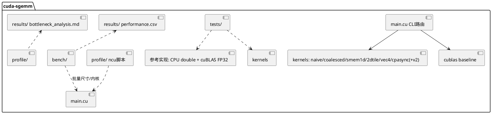

# cuda-sgemm 组件详细设计（组件_spec.md）

> 本文件是组件层全局基准（WHAT 的 single source of truth）。各 AR 的 srs.md/design.md 不得与其冲突；
> 实现过程中若组件契约需要变更，须经用户确认后先修订本文件。

---

## 1. 组件职责与边界

**职责**：在 RTX 4060 Laptop GPU（Ada, sm_89）上交付六版严格 FP32 的 SGEMM kernel
（Naive → 访存合并 → Smem 分块 → 2D 寄存器分块 → float4 向量化 → cp.async 双缓冲），
配套统一评测框架、数值正确性验证、Nsight Compute 瓶颈分析，最终达到 cuBLAS FP32 实测值 ≥ 97% 的性能。

**边界（Out of Scope）**：
- 不做 TF32 / Tensor Core / FP16/BF16 / 分块量化等非 FP32 路径；
- 不做批量化（strided-batched）、转置输入（`C=AᵀB` 等）、稀疏矩阵；
- 不支持 M/N/K ≤ 0 之外的非法输入（须报错退出而非崩溃）；
- 不做多 GPU / 多流 / 图（CUDA Graph）优化（可作为未来 AR）。

---

## 2. 运行环境（AR001/T001 已实测回填，2026-10-04）

> **⚠️ 环境偏差声明**：本工程原设计目标机为 RTX 4060 Laptop（sm_89, Ada）。实际执行机为
> **Quadro RTX 5000（sm_75, Turing）**，经用户批准继续（2026-10-04），全量偏差分析与处理原则见
> `results/environment.md` §0。要点：构建 `-arch=sm_75`；**绝对性能门（§4.6 各版本目标 GFLOPS 数值）
> 作废，改用相对门**（vs 本机 cuBLAS FP32 实测百分比 + 相邻版本加速比）；cp.async 硬件指令在 sm_75
> 不存在（需 sm_80+），AR006 的 `__pipeline_memcpy_async` 将退化为同步拷贝，如实归档。

| 项 | 值（实测） |
|----|-----|
| GPU | NVIDIA Quadro RTX 5000（TU104 GL，3072 CUDA cores，16GB GDDR6 256-bit @7001MHz = 448.1 GB/s） |
| SM 架构 | sm_75（Turing），48 SM，每 SM 64 FP32 lanes，64KB smem/SM 可配，寄存器 64K×32bit/SM，L2 4MB |
| 理论 FP32 峰值 | **11.15 TFLOPS**（2 × 3072 × 1.815 GHz boost，deviceQuery 实测 clockRate=1815000kHz） |
| TGP 档位 | 固定 230W（Default=Max=230W，Min=125W，无 Dynamic Boost） |
| 驱动版本 | 556.18（WDDM 模式） |
| CUDA Toolkit | nvcc 12.5.40（官方 redist 免管理员组装）+ ncu 2024.2.0.0 + compute-sanitizer 2024.2.0.0（详见 results/environment.md §4） |
| 时钟策略 | **方案 B：稳态预热**（WDDM + 无管理员权限，`-lgc` 不可用；RSD ≤ 5% 稳态判据；同会话内相对比较有效） |

---

## 3. 系统架构与模块分解



| 模块 | 职责 | 关键约束 |
|------|------|---------|
| `include/common.h` | CUDA_CHECK、CLI 解析、event 计时器、GFLOPS/带宽计算 | 全部 kernel/test/bench 共用，接口冻结于 AR001 |
| `src/sgemm_*.cu` | 六版 kernel，每文件自包含 | 统一签名（§4.1），头部注释契约（AGENTS.md §4.5） |
| `src/main.cu` | `--kernel {naive\|coalesced\|smem1d\|tile2d\|vec4\|cpasync\|cpasync2\|cublas} [--bk 8/16/32] [--lb 1/2] [--csv] [--verbose] --m --n --k --warmup --iters --check` | CLI 参数表冻结于 AR001 |
| `tests/` | 参考实现 + 误差判据 + 一键全矩阵回归 | §4.4 |
| `bench/` | 批量跑分 → `results/performance.csv` | §4.3 |
| `profile/` | ncu 采集脚本 + 各版指标导出 + sanitizer 脚本 | §4.5 |
| `results/` | performance.csv、environment.md、bottleneck_analysis.md、阶梯图 | 数据真实性军规 |

---

## 4. 核心契约（冻结项）

### 4.1 Kernel 接口与内存布局

```cpp
// 行主序：A[M×K]，B[K×N]，C[M×N]，C = A·B（不使用 alpha/beta，C 即输出）
void sgemm_naive    (const float* A, const float* B, float* C, int M, int N, int K);
void sgemm_coalesced(const float* A, const float* B, float* C, int M, int N, int K);
void sgemm_smem_1d  (const float* A, const float* B, float* C, int M, int N, int K);
void sgemm_2d_tile  (const float* A, const float* B, float* C, int M, int N, int K);
void sgemm_vec4     (const float* A, const float* B, float* C, int M, int N, int K);
void sgemm_cpasync  (const float* A, const float* B, float* C, int M, int N, int K);
void sgemm_cpasync_v2(const float* A, const float* B, float* C, int M, int N, int K);  // 方案乙（AR006 消融），CLI 注册名 cpasync2
```

### 4.2 cuBLAS FP32 基线（公平性契约）

- 必须 `cublasSetMathMode(handle, CUBLAS_DEFAULT_MATH)`（确保非 TF32），并在代码注释与报告中声明。
- cuBLAS 为列主序。行主序 C = A·B 等价于列主序 C' = B'·A'，其中 A'/B'/C' 是同一 buffer 的列主序视图
  （A'=Aᵀ，B'=Bᵀ，C'=Cᵀ）。因此正确调用为：

```cpp
// C_row(M×N) = A_row(M×K) * B_row(K×N)，三个 buffer 原样传入：
// 列主序视角：C'(N×M) = B'(N×K) * A'(K×M)
cublasSgemm(handle, CUBLAS_OP_N, CUBLAS_OP_N,
            N, M, K,            // C' 为 N×M
            &alpha, B, N,       // B' (N×K)，ldb = N
            A, K,               // A' (K×M)，lda = K
            &beta,  C, N);      // C' (N×M)，ldc = N
```

- **自校验义务**：该调用方式必须先在小尺寸与 CPU double 参考交叉验证通过，才可作为基准与正确性参考。

### 4.3 计时协议与 CSV schema

- CUDA events 成对环绕单次 kernel；warmup ≥ 20、iters ≥ 100；统计 median/min/max；
  方差大时（RSD > 5%）如实报告并检查频率。
- CSV 列（append 模式，含版本头注释行）：

```
kernel, m, n, k, ms_median, ms_min, ms_max, gflops, vs_naive, vs_cublas,
regs_per_thread, smem_per_block, achieved_occupancy, sm_clock_mhz, gpu_temp_c,
power_w, git_commit, timestamp
```

- `vs_naive` / `vs_cublas` 在报告中计算；`regs/smem` 来自 `-Xptxas -v`，`occupancy` 来自 ncu。

### 4.4 正确性判据与测试矩阵

- 参考实现：小尺寸用 CPU double 累加参考；大尺寸用 cuBLAS FP32（经 §4.2 自校验）。
- 判据：`max|C_gpu - C_ref| / max(|C_ref|, ε) ≤ 1e-4`，报告中给出实际 max abs / max rel 值。
  FP32 与参考的累加顺序差异属正常，禁止以 TF32/FP16 结果做参考。
- 测试矩阵（每版 kernel 全量回归）：

| 用例 | 尺寸 (M×N×K) | 目的 |
|------|--------------|------|
| 主场景 | 4096×4096×4096 | 性能与正确性主战场 |
| 快速回归 | 256³、1024³ | 日常迭代 |
| 非方阵 | 1000×1016×1024 | 步长非 2/4 幂 |
| 边界尺寸 | 1023×1024×511 | 检验谓词/回退路径（非 tile 对齐、非 4 倍数） |

- 测试输入：均匀随机 `[-1, 1]`（固定 seed 可复现）；另含 K=1 退化用例抽查。

### 4.5 Nsight Compute 与 sanitizer 协议

统一采集命令模板（以实际 ncu 版本支持为准，缺项用 `--set full` 页签等价指标）：

```
ncu -k <kernel_regex> --launch-count 3 \
    --metrics gpu__time_duration.sum,
    sm__throughput.avg.pct_of_peak_sustained_elapsed,
    gpu__compute_memory_throughput.avg.pct_of_peak_sustained_elapsed,
    dram__bytes.sum, dram__bytes_read.sum, dram__bytes_write.sum,
    l1tex__average_t_sectors_per_request_pipe_lsu_mem_global_op_ld.ratio,
    l1tex__average_t_sectors_per_request_pipe_lsu_mem_global_op_st.ratio,
    l1tex__data_bank_conflicts_pipe_lsu_mem_shared_op_ld.sum,
    l1tex__data_bank_conflicts_pipe_lsu_mem_shared_op_st.sum,
    smsp__average_warps_issue_stalled_long_scoreboard_per_issue_active.ratio,
    smsp__average_warps_issue_stalled_barrier_per_issue_active.ratio,
    smsp__average_warps_issue_stalled_short_scoreboard_per_issue_active.ratio,
    smsp__average_warps_issue_stalled_wait_per_issue_active.ratio,
    smsp__average_warps_issue_stalled_mio_throttle_per_issue_active.ratio,
    sm__warps_active.avg.pct_of_peak_sustained_active,
    launch__registers_per_thread, launch__shared_mem_per_block_static,
    sm__inst_executed_pipe_fma.avg.pct_of_peak_sustained_active
    -o profile/<kernel>/<kernel> ./sgemm_bench --kernel <k> --m 4096 --n 4096 --k 4096 --iters 3
```

归档要求：每版 kernel 的 `.ncu-rep` + 指标 csv + `ncu --import ... --page details` 文本导出。
必看页签：Speed of Light / Occupancy / Memory Workload / Warp State / Source（联合 `-lineinfo`）。
sanitizer：发布前 `compute-sanitizer --tool memcheck` 干净；cp.async 版加 `--tool racecheck` 抽查。

---

## 5. 优化路线与性能阶梯（每版 = 一个 AR 的 WHAT 基准）

> 数值口径：M=N=K=4096，严格 FP32；目标值来自参考调优水平，实测按 §7 ±10% 条款判定。
> 每版验收四门：正确性 / 性能 / 资源 / 分析（PROMPT.md §3 阶段 5）。

### Kernel 0 — Naive（AR001，目标 ~113.55 GFLOPS）
一维线程映射，每线程一个 `C[i][j]`，K 维串行累加；**刻意不做任何优化**，作为加速比基准。
预期证据：DRAM 流量远超理论最小值（每 FMA 都回全局内存取数）、long scoreboard stall 主导。

### Kernel 1 — 访存合并（AR002，目标 ~740.44 GFLOPS，6.52×）
线程映射调整为 warp 内 32 线程**连续读 B、连续写 C**（相邻线程相邻列，128B 对齐事务）；
检查 A 的行广播/重复读取。**仍无分块**：A/B 被重复读取 O(N)/O(M) 次，保持 memory-bound，
为 AR003 提供证据（DRAM 流量 ≈ 理论最小值的数十倍）。
预期证据：sectors/request 接近 4（32×4B=128B），global 效率大幅提升。

### Kernel 2 — Smem 32×32 分块 + 1D TM=8（AR003，目标 ~1.43 TFLOPS，1.94×）
block 协作将 A/B tile 装入 shared memory（含边界判断），`__syncthreads` 后从 smem 计算；
**1D thread tiling TM=8**：每线程沿一个方向算 8 个输出（128 线程/块，线程映射在 design.md 定稿，
要求 warp 级写回 C 合并）。BK 扫描（8/16/32 实测取舍）。
预期证据：DRAM 流量降至 tile 级；新瓶颈 = smem 冲突 / barrier 等待 / load:FMA 比例高。

### Kernel 3 — 2D 寄存器分块（AR004，目标 ~3.51 TFLOPS，2.46×）
Block Tile **128×128×8**，256 线程（16×16），Thread Tile **8×8**：每线程 64 个 fp32 累加器；
内层每 k 步读 smem 片段 `a[8]`、`b[8]`，做 64 次外积 FMA；smem 布局 `[128][8+pad]`、`[8][128+pad]`；
必须无 spill（`__launch_bounds__(256, …)` 控制分配，目标 ≤ 128 regs 以留 2 block/SM 可能，实测取舍）。
预期证据：FP32 pipe 利用率大升；剩余瓶颈 = 标量搬运与无流水重叠（global→reg→smem 两次搬运）。

### Kernel 4 — float4 向量化（AR005，目标 ~5.84 TFLOPS，1.66×）
三处 16B 向量化：① global→smem 用 float4；② A tile 转置布局写入 smem（全局侧沿 K 维 float4 读，
配 padding/swizzle 消转置写与片段读冲突，内层 `a[8]` 可 2×float4）；③ C 回写每线程 8 个连续 N 输出
= 2×float4。非 4 倍数尺寸走谓词化回退。
预期证据：指令数下降、sectors 效率≈满、bank conflict ≈ 0。

### Kernel 5 — cp.async 双缓冲（AR006，目标 ~6.61 TFLOPS，+13.3%，≥97% cuBLAS）
sm_89 `cp.async`（`cuda::memcpy_async`/pipeline 原语或内联 PTX `cp.async.cg.shared.global 16B`）
global→smem 直拷：不占寄存器、cg 路径不污染 L1；**2-stage 双缓冲**：算 tile k 同时预取 tile k+1，
`commit_group/wait_prior/__syncthreads` 与 buffer 交替正确配合（racecheck 抽查）。
cp.async 不能转置：A/B 布局方案须做**消融对比**（全直拷+padding vs B 直拷 + A 保留 float4 转置混合），
以实测最优为准并记录。任意 M/N/K：主路径向量化+流水，边界 tile 谓词化（cp.async 4B/8B 变体或标量补零）。
预期终态：DRAM 吞吐逼近峰值，主要 stall 从 long scoreboard 转为 barrier/依赖等待。
预构建定稿：双方案已实现并注册为 cpasync（甲：全直拷）与 cpasync2（乙：A 转置+寄存器预取），
E08 实验消融定稿，败者代码保留（军规）。

---

## 6. 关键技术决策记录（ADR 摘要）

| # | 决策 | 理由 |
|---|------|------|
| D1 | 严格 FP32，禁 TF32/TC/低精度 | 题设硬约束；cuBLAS 对比须 `CUBLAS_DEFAULT_MATH` |
| D2 | FMA 合并允许（默认 nvcc 行为） | IEEE 合规范围，cuBLAS 同样受益 |
| D3 | 行主序 + 固定 kernel 签名 | 与原始需求一致；简化测试 |
| D4 | 计时只认 CUDA events + median | 排除 host 噪声；笔记本降频下 median 最稳健 |
| D5 | 性能目标 ±10% 判定条款 | 笔记本功耗墙/频点差异；达不到须报告频率与归因而非放宽判定 |
| D6 | 每版 kernel 保留在仓库、可独立复现 | 性能阶梯逐点可回归 |
| D7 | smem 布局/转置/swizzle 一切以 ncu 计数实测取舍 | 消除"凭感觉"优化 |

---

## 7. 风险与对策

| 风险 | 影响 | 对策 | 归属 |
|------|------|------|------|
| 功耗墙降频 | 阶梯失真、方差大 | `-lgc` 锁频或稳态预热；记录频率/温度/功耗曲线；报告 RSD | 全 AR |
| cuBLAS TF32 泄漏 | 97% 对比失真 | `CUBLAS_DEFAULT_MATH` + 代码断言 + 报告声明 | AR001 |
| cuBLAS 行主序换算错 | 参考线错误 | §4.2 自校验义务（与 CPU double 交叉验证） | AR001 |
| 寄存器溢出（8×8 分块 ≈ 90+ regs） | 性能悬崖 | `__launch_bounds__`；spill 视为缺陷；必要时减片段缓存/调循环结构 | AR004 |
| float4/cp.async 对齐违例 | 结果错/崩溃 | 谓词化回退 + 入口断言；边界尺寸专项用例 | AR005/006 |
| 双缓冲数据竞争 | 偶发错果 | racecheck 抽查 + 全矩阵回归 | AR006 |
| bank conflict 反直觉 | 优化无效 | 以 ncu conflict 计数为准；padding/swizzle 消融 | AR003-006 |
| 环境占位符未回填 | 报告不可复现 | AR001/T001 强制回填 results/environment.md | AR001 |

**±10% 条款**：每 AR 性能门 = 目标 × 0.90（AR006 附加"≥ 6.3 TFLOPS 且 ≥ 97% × 实测 cuBLAS"）。
在门内但低于目标值时，验收通过但须在 bottleneck_analysis.md 记录差距归因（频率/温度/调参空间）。

---

## 8. AR 拆分与依赖

| AR | 主题 | 关键交付 | 前置 |
|----|------|---------|------|
| AR001-harness-naive-baseline | 评测框架 + 环境 + cuBLAS 基线 + Naive + 首份瓶颈闭环 | common.h/Makefile/tests/bench/profile 骨架 + performance.csv 首批数据 | - |
| AR002-coalesced-access | Kernel 1 | sgemm_coalesced + 闭环 | AR001 |
| AR003-smem-1d-tiling | Kernel 2 | sgemm_smem_1d + 闭环 | AR002 |
| AR004-register-tiling-2d | Kernel 3 | sgemm_2d_tile + 闭环（无 spill 门） | AR003 |
| AR005-float4-vectorization | Kernel 4 | sgemm_vec4 + 闭环（conflict≈0 门） | AR004 |
| AR006-cpasync-double-buffer | Kernel 5 + 终验 | sgemm_cpasync + 消融 + 阶梯图 + README + 归档 | AR005 |

---

## 9. 术语表

| 术语 | 定义 |
|------|------|
| SGEMM | 单精度通用矩阵乘 C = A·B |
| TF32 | Ampere+ 的 tensor core 中间精度，本工程禁用 |
| Block/Thread Tile (BM×BN×BK, TM×TN) | 线程块/单线程负责的输出子块尺寸 |
| cp.async | sm_80+ 的 global→shared 异步拷贝指令（.cg 绕过 L1，16B；.ca 4/8/16B） |
| 双缓冲 | smem 两份 tile 缓冲交替"计算 k / 预取 k+1"的流水 |
| bank conflict | smem 32 bank×4B 并行访问的同 bank 串行化 |
| 外积 FMA | `c[i][j] += a[i] * b[j]`：单读多算的寄存器复用模式 |
| sectors/request | 平均每请求的 L1 sector 数（合并效率，FP32 理想=4） |
| RSD | 相对标准差，用于衡量降频下的计时波动 |
